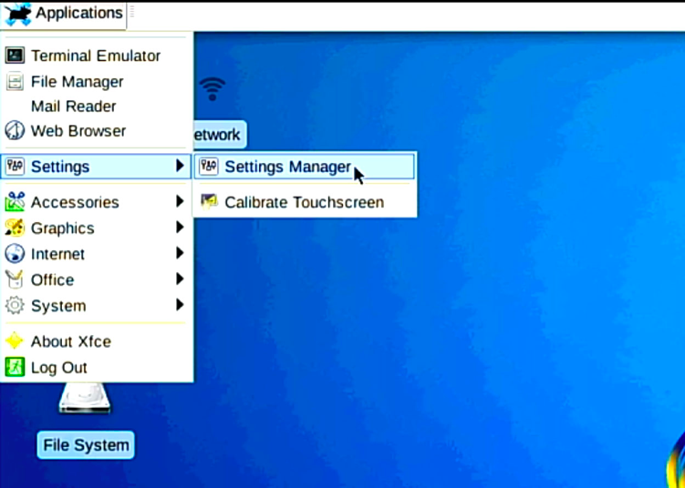
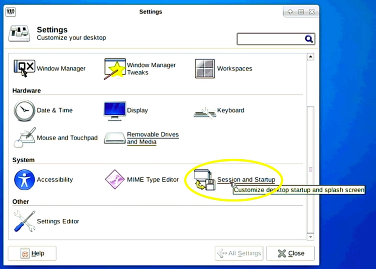
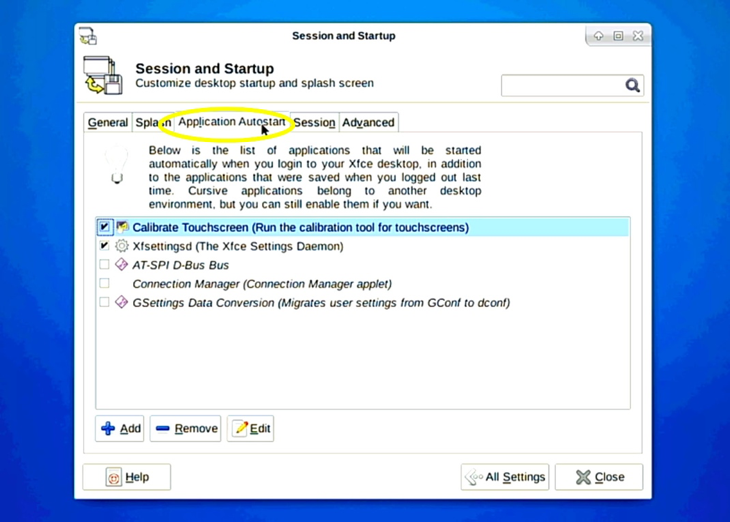
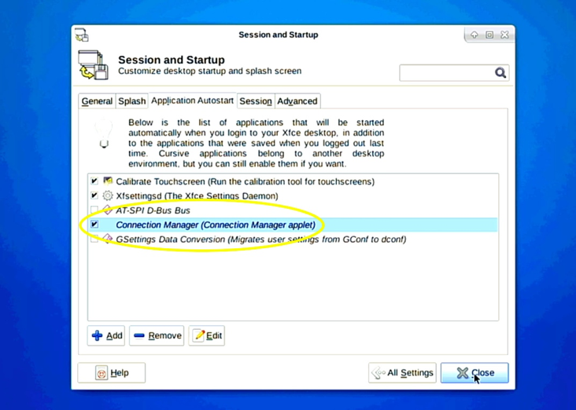
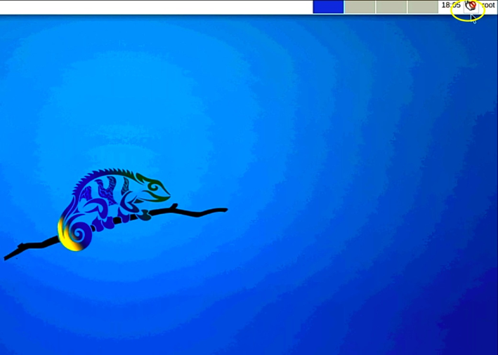
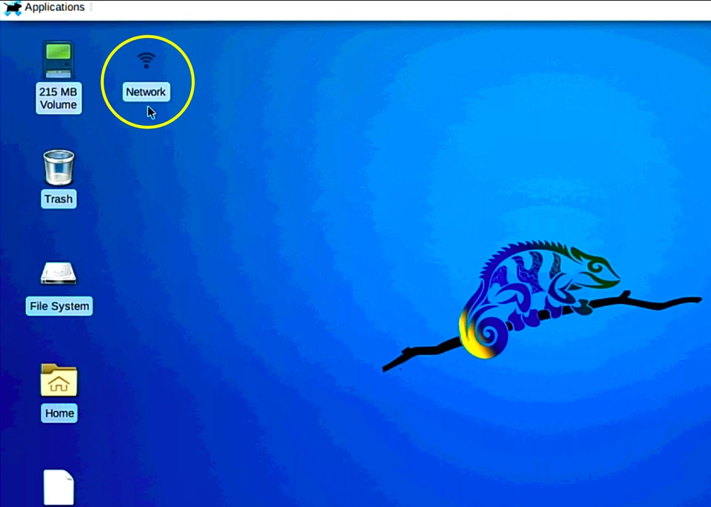
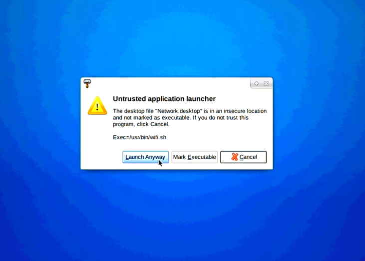
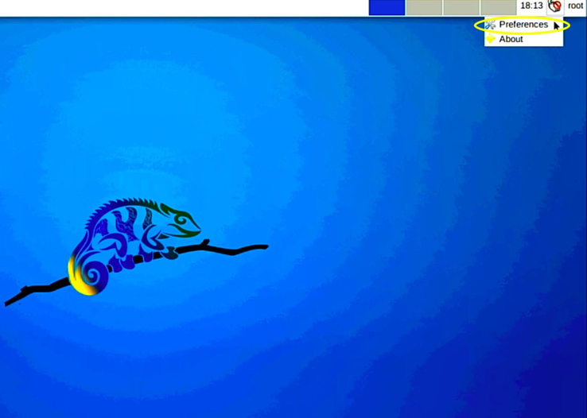
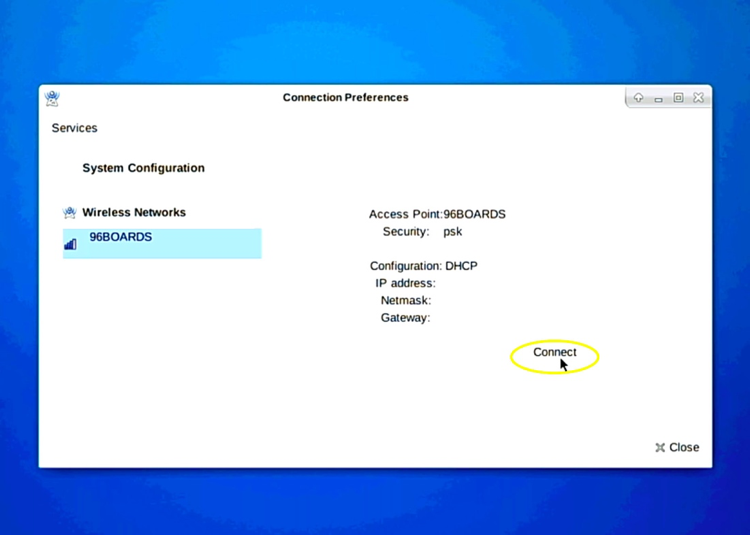
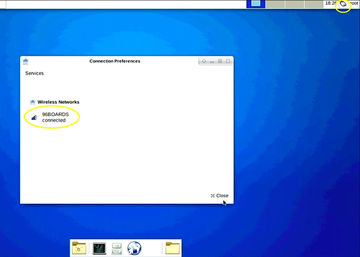

# Step-by-Step Initial Network Setup Guide

-	On the top left corner click on Applications tab -> Settings -> Settings Manager

-	In the settings window scroll down to System and click on Session and Startup

-	In the Session and Startup Window click on Application Autostart tab

-	Check the box for Connection Manager and click Close

-	Power cycle or reset your Chameleon96®, the connman applet should be running and visible on the upper right of your screen on your next power up.

-	On the top left corner of the desktop double-click on Network

-	In the pop-up window click on Launch Anyway or Mark Executable

-	Click on the Applet in the upper right corner and select "Preferences"

-	Choose the Network and click on Connect

-	Type in your network password and click on OK

	
-	Wait for the network to connect, and Congratulations, your computer is now connected to network!

