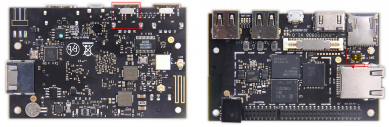

# Getting Started

Learn about your DB4 board as well as how to prepare and set up for basic use

## Setup - What you will need

**Basic kit includes**
- [Geniatech DB4](https://www.96boards.org/product/db4/)
   - Board based on Qualcomm® APQ8016E processor

**Required Addons**
- Power adapter
   - 96Boards specifications requires a 6.5V-18V with 2000mA Power adapter
- USB Keyboard and Mouse
   - With two USB-A connectors, all 96Boards can be equiped with a full sized keyboard and mouse
- Monitor and HDMI Cable
   - All 96Boards are equiped with a full sized HDMI connector, HDMI capable monitor is recommended

**Optional Addons**
- MicroSD card with adapter
   - For quick and easy switching between operating systems, Board recovery and extra storage
- Mezzanine Products
   - These devices allow you to expand your experience with any 96Boards by adding peripherals and enhancing onboard components
- USB to MicroUSB cable
   - This is needed for serial console interface and fastboot/adb commands
- USB to ethernet adapter and ethernet cable
   - For connecting to a network without using WiFi

***

# Out of the Box

The following subsections should describe how to get started with the DragonBoard 410c using the release build shipped with the boards. The DragonBoard 410c is ready to use “out of the box” with a preinstalled version of Android (unless otherwise specified).

## Features

|   Component          |   Description                                                                                    |
|:---------------------|:-------------------------------------------------------------------------------------------------|
|  SoC                 | Qualcomm APQ8016E                                                                          |
|  CPU                 | ARM Cortex-A53 Quad-core up to 1.2 GHz per core                                                  |
|  GPU                 | Qualcomm Adreno 306 @ 400MHz for PC-class graphics with support for Advanced APIs, including OpenGL ES 3.0, OpenCL, DirectX, and content security                                                                                     |
|  RAM                 | 1GB or 2GB LPDDR3 533MHz                                                                        |
|  PMU                 | ???                                                                                              |
|  Storage             | 8GB or 16GB eMMC 5.0 on board storage and MicroSD card slot                                             |
|  Ethernet Port       | RJ45 10/100/1000Mbps Ethernet                                                                               |
|  Wireless            | WLAN 802.11 b/g/n 2.4 GHz, _Bluetooth_® wireless technology 4.1, GPS. On board GPS, BT and WLAN antennas                |
|  USB                 | 2 x USB 2.0 Host 1 x USB 2.0 OTG                                                                 |
|  Display             | 1 x HDMI 1.4 (Type A - full) 1 x MIPI-DSI HDMI output up to FHD 1080P                            |
|  Video               | 1080p@30fps HD video playback and capture with H.264 (AVC), and 720p playback with H.265 (HEVC)  |
|  Audio               | PCM/AAC+/MP3/WMA, ECNS, Audio+ post-processing (optional)                                        |
|  Camera              | Integrated ISP with support for image sensors up to 13MP                                         |
|  Expansion Interface | 40 pin low speed expansion connector: +1.8V, +5V, SYS_DCIN, GND, UART, I2C, SPI, PCM, PWM,GPIO x12 60 pin high speed expansion connector: 4L-MIPI DSI, USB, I2C x2, 2L+4L-MIPI CSI                                                  |
|  LED                 | 6 x LED: 4xUser controlled, 2xRadio(BT and WLAN activity)                                        |
|  Button              | Power/Reset and Volume Up/down                                                                   |
|  Power Source        | 8V~18V@3A, Plug specification is inner diameter 1.7mm and outer diameter 4.8mm                   |
|  OS Support          | Android 5.1 / Debian Linux / Windows IoT Core                                                    |
|  Size                | 85mm x 54mm                                                                                      |

**IMPORTANT NOTES**

- HDMI EDID display data is used to determine the best display resolution. On monitors and TVs that support 1080p (or 1200p) this resolution will be selected. If 1080p is not supported the next available resolution reported by EDID will be used. This selected mode will work with **MOST but not all** monitors/TVs.
- There are limitations on the usage of the USB ports on the DragonBoard 410c.

***

## Starting the board for the first time

**The DragonBoard 410c comes preloaded with Android and can be up and running with a few simple steps:**

- Connect the DragonBoard 410c to your display with the HDMI cable. It is important to do this first because the monitor will not detect the board if it is connected after starting. Ensure that the source for the display is switched to the HDMI port you are using.
- Connect the USB keyboard and mouse. Do not connect the USB OTG port to your computer – this will prevent the keyboard and mouse from operating. The USB OTG port is the micro USB connector on the board.

- Set the boot switches SW7 to 00 and set the USB boot to ‘on’side.
- Verify the HDMI cable and USB cables are plugged in, then connect the power supply to the DragonBoard. The board will begin to boot Android immediately. Note that this may take a minute or two to get to the Android screen on the HDMI Monitor.

Please refer to the DragonBoard 410c [Android User Guide](https://github.com/96boards/documentation/blob/master/consumer/dragonboard/dragonboard410c/guides/AndroidUserGuide_DragonBoard.pdf) for further information on working with Android and some basic programming examples.

***

## Updating to a new release or change your operating system

If you are already familiar with the DragonBoard 410c and would like to change out the stock operating system, please proceed to one of the following pages:

- [Downloads page](../../dragonboard410c/downloads/): This page lists all Linaro and 3rd party operating systems available for the DragonBoard 410c
- [Installation page](../../dragonboard410c/installation/): If you already have the images you need, this page has information on how to install the different operating systems onto your DragonBoard 410c
- [Board Recovery](../../dragonboard410c/installation/board-recovery.md)
   - If at any time your board is having unexplainable issues, it is suggested to attempt a board recovery. These instructions will guide you through a succesfull board recovery.
- [Support](../support/)
   - From bug reports and current issues, to forum access and other useful resources, we want to help you find answers

Back to the [DB4 documentation home page](../)

***
