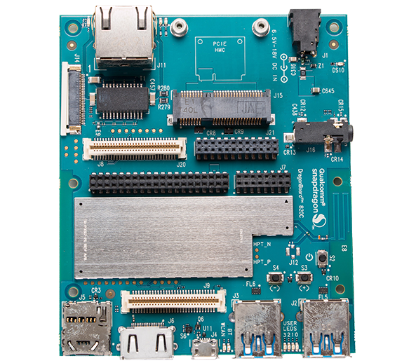

# Getting Started

Learn about your DragonBoard™ 820c board as well as how to prepare and set up for basic use

## Setup - What you will need

**Need**
- [DragonBoard 820c](https://www.96boards.org/product/dragonboard820c/)
   - Board based on Qualcomm® Snapdragon™ 820E processor
- Power adapter
   - 96Boards specifications requires a 6.5V-18V with 2000mA Power adapter
- USB Keyboard and Mouse
   - With two USB-A connectors, all 96Boards can be equiped with a full sized keyboard and mouse
- Monitor and HDMI Cable
   - All 96Boards are equiped with a full sized HDMI connector, HDMI capable monitor is recommended

**Optional**
- MicroSD card with adapter
   - For quick and easy switching between operating systems and extra storage
- Mezzanine Products
   - These devices allow you to expand your experience with any 96Boards by adding peripherals and enhancing onboard components
- USB to MicroUSB cable
   - This is needed for serial console interface and fastboot/adb commands
- USB to ethernet adapter and ethernet cable
   - For connecting to a network without using WiFi

***

# Out of the Box

The following subsections should describe how to get started with the DragonBoard 820c using the release build shipped with the boards.

## Starting the board for the first time

**To start the board, follow these simple steps:**

- Step 1: Connect the HDMI cable to the 820c HDMI connector (marked J6) and to the LCD Monitor.
- Step 2: Connect the mouse and keyboard to the 820C USB connectors marked J2 and. (It doesn’t matter which order
you connect them in. You can also connect via an external USB Hub.)
- Step 3: Ensure that the boot switches S1 are set to ‘0000’, all in Off position.
- Step 4: Connect the power supply to power connector J1.
- Step 5: Plug the power supply into a power outlet.

The board will start the booting process, and you should see Linux boot up. The ’power up’ blue LED ‘DS10’ should
illuminate.

> NOTE: The first boot takes 3-4 minutes due to first time initialization. Subsequent boot times should be faster in
the range of 1-2 minutes.

For more information and support, you may also want to visit the [DragonBoard 820c Hardware User Manual](../hardware-docs/).

***

## What's Next?

If you are already familiar with the DragonBoard™ 820c and would like to change out the stock operating system, please proceed to one of the following pages:

- [Downloads page](../downloads/): This page lists all Linaro and 3rd party operating systems available for the DragonBoard 820c
- [Installation page](../installation/): If you already have the images you need, this page has information on how to install the different operating systems onto your DragonBoard 820c
- [Board Recovery](../installation/board-recovery/)
   - If at any time your board is having unexplainable issues, it is suggested to attempt a board recovery. These instructions will guide you through a succesfull board recovery.
- [Troubleshooting](../support/)

- From bug reports and current issues, to forum access and other useful resources, we want to help you find answers

Back to the [DragonBoard 820c documentation home page](../)

***
