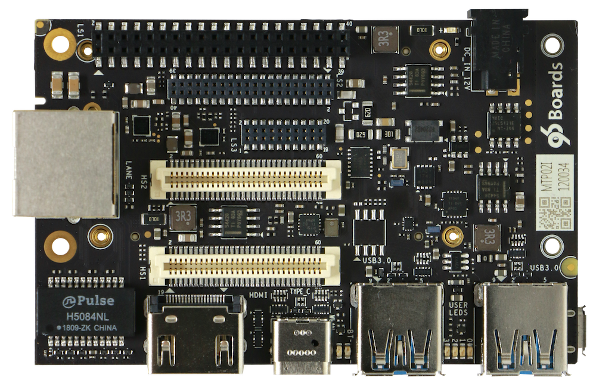
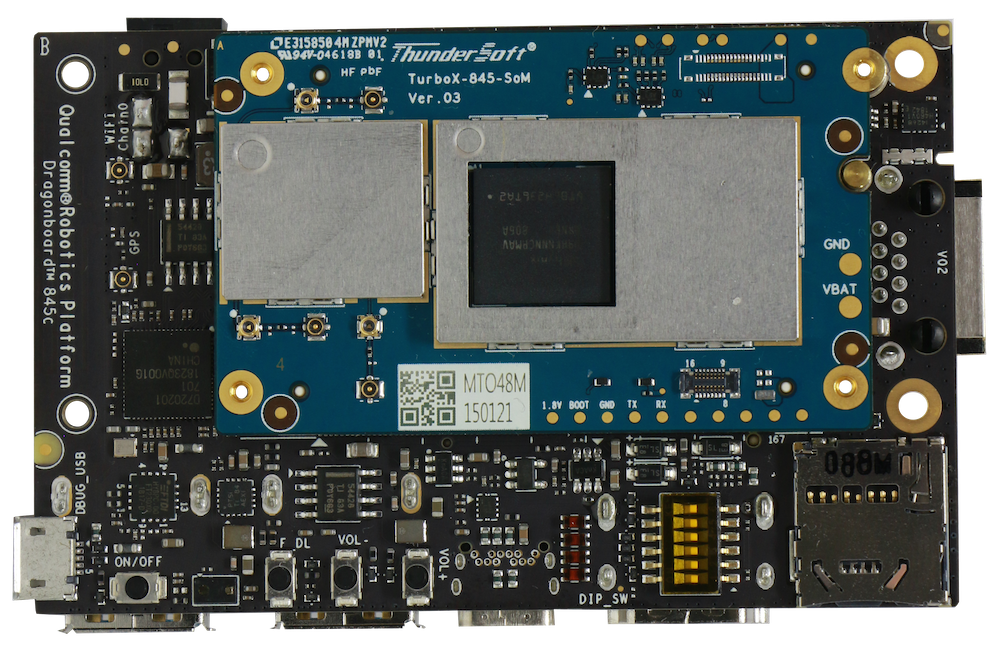
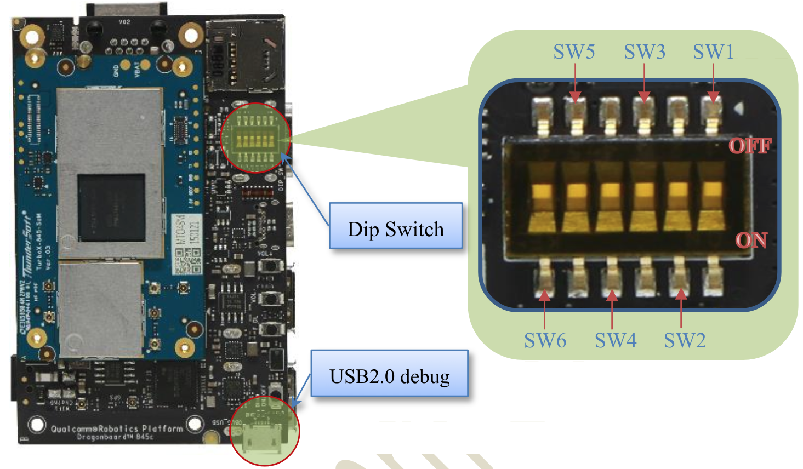

# Getting Started

Learn about your DragonBoard 845c board as well as how to prepare and set up for basic use

## Setup - What you will need

**Basic kit includes**
- [DragonBoard 845c](https://www.96boards.org/)

**Required**
- DragonBoard™ 845c development board
   - Board based on Qualcomm® Snapdragon™ 845 processor
- Power adapter
   - 96Boards specificationrequirea 12V with 2500mA power adapter
- USB to micro USB cable
   - This is needed for serial console interface and fastboot/adb commands
- USB to USB Type C cable
   - Thisisneeded to connect the USB3.0 Type C port and flash the images
- Host PC
   - This is needed to connect the board and have fastboot installed

**Optional**
- Navigation Mezzanine board
   - This board allows you to expand your experience by adding cameras, peripherals and enhancing onboard components
- Camera Modules
   - OV8856
   - OV7251
   - ToF
   - SLMCamera
- Cellular Mezzanine board
   - This board supports LTE module for a better communication experience

***

# Out of the Box

Coming Soon...

## Features

|   Component          |   Description |
|:---------------------|:--------------|
|  SoC                 | Qualcomm® Snapdragon™ 845              |
|  CPU                 | Snapdragon™ 845 embedded platform, custom 64-bit ARM v8-compliant octa-core CPU Up to 2.8 GHz,10nm LPP FinFET process technology              |
|  GPU                 | Adreno™ 630 GPU  OpenGL™ ES 3.2 + AEP, DX next, Vulkan®2,  OpenCL™ 2.0 full profile, RenderScript             |
|  DSP                 | Hexagon™ 685 DSP |
|  RAM                 | 4GB LPDDR4x SDRAM @ 1866 MHz              |
|  Storage             | 64GB UFS 2.1 on-boardstorage and1 x MicroSD card slot             |
|  Ethernet Port       | 1x GbE Ethernet              |
|  Wireless            | WLAN 802.11a/b/g/n/ac 2.4/5GHz 2×2 MIMO & _Bluetooth_® wireless technology 5.0,on-boardWLAN/BT/GPSantennas              |
|  USB                 | 1 x USB 2.0 Micro B (Debug only ),   1 x USB 3.0 Type C (OTGmode),   2x USB 3.0 Type A (Host mode only)              |
|  Display             | Two 4-lane DSI, D-PHY 1.2 or C-PHY 1.0; VESA DSC 1.1 1 x HDMI 1.4 (Type A -full) connector              |
|  Video               | 4K60 decode for H.264 High Profile, H.265 Main 10 Profile and VP9 Profile 2,  4K60 encode for H.264 High Profile, H.265 Main 10 Profile              |
|  Audio               | MP3; aacPlus, eAAC; WMA 9/Pro              |
|  Camera              | Qualcomm Spectra™ 280 ISP, dual 14-bit ISP+one Lite ISP, 32 MP 30 fps ZSL with a dual ISP              |
| Sensors              | Accelerometer + Gyro Sensor/ Proximity sensor |
|  Expansion Interface | HS1:1 x 60 pin High-Speed connector (4L-MIPI DSI, USB 2.0 x2,I2C x2, 2L+4L-MIPI CSI) HS2:1x 60 pin High-Speed connector (4L-MIPI CSI x 2, SSC SPI, PCIe 3.0,USB 3.0 x1, GPIO x 9) LS1:1x 96boards 40 pin Low-Speed connector (UART x2, SPI, I2S, I2C x2, GPIO x12, DC power)      LS2:1x 96boards 40 pin Low-Speed connector(headset, stereospeaker, DMIC I/F x3, CAN, I2S, GPIO x 7, PWM x 2, ADC x 2) LS3:1x 96boards 20 pin Low-Speed connector (SSC SPI x 3, SSC I2C, sensor interrupt x 5)              |
|  LED                 | 7 LED indicators: 4 - user controllable 2 - for radios (BT and WLAN activity) 1 - power indicator              |
|  Button              | Power ,Volume Up/Down,Force Usb Boot, DipSwitch(6 PIN)              |
|  Power Source        | 12V@2.5A adapter with a DC plug: Plug specification is inner diameter 1.75mm and outer diameter 4.75mm              |
|  OS Support          | LE             |
|  Size                | 85mm by 54 mm meeting 96Boards™ Consumer Edition Standard form dimensions specifications              |

***

## Starting the board for the first time

**To start the board, follow these simple steps:**
- Step 1: Open the serial console tool on the Host PC.(for example:minicom)
- Step 2: Enable the USB2.0 debug port by turning on the SW2 of the Dip Switch

   

- Step 3: Connect the Micro-B plug on the USB cable to the USB2.0 debug port on the device,and the other end to an available USB port on the host PC
   > Note:please set the Bps/Par/Bits to 1152008N1
- Step 4: Connect the power supply to power connector
- Step 5: Plug the power supply into a power outlet, and “power up” green Led should illuminate
- Step 6: Press and release the power button on the device,and user yellow Led0 should illuminate.

The board will start the booting process, and you should see Login Credentials displayed on the host PC:
- sda845 login: root
- Password:123456

***

## Updating to a new release or change your operating system

If you are already familiar with the DragonBoard 845c and would like to change out the stock operating system, please proceed to one of the following pages:

- [Downloads page](../../downloads/): This page lists all Linaro and 3rd party operating systems available for the DragonBoard 845c
- [Installation page](../../installation/): If you already have the images you need, this page has information on how to install the different operating systems onto your DragonBoard 845c
- [Board Recovery](../../installation/board-recovery.md)
   - If at any time your board is having unexplainable issues, it is suggested to attempt a board recovery. These instructions will guide you through a succesfull board recovery.
- [Support](../../support/)
   - From bug reports and current issues, to forum access and other useful resources, we want to help you find answers

Back to the [DragonBoard 845c documentation home page](../../)

***
