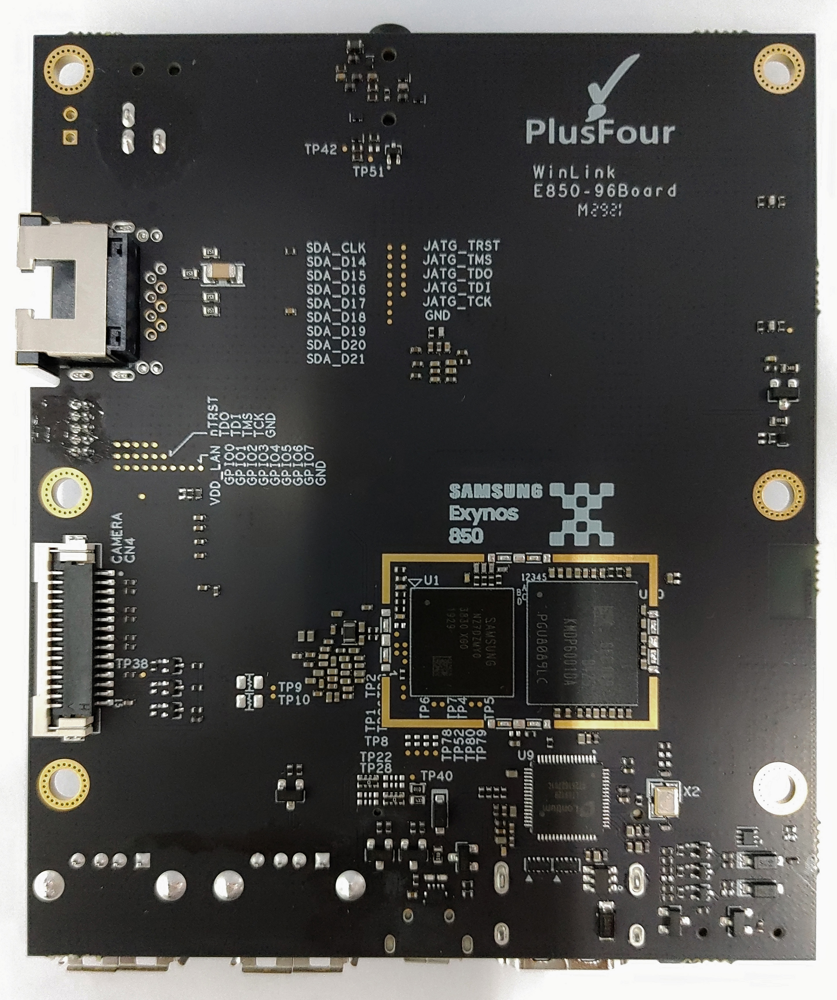

# Getting Started

Learn about your WinLink E850-96Board board as well as how to prepare and set up for basic use

## Setup - What you will need

**Required**
- WinLink E850-96Board development board
- Power adapter
   - 96Boards specification requires a 12V with 2500mA power adapter

**Optional**
- HDMI Display
- USB Keyboard and Mouse

***

# Out of the Box

In the Box you can find the WinLink E850-96Board as well as a microSD card which comes with a pre-installed linux.

## Features

|   Component          |   Description                                                                                                                  |
|:---------------------|:-------------------------------------------------------------------------------------------------------------------------------|
|  SoC                 | Exynos 850, 64-bit                                                                                                             |
|  CPU                 | Cortex-A55 Octa core up to 2.0GHz                                                                                              |
|  GPU                 | ARM Mali G52MP1, 2nd Generation Bifrost architecture    OpenGL ES1.1/2.0/3.2, OpenCL 2.0 Full Profile and Vulkan 1.0/1.1    |
|  RAM                 | 4GBytes LPDDR4 on board(MCP, KMDP6001DA-B425)                                                                                  |
|  Storage             | eMMC v5.1, 64GB onboard(MCP, KMDP6001DA-B425) and 1x MicroSD card slot                                                         |
|  Ethernet Port       | 1x10/100 Ethernet (RJ-45) socket                                                                                               |
|  Wireless            | WiFi 2.4/5GHz & BT5.0 (S612 RF transceiver)                                                                                    |
|  USB                 | 1x USB 2.0 Micro B (Debug only),   2x USB 2.0 Type A (Host mode only)                                                       |
|  Display             | HDMI (v1.4 Type-A full-size connector)                                                                                         |
|  Video               | HEVC (High Efficiency Video Coding) codec which enables FHD(1920X1080) 60fps encoding and decoding simultaneously              |
|  Audio               | Stereo Headphone output & MIC input via 3.5mm Audio Jack   Built-in audio interfaces HMU(Headphone Management Unit) by PMIC |
|  Camera              | Up to 3-image sensor(camera) inputs with a max. resolution of 21.7MP Bayer supported                                           |
|  Expansion Interface | 40-Pin Low Speed Header   60-Pin High Speed Header                                                                          |
|  LED                 | 3x green user controlled LEDs   1x blue Bluetooth enabled   1x yellow WiFi enabled                                       |
|  Button              | Power, Volume UP/DN, Reset                                                                                                     |
|  Power Source        | 12V@2A adapter with a DC plug: Plug specification is inner diameter 1.75mm and outer diameter 4.75mm                        |
|  OS Support          | AOSP(Android-10 based k4.14) / LINUX(TBD)                                                                                      |
|  Size                | 100mm x 54mm meeting 96Boards™ Consumer Edition Extended Standard form dimensions specifications                               |

***

## Starting the board for the first time

This short guide leads you through the first steps to start exploring your WinLink E850-96Board.

**Easy Setup Guide**

- USB cable to Dubug
   - Connect the Micro-USB end of the USB cable to the debug port and TypeA-USB to the computer host.
   - Open the serial port tool of the host computer and apply the following configuration:
      - baud rate: 1500000
      - Data bits: 8
      - Stop Bit: 1
      - Parity Check: NA
      - flow control: NA

- Connect HDMI cable (optional)
   - Connect one end of the HDMI cable to the development board HDMI port and the other end to a display that supports HDMI.

- Connect to Ethernet (optional)
   - Plug wired Ethernet into RJ45 ports ofthe development board.

- Connect mouse and keyboard (optional)
   - Insert a USB mouse and USB keyboard to the USB port of the development board.
   - Mouse and keyboard to watch/track on HDMI display.

- Connect LTE module (optional)
   - Insert LTE/5G module into M.2 port
   - Insert SIM card at the same time

- Connect a USB-OTG cable (optional)
   - When firmware needs to be reflashed, plug micro USB port of USB data cable into USB OTG port of development board, and type a USB at the other end to computer host

- Connect DC12V power cord (power on)
   - Connect the 12V power plug, and when the power supply is connected, the development board starts automatically.

***

## Whats Next?

If you are already familiar with the WinLink E850-96Board and would like to change out the stock operating system, please proceed to one of the following pages:

- [Downloads page](../downloads/): This page lists all Linaro and 3rd party operating systems available for the WinLink E850-96Board
- [Installation page](../installation/): If you already have the images you need, this page has information on how to install the different operating systems onto your WinLink E850-96Board
- [Support](../support/)
   - From bug reports and current issues, to forum access and other useful resources, we want to help you find answers

Back to the [WinLink E850-96Board documentation home page](../)

***
