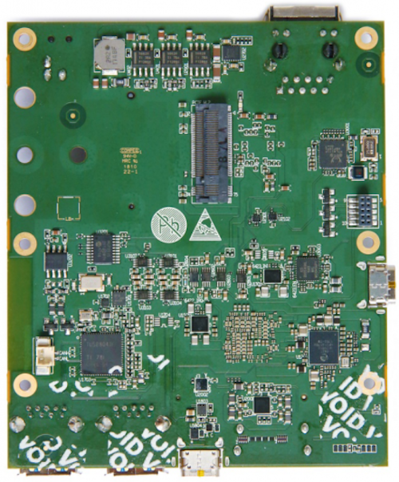
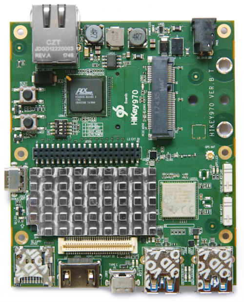

# Getting Started

Learn about your HiKey970 board as well as how to prepare and set up for basic use

## Setup - What you will need

**Need**
- HiKey970
   - Board based on the HI3670 Application Processor
- Power adapter
   - 96Boards specifications requires a 8V-18V with 2000mA Power adapter
- USB Keyboard and Mouse
   - With two USB-A connectors, all 96Boards can be equiped with a full sized keyboard and mouse
- A HDMI LCD Monitor that supports a resolution of 1080P/60Hz
   - All 96Boards are equiped with a full sized HDMI connector, HDMI capable monitor is recommended
- HDMI-HDMI cable cable to connect the board to the Monitor.

**Optional**
- MicroSD card with adapter
   - For quick and easy switching between operating systems and extra storage
- Mezzanine Products
   - These devices allow you to expand your experience with any 96Boards by adding peripherals and enhancing onboard components
- USB host to type C cable
   - This is needed for serial console interface and fastboot/adb commands
- USB to ethernet adapter and ethernet cable
   - For connecting to a network without using WiFi

***

# Out of the Box

The following subsections should describe how to get started with the HiKey970 using the release build shipped with the boards. The HiKey970 board is ready to use “out of the box” with a preinstalled version of the Debian Linux distribution.

## Features

|   Component          |   Description                                                                                    |
|:---------------------|:-------------------------------------------------------------------------------------------------|
| SoC:                 | HiSilicon Kirin 970 - HiAI Architecture, Dedicated NPU                                           |
| CPU:                 | ARM Cortex-A73 MPCore*4 @up to2.36GHz, ARM Cortex-A53 MPCore*4 @up to1.8GHz                      |
| GPU:                 | ARM Mali-G72 MP12 GPU                                                                            |
| RAM:                 | 6GB LPDDR4X 1866MHz                                                                              |
| Storage:             | 64GB UFS 2.1, Micro SD                                                                           |
| Connectivity:        | _Bluetooth_® wireless technology/WIFI/GPS                                                                               |
| Video:               | 1080p@60Hz HDMI, 4 line MIPI/LCD port                                                            |
| Camera:              | 4 line MIPI port, 2 line MIPI port                                                               |
| Expansion Interface: | One 40-pin Low Speed (LS) expansion connector UART, SPI, I2S, I2C x2, GPIO x12, DC power One 60-pin High Speed (HS) expansion connector 4L-MIPI DSI, USB, I2C x2, 2L+4L-MIPI CSI                                        |
| User Interface:      | Power/Reset 8 LED indicators 4 -user controllable 3 -for radios (BT and WLAN and GPS activity) 1 – for CAN                                                                                                              |
| Power Source:        | DC Power: +8V to +18V                                                                            |
| OS Support:          | Android Linux                                                                                 |
| Mechanical:          | 105.26mm by 100mm meeting 96Boards Consumer Edition standard dimensions specifications.          |
| Environmental:       | Operating Temp: 0°C to +70°C RoHS and Reach compliant                                            |

***

## Starting the board for the first time

To start the board, follow these simple steps:

- Step 1. Connect the HDMI cable to the HiKey970 HDMI connector (marked J2001) and to the LCD Monitor.
- Step 2. Connect the keyboard to the boards USB connector marked J1901(or J1902) and the mouse to the USB connector marked J1902(or J1901).
- Step 3. Ensure that the boot switches SW2402 are set to ‘1000’, on/off/off/off position.
- Step 4. Connect the power supply to power connector J401.

Once you plug the power supply into a power outlet the board will start the booting process, and you should see Android boot up.
Please note that the first boot takes several minutes due to Androids initialization. Subsequent boot times should be faster.

***

## What's Next?

If you are already familiar with the HiKey970 board and would like to change out the stock operating system, please proceed to one of the following pages:

- [Downloads page](../downloads/): This page lists all Linaro and 3rd party operating systems available for HiKey970
- [Installation page](../installation/): If you already have the images you need, this page has information on how to install the different operating systems onto your HiKey970 board
- [Support](../support/)
   - From bug reports and current issues, to forum access and other useful resources, we want to help you find answers

Back to the [HiKey970 documentation home page](../)

***
