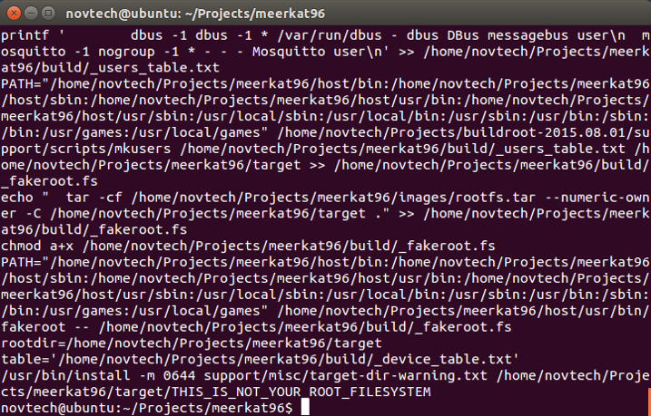

# Software Guide

# Updating source and images

Updates to the i.MX7 96Board Meerkat<sup>®</sup> project are available from the VM via SVN.
The following directories are maintained by SVN:

~/Projects/support_files
~/Projects/meerkat96/build/linux_custom
~/Projects/meerkat96/build/uboot_custom

These are available via SVN from

http://novtech.ddns.net/svn/Customer/meerkat96
with username: meerkat96
and password: Meerkat2017@NovTech

## 1.1	First update

Initially, it is a good idea to pull the latest support files from SVN and update the svn_script, overlay and buildroot .config files located at ~/Projects/meerkat96.

To do this, run the following commands:
```
cd ~/Projects/support_files
svn update
./load_files.sh
```
## 1.2	Updating from SVN with script

For your convenience, a script has been prepared which will update each of the three SVN repositories from within the **~/Projects/meerkat96** directory. This script is pre-installed at that location, but the SVN updated version of it can be found in the **~/Projects/support_files** directory.

To update the source and images, run the following commands (you may need to provide login credentials as indicated above):
```
cd ~/Projects/meerkat96
./svn_script get support_files
./svn_script get linux
./svn_script get uboot
```

# Building source and images


Please refer to the [i.MX7 96Board User Guide](user-guide.md) for instructions on retrieving and configuring the VM for use.

For convenience of development full source and pre-compiled images for console and GUI configurations are provided. The virtual machine is pre-configured with the necessary tools and packages for compilation.

## 2.1	Important VM directories

Open a terminal in the virtual machine.
Change directory to the “Projects” directory
```
cd ~/Projects
```

This directory contains the following directories:
 - buildroot-2015.08.01 – buildroot and associated support packages
 - meerkat96 – The buildroot project directory, containing a buildroot tree pre-configured for the i.MX7 96Board.
 - support_files – NovTech support files, including scripts to update VM packages and download from SVN.

## 2.2	Compiling in Buildroot

 - Change directory to **~/Projects/meerkat96** by typing
 ```
 cd ~/Projects/meerkat96
 ```

 - Configure buildroot to include whatever packages you desire by typing
 ```
 make menuconfig
 ```
  and selecting packages.

 - Compile the buildroot tree by typing
 ```
 make
 ```
  It will take some time to compile.

 - When completed, you should see something like this:

 

## 2.3	Programming compiled images to SD/MMC cards

Once the compilation is complete, you will need to place the images onto an SD/MMC card for use in the i.MX7 96Boards Meerkat<sup>®</sup>. The compiled buildroot images are located in: **~/Projects/meerkat96/images**

For convenience, a script has been provided which will place the images onto an SD/MMC card.
Insert the SD/MMC card into your PC and connect it to the VM by selecting it from the **Removable devices** menu.

From the **~/Projects/meerkat96** directory run
```
./mk_meerkat_sd -a sdb
```

This will program the contents of the ~/Projects/meerkat96/images directory onto the SD/MMC card at **/dev/sdb**
*Important Note: If your card is NOT located on /dev/sdb, use the appropriate device handle.*

**Warning** - this script can be destructive if the wrong device handle is used. Please verify your SD/MMC card is at the expected location before executing. The card location can be verified by running **cat /proc/partitions** and looking for **/dev/sdb.**

The script can also place individual portions of the compiled images. Run **mk_meerkat_sd** without options for more information.

#	Programming pre-compiled images to SD/MMC cards

Pre-compiled images for both the console and graphical systems are available from https://novtech.sharefile.com in the **03 – Compiled SD Images** directory.

Images in **03.01 – Card Images** can be programmed directly to SD/MMC cards with **dd** or Win32DiskImager per instructions in the [i.MX7 96Boards Meerkat<sup>®</sup> User Guide](user-guide.md)

Images in **03.02 – Card Contents** can be downloaded to the VM extracted. These images can be written to cards using the **mk_meerkat_sd** script included in their respective directories.

#	Building the graphical image

Also included within the [ShareFile site](https://novtech.sharefile.com) is a script to compile the graphical images. This is accomplished with an Angstrom distribution and Yocto.  However, Yocto requires approximately 75GB of HDD space and 8GB RAM to compile, and so is too large to compile on the standard VM.

Therefore, to compile Yocto, you will need to modify the RAM supplied by the VM and mount an additional drive in the VM with sufficient space for the compilation, or transfer the Yocto script to a PC with sufficient resources running Ubuntu 14.04. Those activities are outside the scope of this document.

Once transferred decompress and read the **readme.first** document and ensure all pre-requisite packages are installed. Then execute the **yocto2.2-build** script as follows:

**./yocto2.2-build -b meerkat96**

This will download the Yocto environment and decompress the meerkat96 layer, then start a compilation. After compilation, a SD/MMC card can be created following the instructions in section 2.3, above.

For additional information about customizing and using Yocto, please refer to: https://www.yoctoproject.org/downloads/core/morty22

Configuring and using Yocto is outside the scope of this document.
