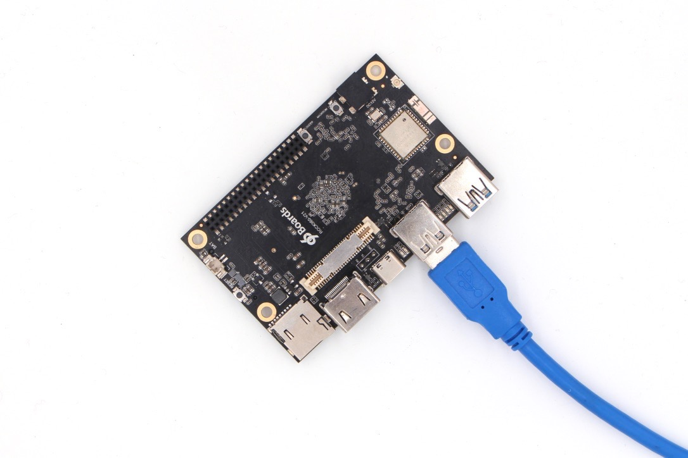

## Linux/macOS Host

This section show how to install a new operating system to ROCK960 on board eMMC using the [rkdeveloptool](http://opensource.rock-chips.com/wiki_Rkdeveloptool) on a Linux or macOS host computer.

***

- **Step 1**: Make sure rkdeveloptool is set up on host computer
- **Step 2**: Download all necessary images
- **Step 3**: Boot device into maskrom mode
- **Step 4**: Prepare the flash environment
- **Step 5**: Flash images onto ROCK960 eMMC and reboot

***

#### **Step 1**: Make sure rkdeveloptool is set up on host computer

##### Linux

To build rkdeveloptool on a debian based Linux distribution, follow the instructions below:

Install build dependency:

    sudo apt-get install libudev-dev libusb-1.0-0-dev dh-autoreconf libglib2.0-dev

Clone the source code and build:

    git clone https://github.com/rockchip-linux/rkdeveloptool
    cd rkdeveloptool
    autoreconf -i
    ./configure
    make

Now you have rkdeveloptool executable at the current directory.

    sudo cp rkdeveloptool /usr/local/bin/

##### macOS

To build rkdeveloptool on macOS, you need [homebrew](https://brew.sh/)(or similar package manager) to install required packages.

Install build dependency:

    brew install automake autoconf libusb

Clone the source code and build:

    git clone https://github.com/rockchip-linux/rkdeveloptool
    cd rkdeveloptool
    autoreconf -i
    ./configure
    make

Now you have rkdeveloptool executable at the current directory.

    sudo cp rkdeveloptool /usr/local/bin/

#### **Step 2**: Download all necessary images

Go to the [Downloads page](../downloads/android.md) to donwload the image.

Extract the image tar ball, for SD card/eMMC AIO image, the file list as below:

- rk3399_loader_v1.xx.1xx.bin - run on target to init DRAM and flash, will not write to eMMC
- rock960-*-gpt.img - android gpt image contains bootloader/kernel/system/......

#### **Step 3**: Boot device into maskrom mode

[Maskrom mode](http://opensource.rock-chips.com/wiki_Rockusb#Maskrom_mode) is the code inside the Rockchip SoC running and waiting for commands from USB when there is no external bootable media. 

To put the device into maskrom mode:

##### For ROCK960

You need USB3.0 or USB2.0 type A to type C cable:

- power on rock960
- plug the rock960 to Linux desktop with USB type A to type C cable
- press and hold the maskrom key, then short press reset key
- release maskrom key(important!)

##### For ROCK960C
You need USB3.0 or USB2.0 type A to type A male cable:

- plug the eMMC module on rock960c and power on
- plug the rock960c to Linux desktop with USB type A to type A male cable from the **USB 3.0 OTG** port, as below:

- press and hold the maskrom key, then short press reset key
- release maskrom key(important!)

**Note**: You don't need to switch the HOST/DEVICE switch for USB OTG, in maskrom mode, USB OTG is forced as device mode.

After the device is in maskrom mode, on the host PC, `lsusb` should show the following VID/PID if the board is in maskrom mode: `Bus 003 Device 061: ID 2207:0011`

**Note**: if no right USB device found, try:

1. Press and hold maskrom key longer, and short press and release reset key
2. Check your usb cable, plug and unplug the usb cable, reverse plug the type C cable and try
3. Try the direct USB port at the back of mother board
4. Try with USB 2.0 cable, not 3.0

#### **Step 4**: Prepare the flash environment

Run the following command to download and run the mini loader to init DRAM and prepare flashing environment:

    rkdeveloptool db rk3399_loader_v1.xx.1xx.bin

#### **Step 5**: Flash images onto ROCK960 eMMC and reboot

Write the GPT image to eMMC with the following command and address:

	rkdeveloptool wl 0 rock960-*-gpt.img

This will take a while, after it finishes, run

    rkdeveloptool rd

Now you reboot to the new image on eMMC.

-------------------------------------------------

## Troubleshooting

### "Creating Comm Object failed!"

After run any command of rkdeveloptool, it keeps complaining

    "Creating Comm Object failed!"

It's permission issue, you can run the following command to set the udev rule:

    echo 'SUBSYSTEM=="usb", ATTR{idVendor}=="2207", MODE="0666",GROUP="plugdev"' | sudo tee /etc/udev/rules.d/51-android.rules

Or use `sudo` before rkdeveloptool command

If this doesn't fix the problem, it might be a USB3 power/signal issue, if you are using a USB3 hub, please directly connect to the USB3 port of the mother board at the back, not the front panel USB3 port.
