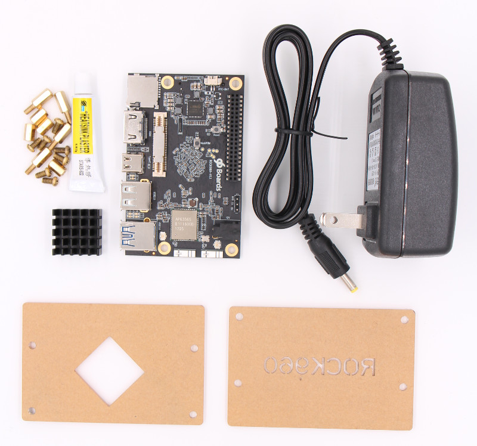
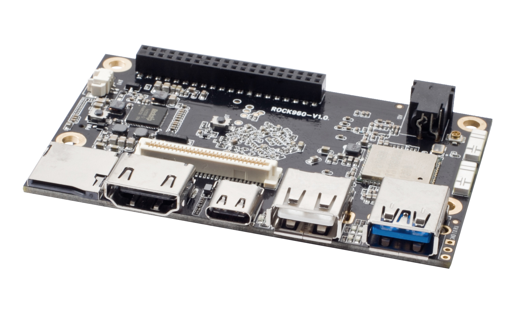
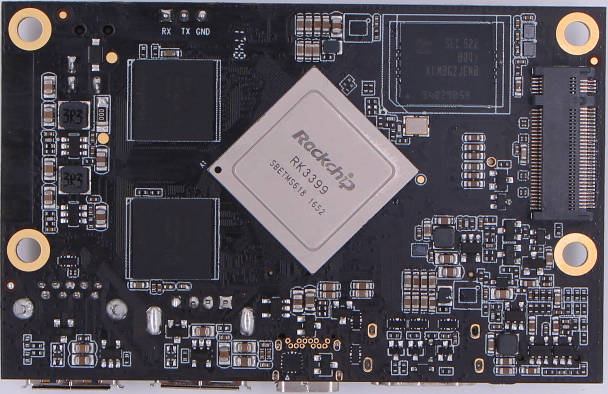
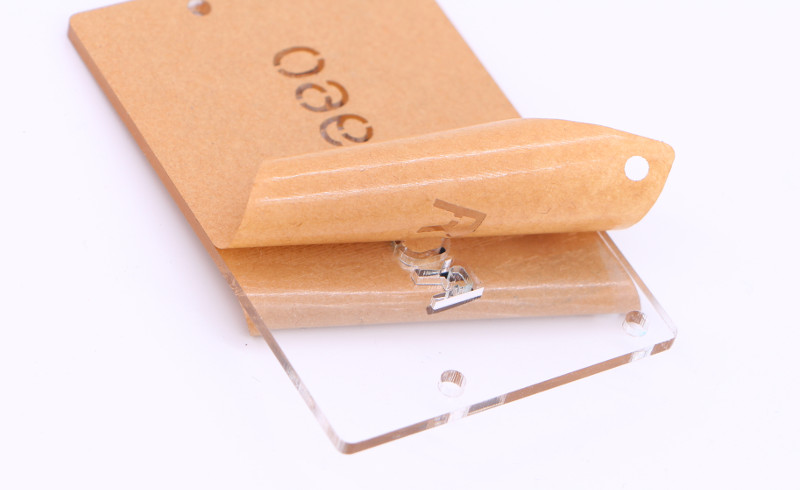
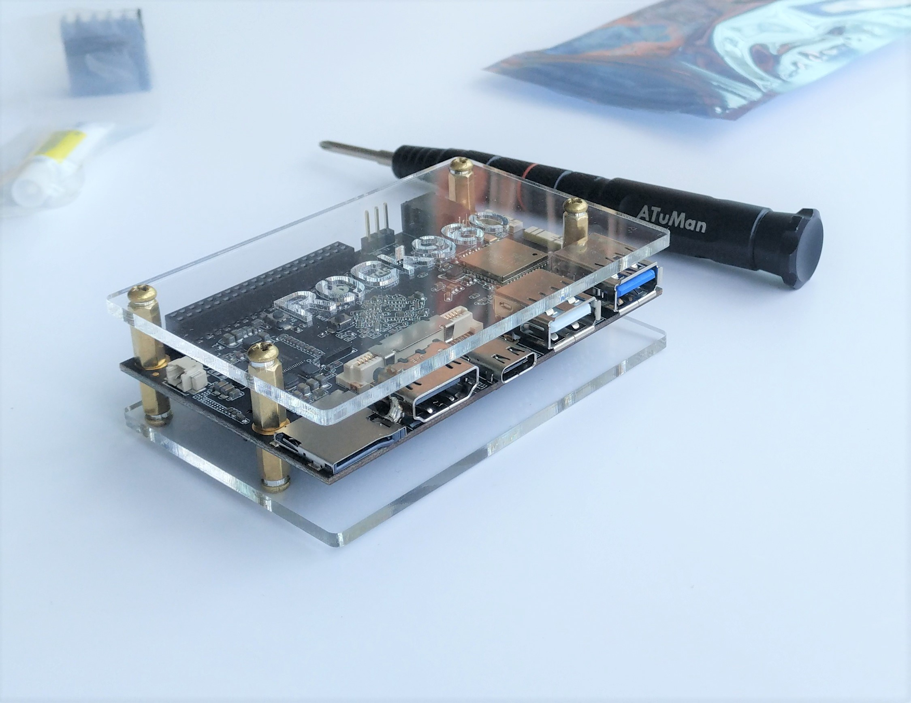

# Getting Started

Learn about your ROCK960 board as well as how to prepare and set up for basic use.

## Setup - What you will need

**Need**
- [ROCK960](https://www.96boards.org/product/rock960/) standard package
   - ROCK960 boards and other accessories
- Power adapter
   - 96Boards specifications requires a 8V-18V with 2000mA Power adapter, included in the standard package
- USB Keyboard and Mouse
   - With two USB-A connectors, all 96Boards can be equiped with a full sized keyboard and mouse
- Monitor and HDMI Cable
   - All 96Boards are equiped with a full sized HDMI connector, HDMI capable monitor is recommended

**Optional**
- MicroSD card with adapter
   - For quick and easy switching between operating systems and extra storage
- Mezzanine Products
   - These devices allow you to expand your experience with any 96Boards by adding peripherals and enhancing onboard components
- USB type A to type C cable
   - This is needed for fastboot/adb commands
- USB to TTL serial cable
   - This is needed for serial console
- USB to ethernet adapter and ethernet cable
   - For connecting to a network without using WiFi

***

# Out of the Box

The standard ROCK960 packages contains the follow:

* Main board
* 12V/2A power adapter
* Transparent acrylic case
* Screws(M3)
* Heatsink(22mm x 22mm)
* Heatsink Plaster

The following subsections describe how to get started with the ROCK960 using the release build shipped with the boards. The ROCK960 board is ready to use “out of the box” with a preinstalled version of the Debian Linux distribution.

## Close look of ROCK960

## Assemble the case

The package comes with a simple acrylic case, assemble it first:

1. Remvoe the protecting film of the acrylic case:

2. Assemble the case and screws with screwer, finished as below:

3. Glue the heatsink with Heatsink Plaster at the bottom side:

## Features

| Component           | Description                              |
| :------------------ | :--------------------------------------- |
| SoC                 | Rockchip RK3399                          |
| CPU                 | ARM Cortex-A72 Dual-core up to 1.8GHz + Cortex A53 Quad-core up to 1.4GHz |
| GPU                 | ARM Mali T860MP4                         |
| RAM                 | 2GB or 4GB LPDDR3 @ 1866MHz              |
| PMU                 | RK805                                    |
| Storage             | 16/32GB eMMC 5.1                         |
| Ethernet Port       | USB 2.0/3.0 expansion                    |
| Wireless            | WLAN 802.11 ac/a/b/g/n, 2xMIMO, 2.4GHz and 5Ghz, _Bluetooth_® wireless technology 4.2. On board WLAN/BT antennas. |
| USB                 | 1 x USB 3.0 type A and 1 x USB 2.0 type A (host mode only) and 1 x USB 3.0 type C OTG |
| Display             | 1 x HDMI 2.0(Type A - full) up to 4Kx2K@60Hz, 1 x 4L - MIPI DSI up to 1080p@60Hz, 1 x DP 1.2(Type C) up to 4Kx2K@60 |
| Video               | Inside decoder: H.264 10bit up to HP level 5.1 - 2160p@60fps (4096x2304), VP9 - 2160p@60fps(4096x2304), H.265/HEVC 10bit - 2160p@60fps(4096x2304),  MPEG-1, MPEG-2, MPEG-4, H.263, VP8, VC-1. |
| Audio               | HDMI output                              |
| Camera              | 2 x 4-lane MIPI CSI                      |
| Expansion Interface | 40 pin low speed expansion connector: +1.8V, +5V, DC power, GND, 2UART, 2I2C, SPI, I2S, 12xGPIO and 60 pin high speed expansion connector: 4L-MIPI DSI, I2C x2, SPI (48M), USB 2.0, 2L+4LMIPI CSI |
| LED                 | 1 x WiFi activity LED（Yellow), 1 x BT activity LED (Blue) and 4 x User LEDs (Green) |
| Button              | Reset button, recovery button            |
| Power Source        | Recommend a 12V@2A adapter with a DC plug which has a 4.75mm outer diameter and 1.7mm center pin with standard center-positive (EIAJ-3 Compliant) |
| OS Support          | AOSP/Debian/Ubuntu/Fedora/LibreELEC/Lakka/FlintOS |
| Size                | 85mm x 55mm                              |

Please visit the [ROCK960 Hardware User Manual](../hardware-docs/hardware-user-manual.md) for more information

**IMPORTANT NOTES**

- HDMI EDID display data is used to determine the best display resolution. On monitors and TVs that support 1080p (or 4K) this resolution will be selected. If 1080p is not supported the next available resolution reported by EDID will be used. This selected mode will work with **MOST but not all** monitors/TVs.

***

## Starting the board for the first time

**The ROCK960 comes preloaded with Android 7.1 and can be up and running with a few simple steps:**

- Connect the ROCK960 to your display with the HDMI cable. Ensure that the source for the display is switched to the HDMI port you are using.
- Connect the USB keyboard and mouse.
- Connect the power supply to the ROCK960. The board will begin to boot Android 7.1 immediately

***

## What's Next?

If you are already familiar with the ROCK960 board and would like to change out the stock operating system, please proceed to one of the following pages:

- [Downloads page](../../downloads): This page lists all Linaro and 3rd party operating systems available for ROCK960
- [Installation page](../../installation): If you already have the images you need, this page has information on how to install the different operating systems onto your ROCK960 board
- [Troubleshooting](../../support)
   - From bug reports and current issues, to forum access and other useful resources, we want to help you find answers

Back to the [ROCK960 documentation home page](../)
Back to the [ROCK Family documentation home page](../../)
***
