# Getting Started

Learn about your ROCK960 Model C board as well as how to prepare and set up for basic use.

## Setup - What you will need

**Need**
- [[ROCK960 Model C](https://www.96boards.org/product/rock960/) main board]
   - The board itself
- [Power adapter]
   - 96Boards specifications requires a 8V-18V with 2000mA Power adapter
- USB Keyboard and Mouse
   - With two USB-A connectors, all 96Boards can be equiped with a full sized keyboard and mouse
- Monitor and HDMI Cable
   - All 96Boards are equiped with a full sized HDMI connector, HDMI capable monitor is recommended
- MicroSD Card Reader
   - For flashing the image into uSD card or eMMC module.
- One of the Storage media below:
   - uSD card larger than 8GB
     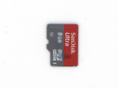

     or

   - eMMC module **and** eMMC-to-uSD adapter board
     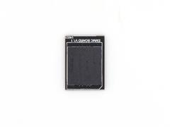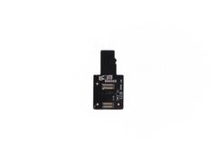

**Optional**
- [Acrylic Case]
   - For protecting the board
- [Heatsink with glue]
   - For better heat dispatching
- Mezzanine Products.
   - These devices allow you to expand your experience with any 96Boards by adding peripherals and enhancing onboard components
- USB type A to type A cable
   - This is used for Android fastboot/adb commands
- USB to TTL serial cable
   - This is needed for low level u-boot/kernel serial console
- USB to ethernet adapter and ethernet cable
   - For connecting to a network without using WiFi

**Note:**
Items in [bracket] are included in the ROCK960 Model C Standard Package.

***

# Out of the Box

The standard ROCK960 Model C packages contains the follow:

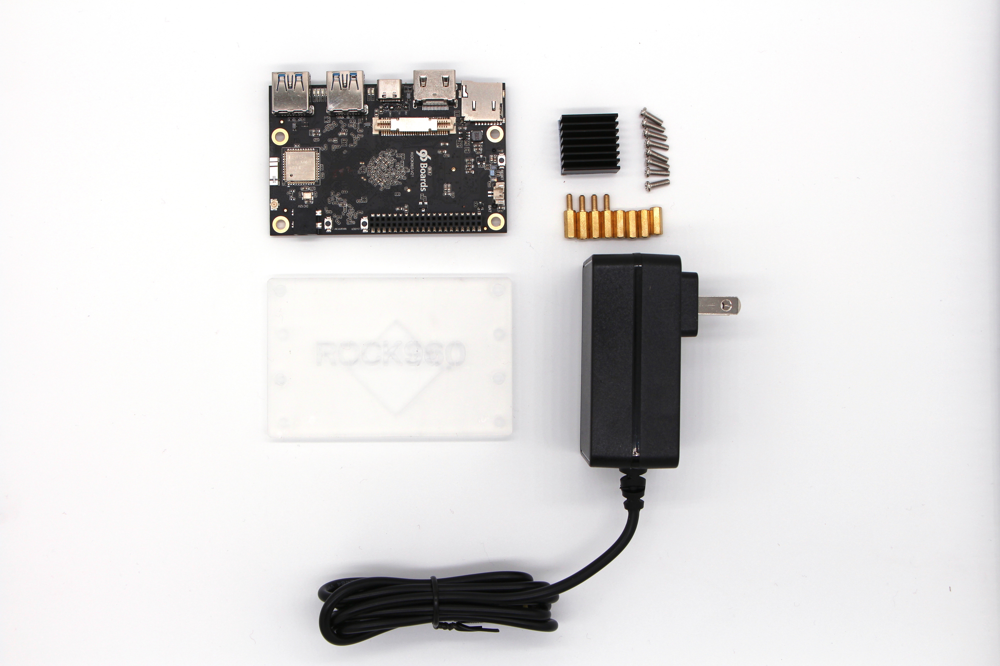

* Main board with eMMC module
* 12V/2A power adapter
* Transparent acrylic case
* Screws(M3)
* Heatsink(22mm x 22mm)
* Heatsink Plaster

The following subsections describe how to get started with the ROCK960 Model C using the release build downloaded from the 96boards website. You need to install the OS image on ROCK960 Model C board to start to use it.

## Close look of ROCK960 Module C

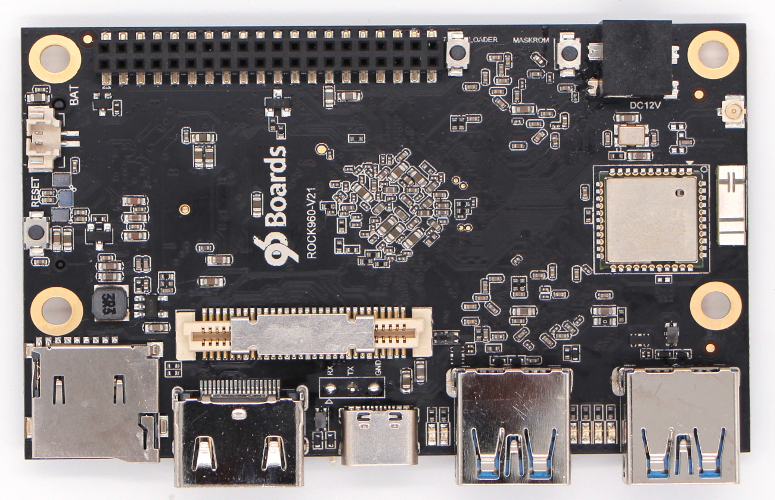

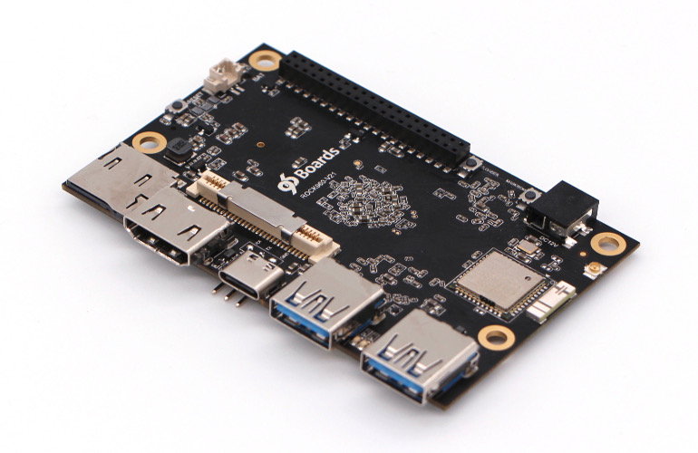

## Assemble the case

The package comes with a simple acrylic case, assemble it first:

1. Assemble the case and screws with screwer, finished as below:
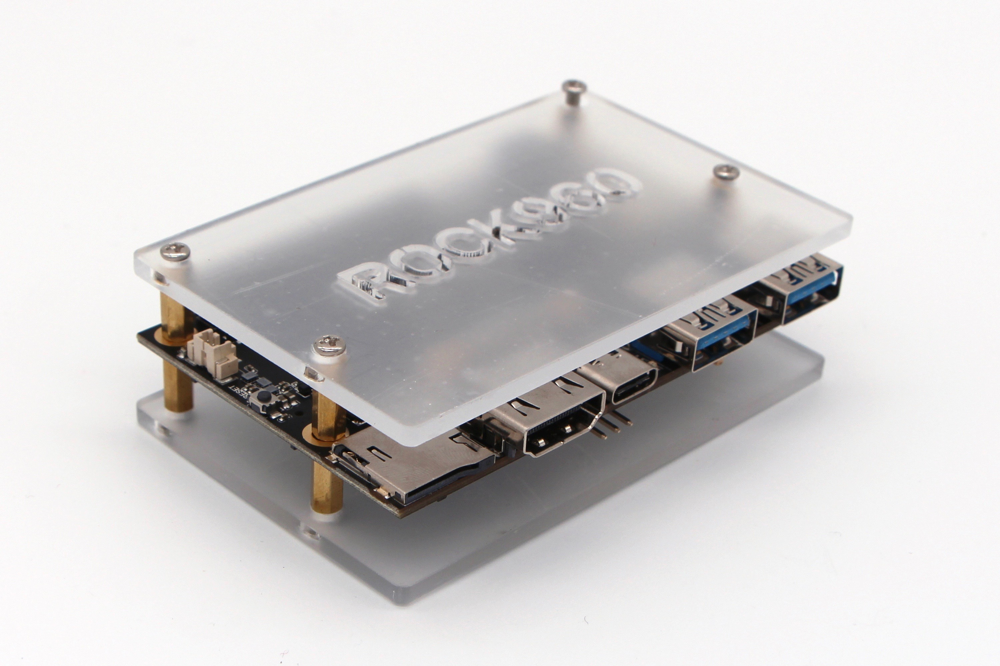

2. Glue the heatsink with Heatsink Plaster at the bottom side:
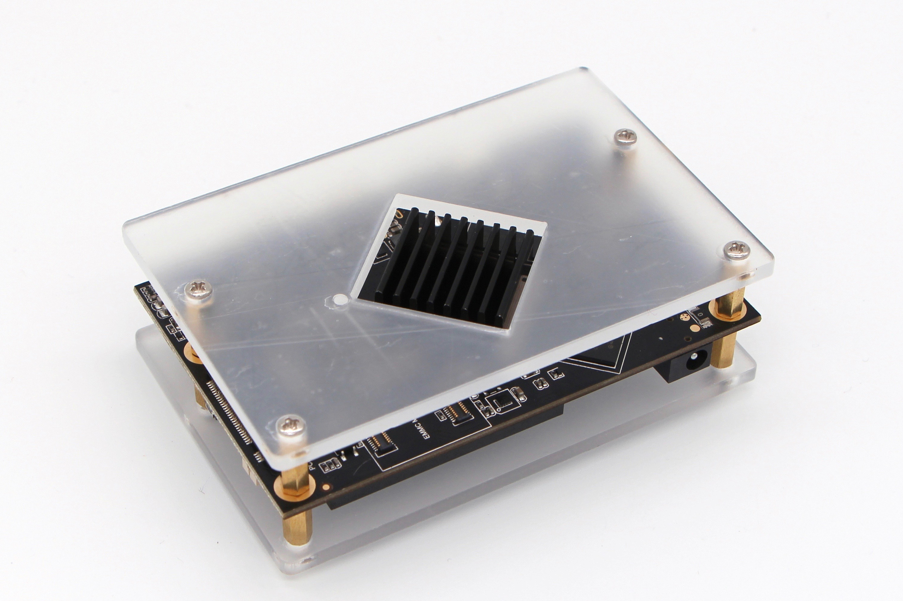

## Features

| Component           | Description                                                  |
| :------------------ | :----------------------------------------------------------- |
| SoC                 | Rockchip RK3399                                              |
| CPU                 | ARM Cortex-A72 Dual-core up to 1.8GHz + Cortex A53 Quad-core up to 1.4GHz |
| GPU                 | ARM Mali T860MP4                                             |
| RAM                 | 1GB or 2GB or 4GB LPDDR4, 3200Mb/s                           |
| PMU                 | RK808-D                                                      |
| Storage             | Reserve eMMC  socket on board, optional eMMC module up to 128GB, uSD card up to 128GB |
| Ethernet Port       | USB 2.0/3.0 expansion                                        |
| Wireless            | WLAN 802.11 ac/a/b/g/n, 2.4GHz and 5Ghz, _Bluetooth_® wireless technology 4.2. On board WLAN/BT antennas, optional IPEX antenna. |
| USB                 | 1 x USB 3.0 host type A, 1 x USB 3.0 OTG type A and 1 x USB 2.0 type C(host only) |
| Display             | 1 x HDMI 2.0(Type A - full) up to 4Kx2K@60Hz, 1 x 4L - MIPI DSI up to 1080p@60Hz |
| Video               | Inside decoder: H.264 10bit up to HP level 5.1 - 2160p@60fps (4096x2304), VP9 - 2160p@60fps(4096x2304), H.265/HEVC 10bit - 2160p@60fps(4096x2304),  MPEG-1, MPEG-2, MPEG-4, H.263, VP8, VC-1. |
| Audio               | HDMI output                                                  |
| Camera              | 1 x 4-lane MIPI CSI, 1 x 2-lane MIPI CSI                     |
| Expansion Interface | 40 pin low speed expansion connector: +1.8V, +5V, DC power, GND, 2UART, 2I2C, SPI, I2S, 12xGPIO and 60 pin high speed expansion connector: 4L-MIPI DSI, I2C x2, SPI (48M), USB 2.0, 2L+4LMIPI CSI |
| LED                 | 1 x WiFi activity LED（Yellow), 1 x BT activity LED (Blue) and 4 x User LEDs (Green) |
| Button              | Reset button, Maskrom button, Loader button                  |
| Power Source        | Recommend a 12V@2A adapter with a DC plug which has a 4.75mm outer diameter and 1.7mm center pin with standard center-positive (EIAJ-3 Compliant) |
| OS Support          | AOSP/Debian/Ubuntu/Fedora/LibreELEC/Lakka/FlintOS            |
| Size                | 85mm x 55mm                                                  |

Please visit the [ROCK960 Model C Hardware User Manual](../hardware-docs/hardware-user-manual.md) for more information

**IMPORTANT NOTES**

- HDMI EDID display data is used to determine the best display resolution. On monitors and TVs that support 1080p (or 4K) this resolution will be selected. If 1080p is not supported the next available resolution reported by EDID will be used. This selected mode will work with **MOST but not all** monitors/TVs.

***

## Starting the board for the first time

**You will be presented with two options when installing your new operating system onto your ROCK960 Model C, eMMC module and uSD card.** eMMC module is faster and longer life time but it's vendor specific, MicroSD card is slower but more accessible.

### Prepare

#### Running on eMMC Module Method.

- Insert eMMC Module into eMMC-to-uSD adapter. Insert the adapter board into MicroSD Card Reader, which connects to host computer. Shown as picture below:

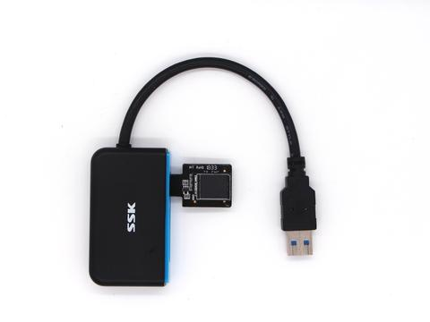

#### Running on MicroSD Card Method.

- Insert the MicroSD Card into MicroSD Card Reader, which connects to host computer. Shown as picture below:

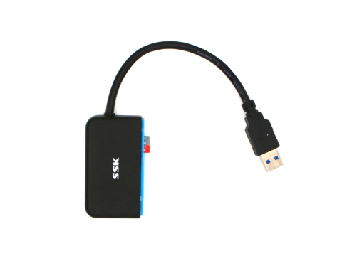

### Download Image and tools

- Go to [Downloads page](../../downloads): This page lists all Linaro and 3rd party operating systems available for ROCK960 Model C. Choose an Image to download and unzip it.

- Download the flash tool, [Etcher](https://etcher.io). Choose the right version for your host operation system. Here we take Ubuntu as an example, other host OS are similar.
  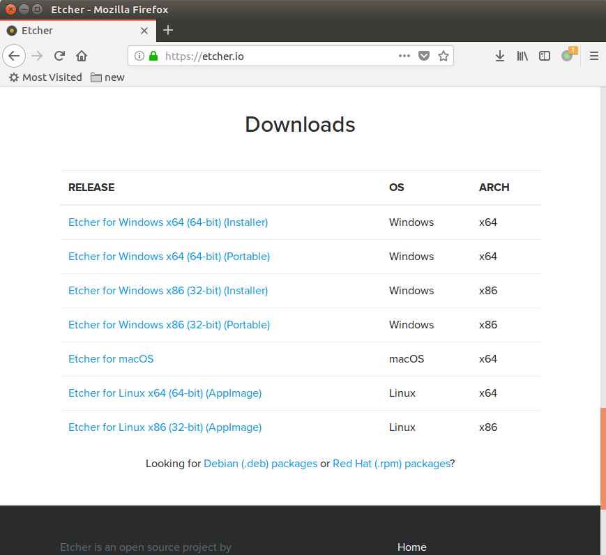

### Write Image

- Find the Etcher app, open it.
  

- In the Etcher window, we click button "Select image", and choose the image we just unzipped. The image extension should be **.img**.
  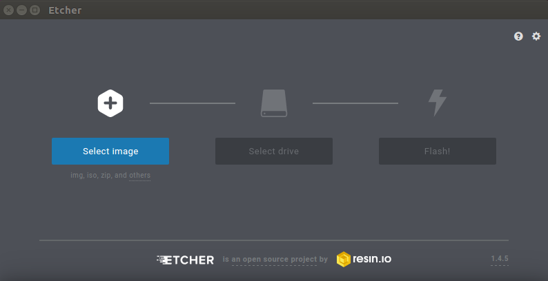

- In the Etcher window, we click button "Select Drive".
  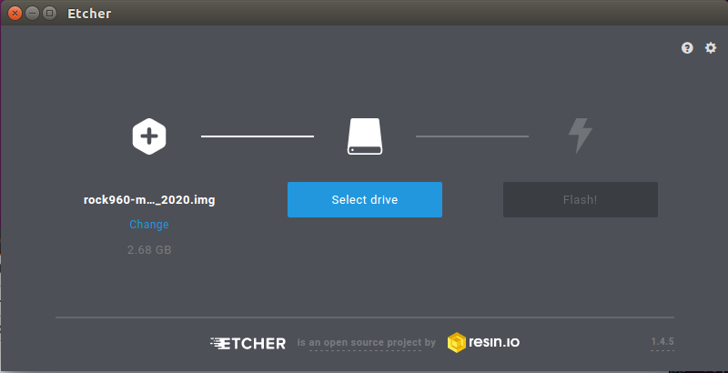

- In the Etcher window, we click button "Flash".
  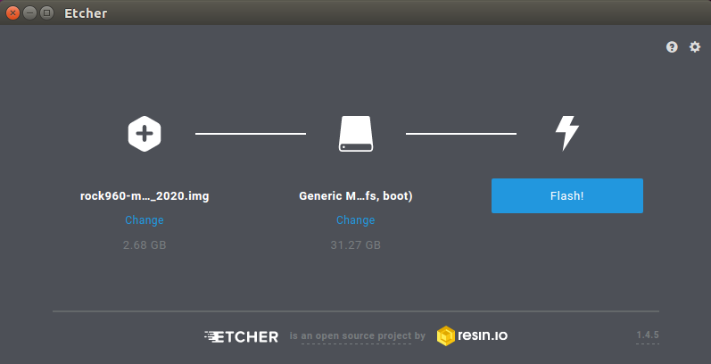

- In the Etcher window, it shows us Flash Complete!
  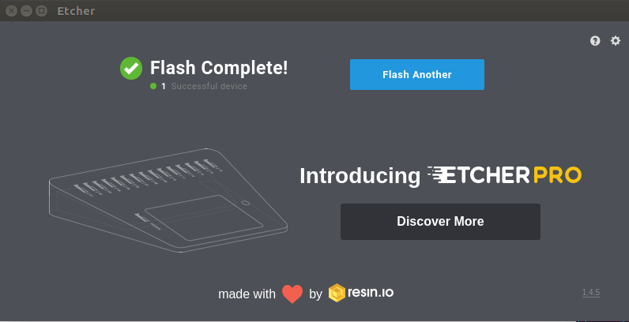

- Now unplug the card reader from host PC, and remove eMMC module or MicroSD card.

### Boot

#### Running on eMMC Module

- Now insert eMMC module with firmware inside into the socket on board. The picture below shows. Make sure the eMMC module orientation is same as blow.
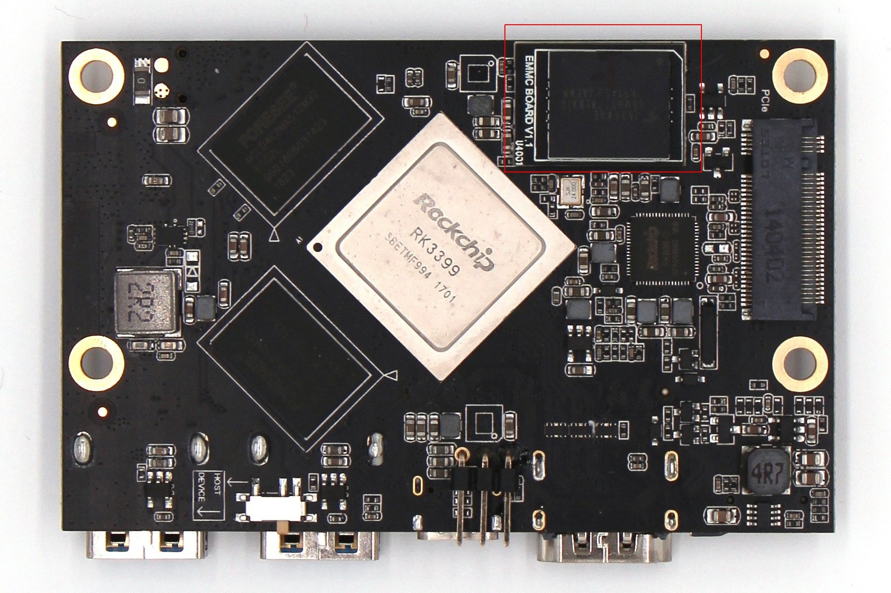

#### Running on MicroSD Card

- Now insert MicroSD Card with firmware inside into the MicroSD card slot on board. The picture below shows.
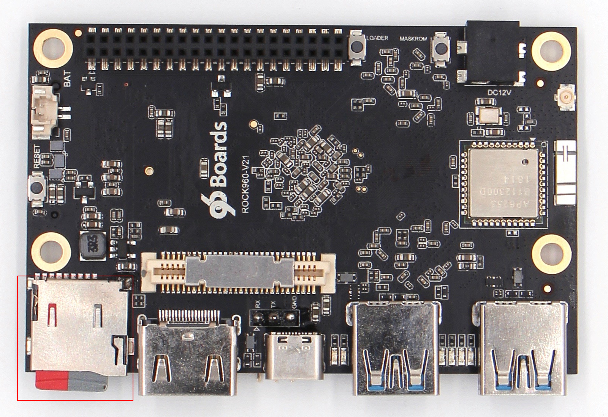

- Connect the ROCK960 Model C to your display with the HDMI cable. Ensure that the source for the display is switched to the HDMI port you are using.
- Connect the USB keyboard and mouse.
- Connect the power supply to the ROCK960 Model C. The board will begin to immediately.

***

## What's Next?

- [Downloads page](../../downloads): This page lists all Linaro and 3rd party operating systems available for ROCK960 Model C. Try alternative images for ROCK960 Model C.

- [Installation page](../../installation): This page lists other installation method for ROCK960 Model C.
- [Userful Guide page](../../guides): This page lists some useful guide of using ROCK960 Model C.
- [Troubleshooting](../../support)
   - From bug reports and current issues, to forum access and other useful resources, we want to help you find answers

Back to the [ROCK960 documentation home page](../)
Back to the [ROCK Family documentation home page](../../)

***
