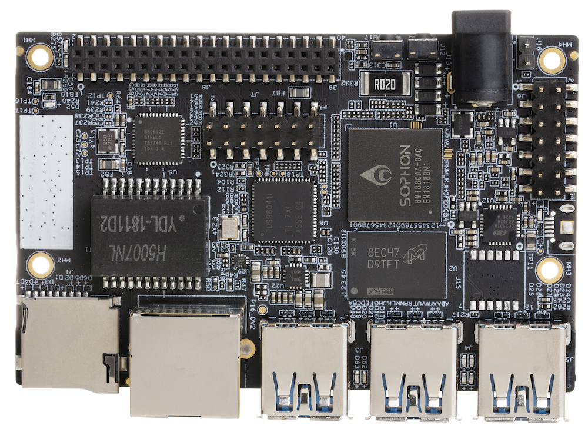
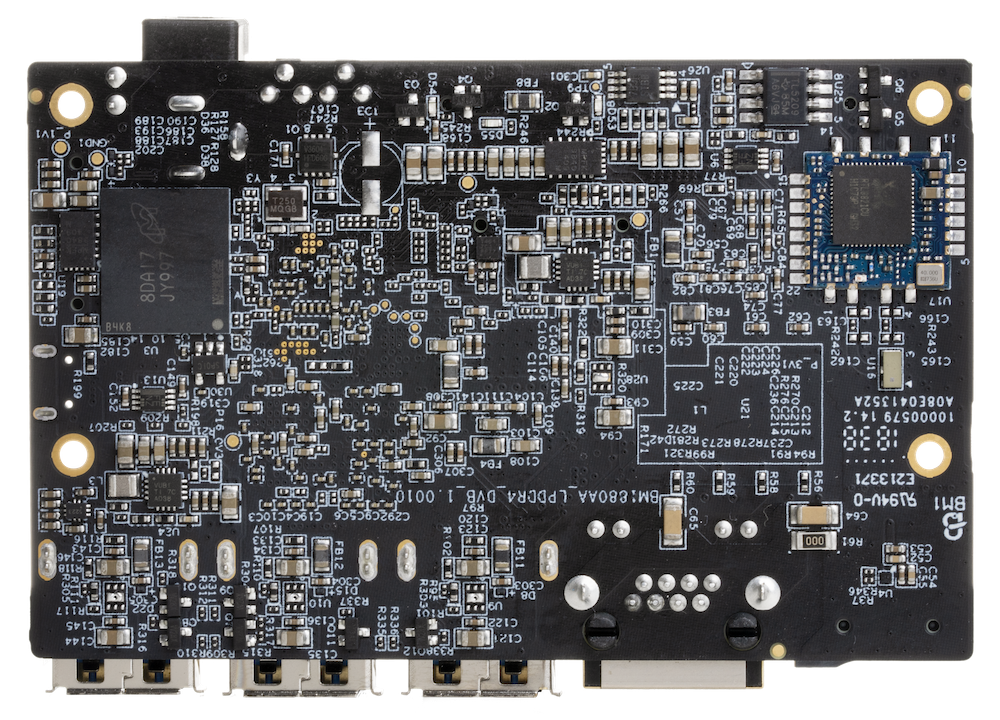

# Getting Started

Learn about your Sophon Edge board as well as how to prepare and set up for basic use

[Skip to Sophon Edge Getting Started Manual](https://sophon-edge.gitbook.io/project/overview/edge-tpu-developer-board)

## Setup - What you will need

**Need**

- [Sophon Edge](https://www.96boards.org/)
   - Board based on Sophon BM1880
- Power adapter
   - 12V @ 2A AC/DC converter compatible with the 96Boards specification

***

# Out of the Box

The following subsections describe how to get started with the Sophon Edge using the release build shipped with your board.

## Features

|   Component          |   Description                                                                                    |
|:---------------------|:-------------------------------------------------------------------------------------------------|
| Processor            | Sophon BM1880                                                                                    |
| System Memory        | LPDDR4 1GB @ 3200Mhz                                                                             |
| Flash Memory         | 8GB eMMC + micro SD card slot                                                                    |
| Connectivity         | Gigabit Ethernet(RJ-45), Wifi, _Bluetooth_® wireless technology                                                         |
| USB                  | USB 3.0 x 3 (support camera, U- disk..etc)                                                       |
| I/O Expansion        | 40-pin 96Boards low-speed expansion header                                                       |
| Audio                | I2S x 2 (included in 40-pin header)                                                              |
| H.264 decoder, MJPEG encoder/decoder | 1x 1080p @60fps or 2x 1080p @30fps H.264 decoder, 75fps for FHD images           |
| Power                | 12V@2A                                                                                           |
| OS                   | Linux                                                                                            |
| Dimensions           | 85mm x 54mm                                                                                      |

**NOTE:** Many compliance items for this board were waived due to the nature of the chipset being used and the uniqueness of the board. The Edge BM1880 TPU ASIC accels in its AI and deep learning abilities, for this reason, the following items were waived in order to accomodate the Sophon Edge into the 96Boards ecosystem:

- Instead of OTG or C port near center of board, the two host ports are pushed into the center, and it uses a 3.0 A port as OTG.
- Does not have any display output capability.
- Does not have high speed connector.
- Ethernet port exeeds component maximum height limit of 6.5mm.

***

## Starting the board for the first time

To start the Edge board, follow these steps:

- Step1. Make sure that the boot switches SW1 is configured as “110”(boot from USB)
- Step2. Connector USB cable to UART port (Micro USB)
- Step3. Connector power adaptor to DC JACK

Once the board powers up, the boot information will be printed on the UART terminal. Please note, the first boot will take few minutes due to intializaiton.

***

## What's Next?

If you are already familiar with the Sophon Edge and would like to change out the stock operating system, please proceed to one of the following pages:

- [Downloads page](../downloads): This page lists all Linaro and 3rd party operating systems available for the Sophon Edge
- [Installation page](../installation): If you already have the images you need, this page has information on how to install the different operating systems onto your Sophon Edge
- [Guides](../guides/)
- [Support](../support)
   - From bug reports and current issues, to forum access and other useful resources, we want to help you find answers

Back to the [Sophon Edge documentation home page](../)

***
