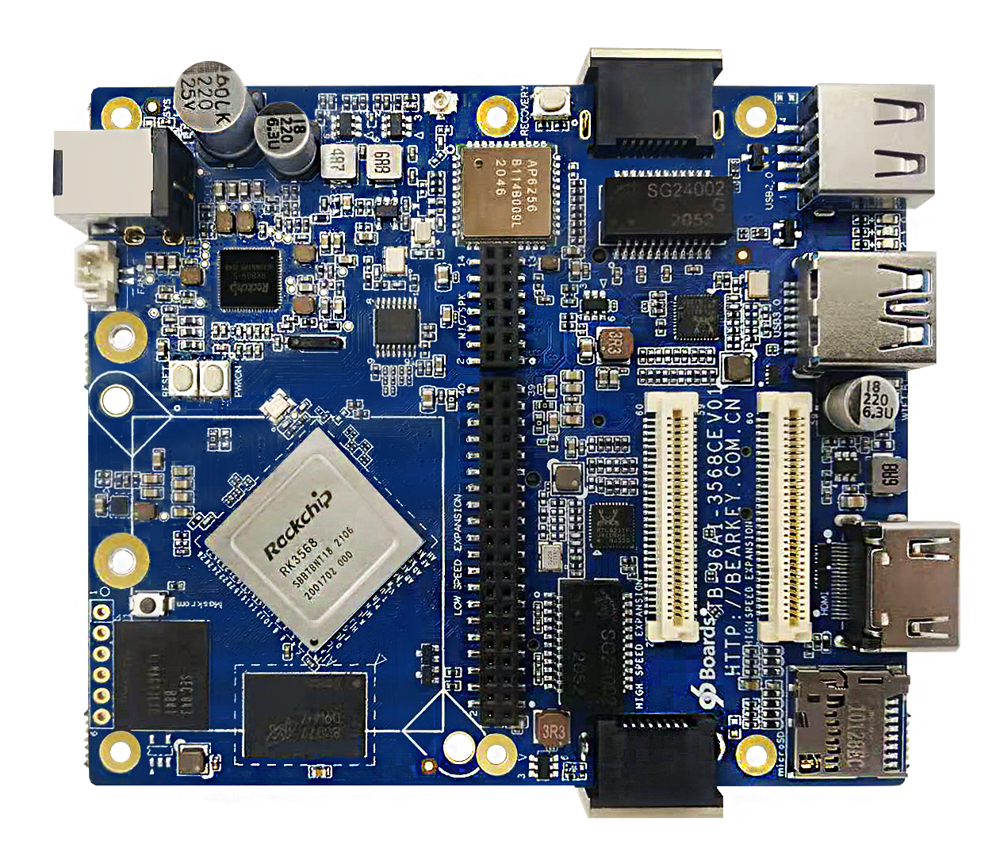
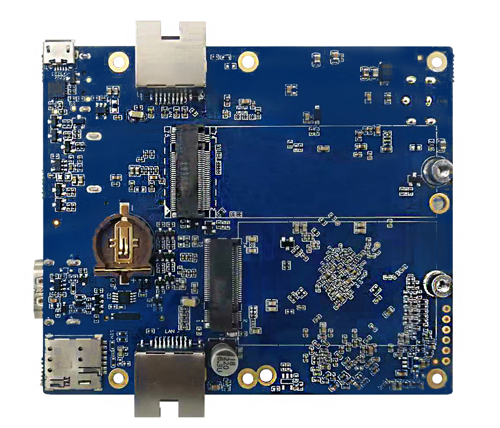

# Getting Started

Learn about your TB-96AI-3586CE board as well as how to prepare and set up for basic use

## Setup - What you will need

**Required**
- TB-96AI-3586CE development board
- Power adapter
   - 96Boards specification requires a 12V with 2500mA power adapter

**Optional**
- HDMI Display
- USB Keyboard and Mouse

***

# Out of the Box

In the Box you can find the TB-96AI-3586CE comes with a pre-installed linux.

## Features

|   Component          |   Description |
|:---------------------|:--------------|
|  SoC                 | RK3568              |
|  CPU                 | 4x ARM®Cortex-A55 up to 2.0 GHz                                                      |
|  GPU                 | Mali-G52                                                                           |
|  RAM                 | 2048 Mbyte DDR3                                                                                                    |
|  Storage             | eMMC 16 Gbyte   microSD Socket: UHS-1 v3.01                           |
|  Ethernet Port       | 2x 10/100/1000 Mbit/s, IEEE 802.3 Compliant                                                                               |
|  Wireless            | WiFi: 5 GHz & 2.4GHz IEEE 802.11 a/b/g/n/ac   Bluetooth® v4.1   External Antenna                           |
|  USB                 | Host: 1x type A, 2.0 high-speed   OTG: 1x type A, 3.0 high-speed                                             |
|  Display             | HDMI 3.0                                                                                |
|  Audio               | Over HDMI                                                                                                              |
|  Expansion Interface | 96Boards Compliant:   40-Pin Low Speed Header   14-Pin Low Speed 2 Header   60-Pin High Speed Header    60-Pin High Speed 2 Header                                       |
|  LED                 | 4x green user controlled LEDs   1x blue Bluetooth enabled   1x yellow WiFi enabled |
|  Button              | Power, Reset & Recovery                                                                                                      |
|  Power Source        | DC Power Jack: 5.5mm*2.5mm Center Positive   8v - 18v upto 24W                                                           |
|  OS Support          | Linux: Debian & Buildroot   Android 11 |
|  Size                | 100mm x 85 mm                                                                                                            |
***

## Starting the board for the first time

This short guide leads you through the first steps to start exploring your TB-96AI-3586CE.

**Easy Setup Guide**

- USB cable to Dubug
   -  Connect the Micro-USB end of theUSB cable to the debug port andTypeA-USB to the computer host.
   -  Open the serial port tool of the host computer and apply the followingconfiguration:
      - baud rate: 1500000
      - Data bits: 8
      - Stop Bit: 1
      - Parity Check: NA
      - flow control: NA

- Connect HDMI cable (optional)
   - Connect one end of the HDMI cable tothe development board HDMI port andthe other end to a display that supports HDMI.

- Connect to Ethernet (optional)
   - Plug wired Ethernet into RJ45 ports ofthe development board.

- Connect mouse and keyboard (optional)
   -  Insert a USB mouse and USB keyboard to the USB port of the development board.
   - Mouse and keyboard to watch/track on HDMI display.

- Connect LTE module (optional)
   - Insert LTE/5G module into M.2 port
   - Insert SIM card at the same time

- Connect a USB-OTG cable (optional)
   - When firmware needs to be re flashed, plug micro USB port of USB data cable into USB OTG port of development board, and typea USB at the other end to computer host

- Connect DC12V power cord (power on)
   - Connect the 12V power plug, and when the power supply is connected, the development board starts automatically.

***

## Whats Next?

If you are already familiar with the TB-96AI-3586CE and would like to change out the stock operating system, please proceed to one of the following pages:

- [Downloads page](../downloads/): This page lists all Linaro and 3rd party operating systems available for the TB-96AI-3586CE
- [Installation page](../installation/): If you already have the images you need, this page has information on how to install the different operating systems onto your TB-96AI-3586CE
- [Board Recovery](../installation/board-recovery.md)
   - If at any time your board is having unexplainable issues, it is suggested to attempt a board recovery. These instructions will guide you through a succesfull board recovery.
- [Support](../support/)
   - From bug reports and current issues, to forum access and other useful resources, we want to help you find answers

Back to the [TB-96AI-3586CE documentation home page](../)

***
