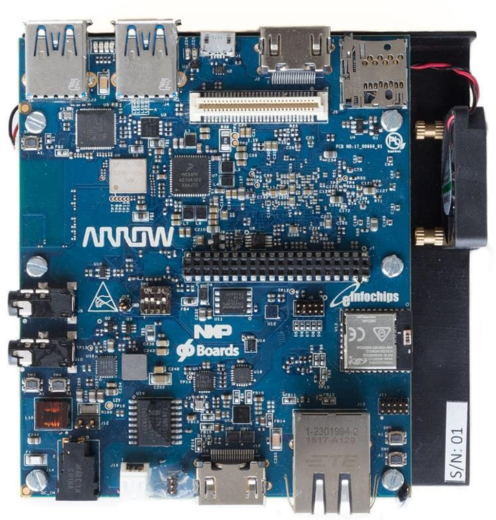
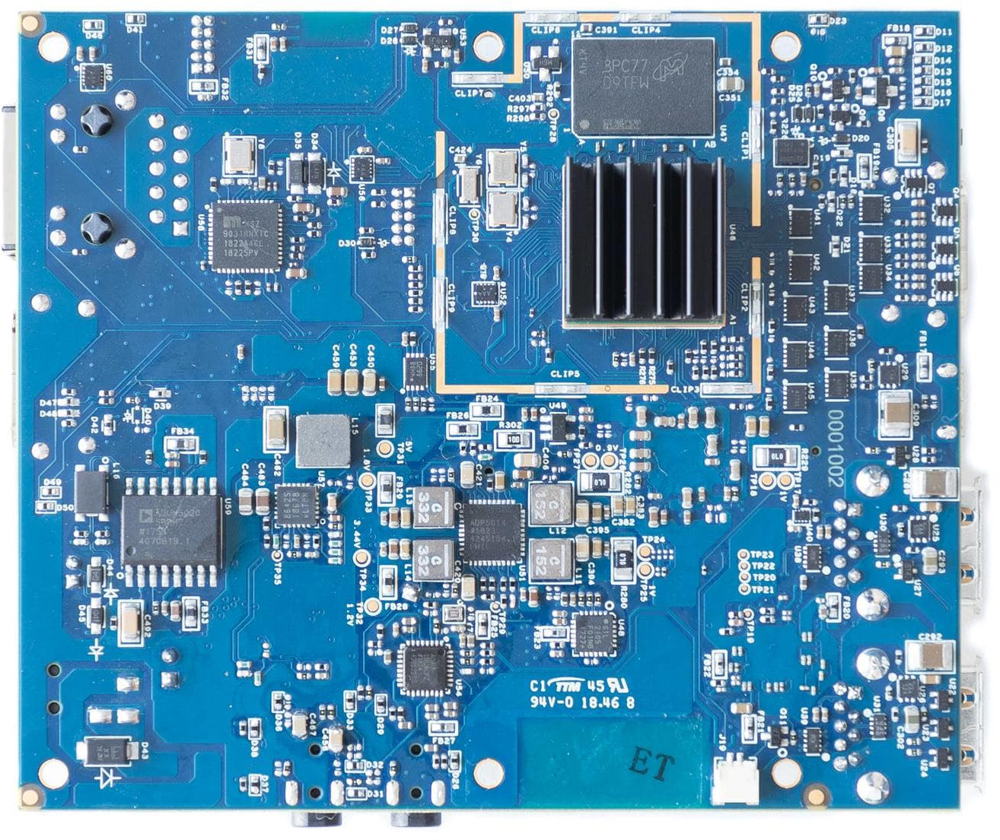

# Getting Started

Learn about your Thor96 board as well as how to prepare and set up for basic use

## Setup - What you will need

**Required**
- Thor96 development board
- Power adapter
   - 96Boards specification requires a 12V with 2500mA power adapter

**Optional**
- HDMI Display
- microSD Card
- USB Keyboard and Mouse

***

# Out of the Box

In the Box you can find the Thor96 as well as a microSD card which comes with a pre-installed linux.

## Features

|   Component          |   Description |
|:---------------------|:--------------|
|  SoC                 | e NXP i.MX 8M |
|  CPU                 | Arm Cortex-A53 Quad-Core 64-bit @ 1.5 GHz   Cortex-M4F Core @ 266MHz |
|  GPU                 | 1x 3D GPU Vivante® GC7000Lite |
|  RAM                 | 1 2-GB LPDDR4 @ 1,600 MHz Industrial Temp by Micron |
|  Storage             | microSD Socket: UHS-1 v3.01 |
|  Ethernet Port       | 10/100/1000 Mbit/s |
|  Wireless            | Cypress’ industry-leading 802.11ac Wi-Fi and Dual-Mode _Bluetooth_® wireless technology |
|  USB                 | Host: 2x USB Type-A 3.0   OTG: 1x type micro-AB, 2.0 high-speed |
|  Display             | HDMI Output and DSI to HDMI |
|  Expansion Interface | 96Boards Compliant:   40-Pin Low Speed Header   60-Pin High Speed Header                                         |
|  LED                 | 4x green user controlled LEDs   1x blue Bluetooth enabled   1x yellow WiFi enabled   1x red power supply okay |
|  Button              | Power and Reset                                                                                                        |
|  Power Source        | DC Power Jack: 1.65mm Center Positive   8v - 18v upto 24W                                                           |
|  Size                | 100 x 85 mm                                                                                                            |

***

## Starting the board for the first time

Coming Soon...

***

## Whats Next?

If you are already familiar with the Thor96 and would like to change out the stock operating system, please proceed to one of the following pages:

- [Downloads page](../downloads/): This page lists all Linaro and 3rd party operating systems available for the Thor96
- [Installation page](../installation/): If you already have the images you need, this page has information on how to install the different operating systems onto your Thor96
- [Board Recovery](../installation/board-recovery.md)
   - If at any time your board is having unexplainable issues, it is suggested to attempt a board recovery. These instructions will guide you through a succesfull board recovery.
- [Support](../support/)
   - From bug reports and current issues, to forum access and other useful resources, we want to help you find answers

Back to the [Thor96 documentation home page](../)

***
