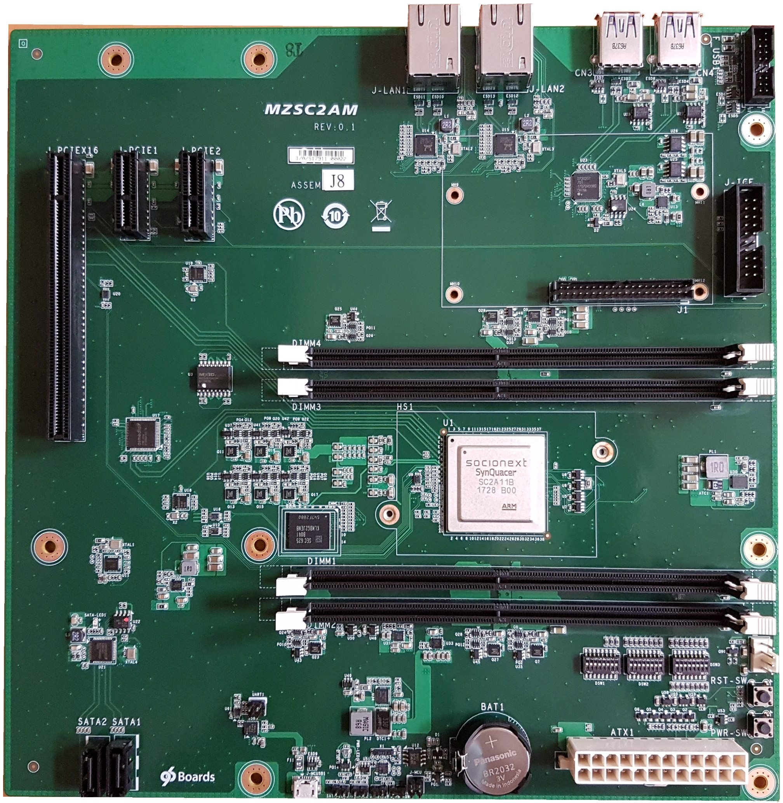
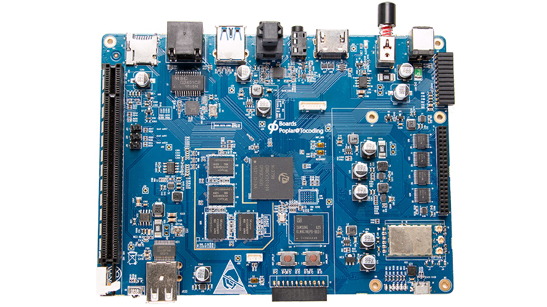

Welcome to the official documentation for 96Boards, this documentation is written by the 96Boards team at Linaro with community contribution and links to third party material.

Select your Enterprise Edition 96Boards device to access all product related resources

| 96Boards                                | About                                       | Options                                       |
|:---------------------------------------:|:-------------------------------------------:|:---------------------------------------------:|
|   **DeveloperBox** | Board based on Synquacer SC2A11 SoC                                           | [Documentation](developerbox/)           |
|   **Cello** | Board based on AMD Opteron A1100 Series SoC                                           | [Documentation](cello/)           |
|   **Poplar** | Board based on HiSilicon Hi3798C V200   | [Documentation](poplar/)           |
|   **Hoperun Poplar** | Board based on HiSilicon Hi3798C V200   | [Documentation](poplar-hoperun/)           |
|   **Oxalis** | Board Based on NXP  Layerscape LS1012A | [Documentation](oxalis/)           |

***
