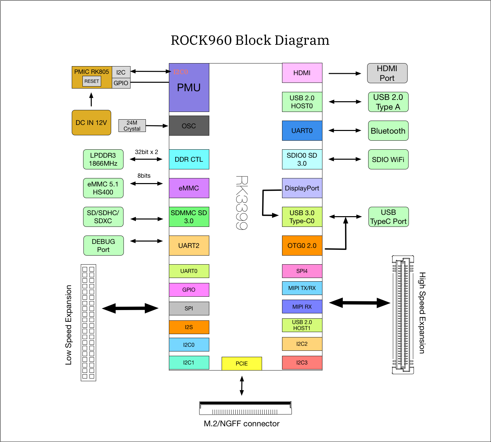
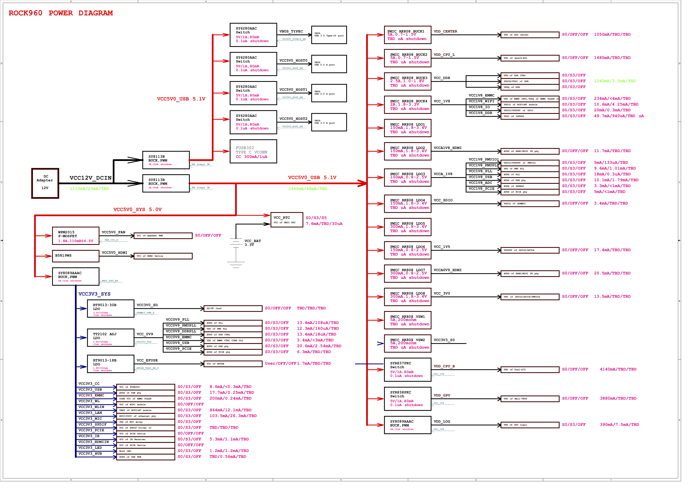

# ROCK960 Development Board User Manual

### Table of Contents
- [Table of Contents](#table-of-contents)
- [Introduction](#introduction)
- [What's in the Box](#whats-in-the-box)
- [Board Overview](#board-overview)
- [Key Components](#key-components)
- [System Block Diagram](#system-block-diagram)
- [Getting Started](#getting-started)
   - [Prerequisites](#prerequisites)
   - [Starting the board for the first time](#starting-the-board-for-the-first-time)
- [Component Details](#component-details)
   - [Processor](#processor)
   - [PMIC](#pmic)
   - [Memory (DRAM)](#memory-dram)
   - [Storage](#storage)
   - [Micro SDHC](#micro-sdhc)
   - [Boot ROM](#boot-rom)
   - [Networking](#networking)
   - [WiFi](#wifi)
   - [Bluetooth](#bluetooth)
   - [GPS](#gps)
   - [HDMI](#hdmi)
   - [MIPI-DSI](#mipi-dsi)
   - [Camera Interface](#camera-interface)
   - [USB Ports](#usb-ports)
   - [USB Host ports](#usb-host-ports)
   - [USB Device ports](#usb-device-ports)
   - [Audio](#audio)
   - [DC Power](#dc-power)
   - [Power Measurement](#power-measurement)
   - [External Fan Connection](#external-fan-connection)
   - [UART](#uart)
   - [Buttons](#buttons)
   - [LED Indicators](#led-indicators)
   - [Additional Functionality](#additional-functionality)
- [Expansion Connectors](#expansion-connectors)
   - [Low Speed Expansion Connector](#low-speed-expansion-connector)
   - [High Speed Expansion Connector](#high-speed-expansion-connector)
   - [Analog Expansion Connector](#analog-expansion-connector)
- [Power Management Overview](#power-management-overview)
   - [Block Diagram](#block-diagram)
   - [DC Power Input](#dc-power-input)
   - [Power Source Selection and Sequencing](#power-source-selection-and-sequencing)
   - [Voltage Rails](#voltage-rails)
- [Mechanical Specification](#mechanical-specification)

***

## Introduction

The ROCK960 Development Board is a 96Boards compliant community board based on Rockchip RK3399 platform.The following table lists its key features:

<!-- Commenting out as images are not available due to the board not being released yet

-->

| Component           | Description                              |
| :------------------ | :--------------------------------------- |
| SoC                 | Rockchip RK3399                          |
| CPU                 | ARM Cortex-A72 Dual-core up to 1.8GHz + Cortex A53 Quad-core up to 1.4GHz |
| GPU                 | ARM Mali T860MP4                         |
| RAM                 | 2GB or 4GB LPDDR3 @ 1866MHz              |
| PMU                 | RK805                                    |
| Storage             | 16/32GB eMMC 5.1                         |
| Ethernet Port       | USB 2.0/3.0 expansion                    |
| Wireless            | WLAN 802.11 ac/a/b/g/n, 2xMIMO, 2.4GHz and 5Ghz, _Bluetooth_® wireless technology 4.2. On board WLAN/BT antennas. |
| USB                 | 1 x USB 3.0 type A and 1 x USB 2.0 type A (host mode only) and 1 x USB 3.0 type C OTG |
| Display             | 1 x HDMI 2.0(Type A - full) up to 4Kx2K@60Hz, 1 x 4L - MIPI DSI up to 1080p@60Hz, 1 x DP 1.2(Type C) up to 4Kx2K@60 |
| Video               | Inside decoder: H.264 10bit up to HP level 5.1 - 2160p@60fps (4096x2304), VP9 - 2160p@60fps(4096x2304), H.265/HEVC 10bit - 2160p@60fps(4096x2304),  MPEG-1, MPEG-2, MPEG-4, H.263, VP8, VC-1. |
| Audio               | HDMI output                              |
| Camera              | 2 x 4-lane MIPI CSI                      |
| Expansion Interface | 40 pin low speed expansion connector: +1.8V, +5V, DC power, GND, 2UART, 2I2C, SPI, I2S, 12xGPIO and 60 pin high speed expansion connector: 4L-MIPI DSI, I2C x2, SPI (48M), USB 2.0, 2L+4LMIPI CSI |
| LED                 | 1 x WiFi activity LED（Yellow), 1 x BT activity LED (Blue) and 4 x User LEDs (Green) |
| Button              | Reset button, recovery button            |
| Power Source        | Recommend a 12V@2A adapter with a DC plug which has a 4.75mm outer diameter and 1.7mm center pin with standard center-positive (EIAJ-3 Compliant) |
| OS Support          | AOSP/Debian/Ubuntu/Fedora/LibreELEC/Lakka/FlintOS |
| Size                | 85mm x 55mm                              |

[Back to top]()

***

## What's in the Box

The standard ROCK960 packages contains the follow:

* Main board
* 12V/2A power adapter
* Transparent acrylic case
* Screws(M3)
* Heatsink(22mm x 22mm)
* Heatsink Plaster

[Back to top]()

***

## Board Overview

[Back to top]()

***

## System Block Diagram

[Back to top]()

***

## Getting Started

#### Prerequisites

Before you power up your ROCK960 Board for the first time you will need the following:

- ROCK960 Board, model A or model B.
- A 96Boards compliant power supply (sold separately).
- A HDMI or DVI LCD Monitor that supports a resolution of 720p/1080P/4K.
- HDMI-HDMI cable or HDMI-DVI cable to connect the board to the Monitor.
- A computer keyboard with USB interface.
- A computer mouse with USB interface.

#### Starting the board for the first time

To start the board, follow these simple steps:

1. Connect the HDMI cable to the ROCK960 Board HDMI connector and to the LCD Monitor.
2. Connect the keyboard to USB connector marked USB2.0 and the mouse to the USB connector marked USB3.0. (It doesn’t matter which order you connect them in.)
3. Plug the power supply into the power outlet.
4. The system will automatically boot when the power supply is connected.

[Back to top]()

***

## Component Details

### Processor

RK3399 is a low power, high performance processor for computing, personal mobile internet devices and digital multimedia devices; it integrates dual-core Cortex-A72 and quad-core Cortex-A53. RK3399 supports multi-format video decoders including H.264/H.265/VP9 up to 4Kx2K@60fps, especially, H.264/H.265 decoders support 10bits coding, and also supports H.264/MVC/VP8 encoders by 1080p@30fps, high-quality JPEG encoder/decoder, and special image preprocessor and postprocessor. RK3399 has high-performance dual channel external memory interface (2x32bit LPDDR3) capable of sustaining demanding memory bandwidths. Learn more at [RK3399 Product Page](http://www.rock-chips.com/a/en/products/RK33_Series/2016/0419/758.html).

### PMIC

The PMIC on ROCK960 is RK805, a companion PMIC for RK3399 by Rockchip.

The RK805 is a complete power supply solution for portable systems. The highly integrated device includes four buck DC-DC converters, three high performance ldos, I2C interface, programmable power sequencing and an RTC.

The RK805 improves performance, reduces component count and size, and therefore provides lower cost solution compared to conventional portable designs. The ultra fast 2MHz current mode DC/DC architecture optimizes the transient performance and is compatible with tiny low cost ceramic inductors and capacitors. All DC/DC channels include integrated MOSFETS. Internal soft-start and compensation circuits minimize external components count. Most outputs can be programmed through the I2C interface

The RK805 integrates internal RC oscillator for low cost application which without RTC function.

### Memory (DRAM)

The ROCK960 Board provides 2GB(model A) or 4GB(model B) LPDDR3-SDRAM which is a 2-channel and 32bit width bus implementation interfacing directly to the RK3399 build-in LPDDR controller. The maximum DDR clock is 933MHz. It's soldered on board and not replaceable.

### Storage

The ROCK960 Board provides an 16GB(model A) or 32GB(model B) EMMC which is compliant with EMMC 5.1.

### Micro SDHC

The ROCK960 Board SD slot signals are routed directly to the RK3399 SDIO interface. It meets the SD3.0 standard.

### Boot ROM

The ROCK960 Board can boot up from the EMMC or the Micro SD card. If a bootable Micro SD card is inserted, ROCK960 will boot from Micro SD card and ignore the EMMC. If the Micro SD card is not inserted or non-bootable(ie. as storage media). The ROCK960 will try to boot from EMMC. If there is no bootable image in EMMC, the board will go to Maskrom mode and wait for USB command from host.

### Networking

#### WiFi

The wifi/bt module used on ROCK960s is AP6356s from AMPAK Technology. The AP6356s module complies with IEEE 802.11 a/b/g/n/ac 2x2 MIMO standard and it can achieve up to a speed of 867Mbps with dual stream in 802.11n to connect the wireless LAN.

- 802.11a/b/g/n/ac dual-band radio with virtual-simultaneous dual-band operation
- Dual-stream spatial multiplexing up to 867 Mbps data rate
- Supports 20, 40, 80 MHz channels with optional SGI(256 QAM modulation)
- Supports IEEE 802.11 ac/n beam forming

The ROCK960 Board also has a RF connector to connect the external antenna or other RF device. If you want to use this function, you should change the 0ohm resistor directions besides the antenna.

#### Bluetooth

- Bluetooth specification V2.1+EDR, 3.0+HS and 4.1+HS compliant
- Integrated PA with 8dBm (class 1) transmit power
- Typical Rx sensitivity: GFSK -94dBm, DQPSK -93dBm, 8-DPSK -87.5dBm.

## Display Interface

### HDMI

RK3399 support HDMI 1.4 and 2.0, up to 10-bit depth color mode, up to 1080p at 120Hz and 4Kx2K at 60Hz HDTV display resolutions and up to QXGA graphic display resolutions.

### MIPI-DSI

- The 96Boards specification calls for a MIPI-DSI implementation via the High Speed Expansion Connector.
- The ROCK960 Board implements a 4-lane MIPI_DSI interface meeting this requirement. It can support up to FHD(1080p@60fps). The ROCK960 Board routes the MIPI_DSI interface signals to the MIPI_TX1/RX1 interface of the RK3399. The MIPI_TX1/RX1 can also be configured as MIPI CSI by software.

### Camera Interface

- The 96Boards specification calls for two camera interfaces.
- The ROCK960 Board supports two camera interfaces, one with a 4-lane MIPI_CSI interface and one with 2-lane MIPI_CSI interface, meeting this requirement. The 4-lane MIPI_CSI interface can support 13M camera.

### USB Ports

The RK3399 has two USB 3.0 OTG controller, two USB 2.0 HOST controller, the four USB controllers can work independently, they are implemented on ROCK960 as following:

### USB Host

- USB 3.0 OTG1 as USB 3.0 HOST Type A
- USB 2.0 HOST0 as USB 2.0 Type A
- USB 2.0 HOST1 on the high speed expansion header

### USB Type C ports

USB 3.0 OTG0 is implimented as USB Type C

The USB Type C port can work in device mode or host mode. For device mode, it can be used for download/flash the firmware or debugging such as adb. For host mode, it can connect the type c hubs and expand more USB ports or Ethernet or VGA/HDMI/DP.

> Note: the type C port can work in one mode at a time, Host mode or Device mode, not both.

### Audio

The ROCK960 Board has four audio ports: BT, HDMI, I2S and DP.

### DC Power

The ROCK960 Board can be powered by two ways:

- 8V to 18V supply from a dedicated DC jack
- 8V to 18V supply from the DC_IN pins on the Low Speed Expansion Connector

### Power Measurement

The current ROCK960 hardware revision(v1.0 and v1.1) has no current sense resistors.

### External Fan Connection

The 96Boards specification calls for support for an external fan. That can be achieved by using the 5V or the SYS_DCIN (12V), both present on the Low Speed Expansion connector.

### UART

The ROCK960 Board has three UART ports, two(UART3 and UART4) present on the Low Speed Expansion connector and one(UART2) has a dedicated 3 pin header.

- Each UART support up to 4Mbps or other special baud rate
- UART 3 is a full function UART supports auto flow control mode
- UART 2 is the default debug console and the default baud rate is 1.5Mbps. Check the [serial console debug](../guides/serial-console.md) for how to setup on PC.

### Buttons

The ROCK960 Board presents two buttons. They are Reset key and Maskrom key. The RESET signals are also routed to the Low Speed Expansion connector.

#### Reset Button

The button serves as the hardware reset button. short press and release the button,the system will be rebooted.

#### Maskrom Button

The Maskrom Button is for firmware flash/upgrade.

### LED Indicators

ROCK960 Board has six LEDs.

#### Two activity LEDs

- WiFi activity LED –The ROCK960 Board drives this Yellow LED via GPIO4_D5(GPIO number 1157), an IO from RK3399.
- BT activity LED –The ROCK960 Board drives this Blue LED via GPIO4_D6(GPIO number 1158), an IO from RK3399.

#### Four User LEDs

The four user LEDs are surface mount Green in 0603 size located between two USB type A ports. The ROCK960 Board drives the four LEDs from the RK3399 GPIO:

- LED1 : GPIO4_C2, GPIO number 1146
- LED2 : GPIO4_C6, GPIO number 1150
- LED3 : GPIO4_D0, GPIO number 1152
- LED4 : GPIO4_D4, GPIO number 1156

### Additional Functionality

The ROCK960 has an additional M.2 connector, which expose the 4 lanes PCIE 2.1 signal from RK3399, a M.2 SSD can be connected to add more storage.

[Back to top]()

***

## Expansion Connectors

### Low Speed Expansion Connector

< Add a table that maps the 96boards signals on the low-speed connector to the SoC signals. Mention the voltage level as a courtesy though they’re defined to be 1.8V in the spec. Add any notes as applicable on how to use the various outputs with relevant schematics >

The Low Speed Expansion Connector implements as following on ROCK960.

| ROCK960 Signals | 96Boards Signals | PIN  |  PIN | 96Boards Signals | ROCK960 Signals |
| :-------------- | :--------------- | :--- | ---: | ---------------: | --------------: |
| GND             | GND              | 1    |    2 |              GND |             GND |
| UART3_CTS       | UART0_CTS        | 3    |    4 |        PWR_BTN_N |    PMIC_POWERON |
| UART3_TX        | UART0_TxD        | 5    |    6 |        RST_BTN_N |         RESET_L |
| UART3_RX        | UART0_RxD        | 7    |    8 |        SPI0_SCLK |        SPI0_CLK |
| UART3_RTS       | UART0_RTS        | 9    |   10 |         SPI0_DIN |         SPI0_RX |
| UART4_TX        | UART1_TxD        | 11   |   12 |          SPI0_CS |         SPI0_CS |
| UART4_RX        | UART1_RxD        | 13   |   14 |        SPI0_DOUT |         SPI0_TX |
| I2C6_SCL        | I2C0_SCL         | 15   |   16 |           PCM_FS |    I2S0_LRCK_TX |
| I2C6_SDA        | I2C0_SDA         | 17   |   18 |          PCM_CLK |       I2S0_SCLK |
| I2C1_SCL        | I2C1_SCL         | 19   |   20 |           PCM_DO |       I2S0_SDO0 |
| I2C1_SDA        | I2C1_SDA         | 21   |   22 |           PCM_DI |       I2S0_SDI0 |
| GPIO0_A6        | GPIO-A           | 23   |   24 |           GPIO-B |        GPIO0_A2 |
| GPIO1_B1        | GPIO-C           | 25   |   26 |           GPIO-D |        GPIO1_B2 |
| GPIO3_D1        | GPIO-E           | 27   |   28 |           GPIO-F |        GPIO4_A0 |
| GPIO3_D4        | GPIO-G           | 29   |   30 |           GPIO-H |        GPIO4_A3 |
| GPIO3_D5        | GPIO-I           | 31   |   32 |           GPIO-J |        GPIO4_A4 |
| GPIO1_C2        | GPIO-K           | 33   |   34 |           GPIO-L |        GPIO1_C7 |
| VCC_1V8         | +1V8             | 35   |   36 |         SYS_DCIN |     VCC12V_DCIN |
| VCC5V0_SYS      | +5V              | 37   |   38 |         SYC_DCIN |     VCC12V_DCIN |
| GND             | GND              | 39   |   40 |              GND |             GND |

### UART {0/1}

- The 96Boards specifications calls for a 4-wire UART implementation, UART0 and an optimal second 2-wire UART, UART1 on the Low Speed Expansion Connector.
- The ROCK960 Board implements UART0 as a 4-wire UART that connects directly to the RK3399 SoC. These signals are driven at 1.8V.
- The ROCK960 Board implements UART1 as a 2-wire UART that connects directly to the RK3399 SoC. These signals are driven at 1.8V.

### I2C {0/1}

- The 96Boards specification calls for two I2C interfaces to be implemented on the Low Speed Expansion Connector.
- The ROCK960 Board implements both interfaces named I2C1 and I2C6. They connect directly to the RK3399 SoC.

### GPIO {A-L}

The 96Boards specification calls for 12 GPIO lines to be implemented on the Low Speed Expansion Connector. Some of these GPIOs may support alternate functions for DSI/CSI control

The ROCK960 board implements this requirement. All GPIOs are routed to the RK3399 SoC. Refer the Low Speed Expansion Connector table for GPIO A-L signals. The GPIO of RK3399 has following features:

- All of GPIOs can be used to generate interrupt to CPU
- GPIO0 and GPIO1 can be used to wakeup system from low-power mode
- The pull direction(pull-up or pull-down) for all of GPIOs are software-programmable
- All of GPIOs are always in input direction in default after power-on-reset
- The drive strength for all of GPIOs is software-programmable

### SPI 0

- The 96Boards specification calls for one SPI bus master to be provided on the Low Speed Expansion Connector.
- The ROCK960 Board implements a full SPI master with 4 wires, CLK, CS, MOSI and MISO. The signals are connected directly to the RK3399 SoC and driven at 1.8V.

### PCM/I2S

- The 96Boards specification calls for one PCM/I2S bus to be provided on the Low Speed Expansion Connector. The CLK, FS and DO signals are required while the DI is optional.
- The ROCK960 Board implements a PCM/I2S interface with 4 wires, CLK, FS, DO and DI. The signals are connected directly to the RK3399 SoC and driven at 1.8V.

### Power and Reset

- The 96Boards specification calls for a signal on the Low Speed Expansion Connector that can power on/off the board and a signal that serves as a board reset signal.
- The ROCK960 Board routes the PWR_BTN_N (named PMIC_PWRON on schematic) signal to the PWRON pin of the PMIC RK805. A mezzanine implementation of this signals should not drive it with any voltage, the only allowed operation is to force it to GND to start the board from a sleep mode.
- The ROCK960 Board routes the RST_BTN_N (named RESET_L on schematic) signal to the NRESPWRON pin of the PMIC RK805. This signal is also routes to SW2100, a push button for reset.

### Power Supplies

The 96Boards specification calls for three power rails to be present on the Low Speed Expansion Connector:
- +1.8V  Max of 100mA
- +5V  Provide a minimum of 5W of power (1A).

SYS_DCIN  8-18V input with enough current to support all the board functions or the output DCIN from on-board DC Connector able to provide a minimum of 7W of power.

The ROCK960 Board supports these requirements as follows:
- +1.8V  Driven by PMIC RK805 up to 2500mA.  It is the system main 1.8V power (VCC_1V8), and it can supply power up to 200mA to the Low Speed Expansion Connector.
- +5V  Driven by a 3A pwm buck converter (SY8113B). It also provides the VBUS power to the two USB host connectors and the HDMI 5V power to the HDMI connector. The remaining capacity provides a max current of 2A to the Low Speed Expansion Connector, for a total of 10W which meets the 96Boards requirements.

SYS_DCIN  Can serves as the board’s main power source or can receive power from the board.

[Back to top]()

***

## High Speed Expansion Connector

| ROCK960 Signals | 96Boards Signals  | PIN  |  PIN | 96Boards Signals |                            ROCK960 Signals |
| :-------------- | :---------------- | :--- | ---: | ---------------: | -----------------------------------------: |
| SPI4_TX         | SD_DAT0/SPI1_DOUT | 1    |    2 |          CSI0_C+ |                              MIPI_RX0_CLKP |
| NC              | SD_DAT1           | 3    |    4 |          CSI0_C- |                              MIPI_RX0_CLKN |
| NC              | SD_DAT2           | 5    |    6 |              GND |                                        GND |
| SPI4_CS         | SD_DAT3/SPI1_CS   | 7    |    8 |         CSI0_D0+ |                               MIPI_RX0_D0P |
| SPI4_CLK        | SD_SCLK/SPI1_SCLK | 9    |   10 |         CSI0_D0- |                               MIPI_RX0_D0N |
| SPI4_RX         | SD_CMD/SPI1_DIN   | 11   |   12 |              GND |                                        GND |
| GND             | GND               | 13   |   14 |         CSI0_D1+ |                               MIPI_RX0_D1P |
| MIPI_MCLK0      | CLK0/CSI0_MCLK    | 15   |   16 |        CCSI0_D1- |                               MIPI_RX0_D1N |
| MIPI_MCLK1      | CLK1/CSI1_MCLK    | 17   |   18 |              GND |                                        GND |
| GND             | GND               | 19   |   20 |         CSI0_D2+ |                               MIPI_RX0_D2P |
| MIPI_CLKP       | DSI_CLK+          | 21   |   22 |         CSI0_D2- |                               MIPI_RX0_D2N |
| MIPI_CLKN       | DSI_CLK-          | 23   |   24 |              GND |                                        GND |
| GND             | GND               | 25   |   26 |         CSI0_D3+ |                               MIPI_RX0_D3P |
| MIPI_D0P        | DSI_D0+           | 27   |   28 |         CSI0_D3- |                               MIPI_RX0_D3N |
| MIPI_D0N        | DSI_D0-           | 29   |   30 |              GND |                                        GND |
| GND             | GND               | 31   |   32 |         I2C2_SCL |                                   I2C2_SCL |
| MIPI_D1P        | DSI_D1+           | 33   |   34 |         I2C2_SCL |                                   I2C2_SDA |
| MIPI_D1N        | DSI_D1-           | 35   |   36 |         I2C3_SDA |                                   I2C7_SCL |
| GND             | GND               | 37   |   38 |         I2C3_SDA |                                   I2C7_SDA |
| MIPI_D2P        | DSI_D2+           | 39   |   40 |              GND |                                        GND |
| MIPI_D2N        | DSI_D2-           | 41   |   42 |         CSI1_D0+ |                                MIPI_TX_D0P |
| GND             | GND               | 43   |   44 |         CSI1_D0- |                                MIPI_TX_D0N |
| MIPI_D3P        | DSI_D3+           | 45   |   46 |              GND |                                        GND |
| MIPI_D3N        | DSI_D3-           | 47   |   48 |         CSI1_D1+ |                                MIPI_TX_D1P |
| GND             | GND               | 49   |   50 |         CSI1_D1- |                                MIPI_TX_D1N |
| HOST1_DP        | USB_D+            | 51   |   52 |              GND |                                        GND |
| HOST1_DM        | USB_D-            | 53   |   54 |          CSI1_C+ |                               MIPI_TX_CLKP |
| GND             | GND               | 55   |   56 |          CSI1_C- |                               MIPI_TX_CLKN |
| NC              | HSIC_STR          | 57   |   58 |              GND |                                        GND |
| NC              | HSIC_DATA         | 59   |   60 |         RESERVED | Pull-up  to VIO18_PMU via 100K resistor |

### MIPI DSI 0

- The 96Boards specification calls for a MIPI-DSI to be present on the High Speed Expansion Connector. A minimum of one lane is required and up to four lanes can be accommodated on the connector.
- The ROCK960 Board implementation supports a full four lane (1.2Gbps/lane) MIPI-DSI interface that is routed to the High Speed Expansion Connector. The MIPI-DSI signals are directly connected to MIPI TX/RX of RK3399.

### MIPI CSI {0/1}

- The 96Boards specification calls for two MIPI-CSI interfaces to be present on the High Speed Expansion Connector. Both interfaces are optional. CSI0 interface can be up to four lanes while CSI1 is up to two lanes.
- The ROCK960 Board implementation supports a full four lane MIPI-CSI interface on CSI0 and two lanes of MIPI-CSI on CSI1. All MIPI-CSI signals are routed directly to/from the RK3399 SoC.  CSI0 can support up to 13M@30fps and CSI1 can support up to 8M@30fps. The max data rate of each lane is 2.5Gbps.

### I2C {2/3}

- The 96Boards specification calls for two I2C interfaces to be present on the High Speed Expansion Connector. Both interfaces are optional unless a MIPI-CSI interface has been implemented. Then an I2C interface shall be implemented.
- The ROCK960 Board implementation supports two MIPI-CSI interfaces and therefore must support two I2C interfaces. For MIPI-CSI0 the companion I2C2 is routed directly from the RK3399 SoC. For MIPI-CSI1, the companion I2C is I2C3. Each of the I2C line's pull up can be set from RK3399 internally.

### SD/SPI

- The 96Boards specification calls for an SD interface or a SPI port to be part of the High Speed Expansion Connector.
- The ROCK960 Board implements a full SPI master with 4 wires (96Boards SPI Configuration), CLK, CS, MOSI and MISO. All the signals are connected directly to the RK3399 SoC. These signals are driven at 1.8V.

### Clocks

- The 96Boards specification calls for one or two programmable clock interfaces to be provided on the High Speed Expansion Connector. These clocks may have a secondary function of being CSI0_MCLK and CSI1_MCLK. If these clocks can’t be supported by the SoC than an alternative GPIO or No-Connect is allowed by the specifications.
- The ROCK960 Board implements two CSI clocks which are connected directly to the RK3399 SoC. These signals are driven at 1.8V.

### USB

- The 96Boards specification calls for a USB Data line interface to be present on the High Speed Expansion Connector.
- The ROCK960 Board implements this requirement by routing USB HOST1 of RK3399 to the High Speed Expansion Connector.

### HSIC

- The 96Boards specification calls for an optional MIPI-HSIC interface to be present on the High Speed Expansion Connector.
- The ROCK960 Board implementation **doesn’t** support this optional requirement.

### Reserved

The pin 60 of the High Speed Expansion Connector is pulled up to VIO18_PMU via 100K resistor.

[Back to top]()

***

## Others

## M.2/NGFF Connector

ROCK960 board also exports a M.2 PCIE M key socket, which connects directly to the SoC. The M.2. socket supports M.2 M key or B&M key PCIE SSD.

[Back to top]()

***

## Power Management Overview

### Block Diagram

### DC Power Input

- An 8V to 18V power from a dedicated DC jack.
- An 8V to 18V power from the SYS_DCIN pins on the Low Speed Expansion Connector.

> Note: Please refer to the mechanical size of the DC plug below.The inside diameter of the plug is 1.7mm，the outer diameter of the plug is 4.75mm.The positive electrode of the DC plug is in the inside, and the negative pole is outside.

### Power Source Selection

The user of the ROCK960 Board should never apply power to the board from DC jack and the Low Speed Expansion connector at the same time. There is no active or passive mechanism on the ROCK960 Board to prioritize one source over the other.

### Voltage Rails

| Circuit Type | Net Name     | Default ON Voltage(V) | Iout Max (mA) | Expected use                                         |
| ------------ | ------------ | --------------------- | ------------- | ---------------------------------------------------- |
| BUCK1        | VDD_CENTER   | 0.7-1.5               | 5000          | SOC center                                           |
| BUCK2        | VDD_CPU_L    | 0.7-1.5               | 5000          | Quad A53 cores                                       |
| BUCK3        | VCC_DDR      | 1.0-1.8               | 2500          | DDR CTRL and DDR                                     |
| BUCK4        | VCC_1V8_EMMC | 1.8                   | 2000          | EMMC CTRL and EMMC                                   |
|              | VCC_1V8_WIFI | 1.8                   | 2000          | WIFI+BT module                                       |
|              | VCC_1V8_IO   | 1.8                   | 2000          | GPIO                                                 |
|              | VCC_1V8_DDR  | 1.8                   | 2000          | VDD of LPDDR3                                        |
| LDO1         | -            | -                     | -             | -                                                    |
| LDO2         | VCCA1V8_HDMI | 1.8                   | 150           | HDMI/MIPI TX pay                                     |
| LDO3         | VCCA_1V8     | 1.8                   | 100           | PMUIO/PMU PLL/USB phy/PCIE phy                       |
| LDO4         | VCC_SDIO     | 1.8                   | 150           | SDMMC0                                               |
| LDO5         | -            | -                     | -             | -                                                    |
| LDO6         | VCC_1V5      | 1.5                   | 150           | APIO2/APIO4                                          |
| LDO7         | VCCA0V9_HDMI | 0.9                   | 300           | HDMI/MIPI TX phy                                     |
| LDO8         | VCC_3V0      | 3                     | 300           | APIO2/APIO4/PMUIO2                                   |
| BUCK         | VDD_CPU_B    | 0.7125-1.5            | 1000          | Dual A72 cores                                       |
|              | VDD_GPU      | 0.7125-1.5            | 1000          | Mali-T860MP4                                         |
|              | VDD_LOG      | 1.8                   | 2000          | SOC logic                                            |
| USB          | VBUS_TYPEC   | 5                     | 1000          | USB 3.0 Type-C0 port                                 |
|              | VCC5V0_HOST0 | 5                     | 1000          | USB 2.0 A port                                       |
|              | VCC5V0_HOST1 | 5                     | 1000          | USB 2.0 A port                                       |
|              | VCC5V0_HOST2 | 5                     | 1000          | USB 3.0 A port                                       |
| BUCK         | VCC5V0_HDMI  | 5                     | 3000          | HDMI device                                          |
|              | VCC3V0_SD    | 3                     | 500           | SD/TF Card                                           |
|              | VCC_0V9      | 0.9                   | 500           | PLL/PMU PLL/DDR CTRL/EMMC CTRL CORE/USB phy/PCIE phy |
|              | VCC_EFUSE    | 1.8                   | 500           | EFUSE                                                |
|              |              |                       |               |                                                      |
| Other        |              |                       |               |                                                      |
|              | DC_IN        | 8 ~ 18                | 1000          | 8-18V DCIN on LS connector as output                 |
|              | DC_IN        | 8 ~ 18                | 3000          | 8-18V DCIN on LS connector as input                  |

[Back to top]()

***

## Mechanical Specification

### 2D Reference Drawing

[Back to top]()
