#  Poplar Hardware User Manual

### Table of Contents

- Introduction
- What's in the Box
- Board Overview
   - Key Components
   - Application Block Diagram
   - Jumpers Configuration
- Getting Started
   - Prerequisites
   - First Power On
- Component Details
   - Processor
   - Memory (DRAM)
   - Storage
      - eMMC
      - Micro SDHC
   - Networking
      - LAN
      - WiFi
      - _Bluetooth_® wireless technology
   - HDMI
   - USB Ports
   - Audio
   - DC Power
   - UART
   - Keys
   - LED Indicators
   - GPIO
- Expansion Connectors
   - PCIe Expansion Connector
   - Smart Card Expansion Connector
   - TS Connector
   - 40 Pin Low Speed Expansion Connector
- Mechanical Specification

***

## Introduction

The 96Boards Poplar board is the first TV board to be certified 96Boards Enterprise Edition, and it's based around the Hisilicon Hi3798C V200 SoC, with Quad-core ARM Cortex-A53 64-bit CPU up to 2.0GHz.

- **Processor**:
   - HiSilicon Hi3798C V200 SoC
   - Integrated Quad-core 64-bit ARM Cortex-A53 CPU up to 2.0 GHz per core
   - Embedded MaliT720 GPU, Supports OpenGL ES 3.1/3.0/2.0/1.1/1.0, OpenVG 1.1, OpenCL 1.2/1.1 Full Profile/RenderScipt
- **Memory / Storage**:
   - 2GB 800MHz LPDDR3
   - 8GB eMMc on-board storage
- **Video Decoding**:
   - H.265/HEVC Main/Main10 profile@level 5.1 high-tier,maximum 4K x 2K@60 fps and 1x1080p@30 fps simultaneous decoding
   - H.264/AVC BP/MP/HP@level 5.1; H.264/AVC MVC,maximum 4K x 2K@30 fps decoding
   - VP9, maximum 4K x 2K@60 fps decoding
   - VP6/8, maximum 1080p@60 fps decoding
   - MPEG1, maximum 1080p@60 fps decoding
   - MPEG2 SP@ML, MP@HL, maximum 1080p@60 fps decoding
   - MPEG4 SP@level 0−3, ASP@level 0−5, GMC, short header format, maximum 1080p@60 fps decoding
   - AVS baseline profile@level 6.0, AVS-P16 (AVS+),maximum 1080p@60 fps decoding
   - VC-1 SP@ML, MP@HL, AP@level 0−3, maximum1080p@60 fps decoding
- **Image Decoding**:
   - Full HD JPEG hardware decoding, maximum 64 megapixels
   - PNG hardware decoding, maximum 64 megapixels
- **Video and Image Encoding**:
   - H.264 BP/MP/HP@level 4.2 video encoding, maximum 1x1080p@30 fps or 2x720p@30 fps encoding
   - Variable bit rate (VBR) or constant bit rate (CBR) mode
   - Low-delay encoding
   - Encoding of multiple region of interests (ROIs)
- **Audio Encoding/Decoding**:
   - MPEG L1/L2
   - Dolby Digital/Dolby Digital Plus Decoder-Converter(optional)
   - Dolby True HD decoding(optional)
   - Dolby True HD decoding(optional)
   - Dolby Digital/DTS transparent transmission(optional)
   - AAC-LC and HE AAC V1/V2 decoding
   - APE, FLAC, Ogg, AMR-NB, and AMR-WB decoding
   - G.711 (u/a) audio decoding
   - Dolby MS12 decoding and audio effect
   - G.711(u/a), AMR-NB, AMR-WB, and AAC-LC audio encoding
   - HE-AAC transcoding DD (AC3)
- **TS Demultiplexing/PVR**:
   - Maximum six TS inputs (optional)
   - Two TS outputs (multiplexed with two TS inputs)
   - DVB-CSA/AES/DES descrambling
   - Recording of scrambled and non-scrambled streams
- **Audio/Video Interfaces**:
   - PAL, NTSC, and SECAM standard output, and forcible standard conversion
   - Aspect ratio of 4:3 or 16:9, forcible aspect ratio conversion, and free scaling
   - 4Kx2Kp60/4Kx2Kp30/1080p60/1080p50/1080p30/1080p24/1080i60/1080i50/720p/576p/576i/480p/480i output
   - HD and SD outputs from the same source
   - One HDMI 2.0a TX with HDCP 2.2 output, maximum 4K x 2K@60 fps
   - Analog video interfaces
      - One CVBS interface
      - One embedded VDAC
      - Rovi
      - VBI
   - Audio interfaces
      - Audio-left and audio-right interfaces
      - S/PDIF interface
      - One embedded ADAC
      - One I2S/PCM digital audio input/output
      - HDMI audio output
- **Connectivity**:
   - LAN Ethernet:10/100M/1000M, standard RJ-45
   - WLAN 802.11 ac/b/g/n 2.4GHz/5GHz Dual Band, Bluetooth 4.2/5.0, Transmission rate 1200Mbps
   - One micro USB
   - One USB 2.0
   - One USB 3.0
   - HDMI
   - HEADPHONE
   - SPDIF
   - IR
- **I/O Interfaces**:
   - Smart Card expansion connector
   - TS connector
   - PCIe expansion connector
   - 40 Pin Low Speed Expansion Connector
- **External Storage**:
   - Micro SD card slot
- **Key & LED**:
   - Power Key
   - STB Key
   - WIFI_WPS Key
   - Recovery Key
   - RST_BTN_N Key
   - USB_BOOT Key
   - WiFi LED
   - Bluetooth LED
   - User LED1
   - User LED2
   - User LED3
   - User LED4
- **OS-Support**:
   - Android
   - Linux
- **Power Mechanical and Environmental**:
   - Power: 12V@2A input
   - Dimensions: 160mm x 120mm meeting 96Boards™ Enterprise Edition standard dimensions specifications.
   - Operating Temp: 0°C to +70°C

***

## What's in the Box

The box contains a 96Boards Poplar board, a product guarantee card and three jumper caps.

***

## Board Overview

### Key Components

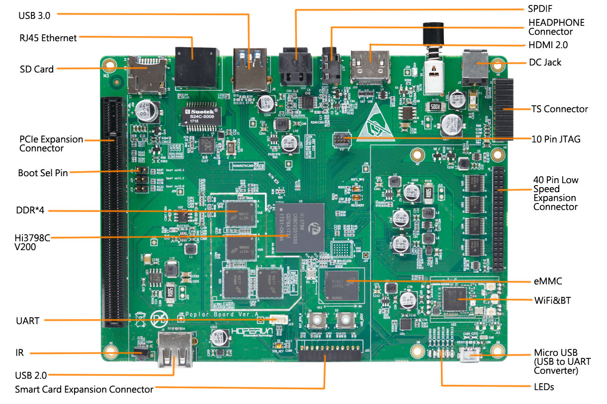

***

## Application Block Diagram

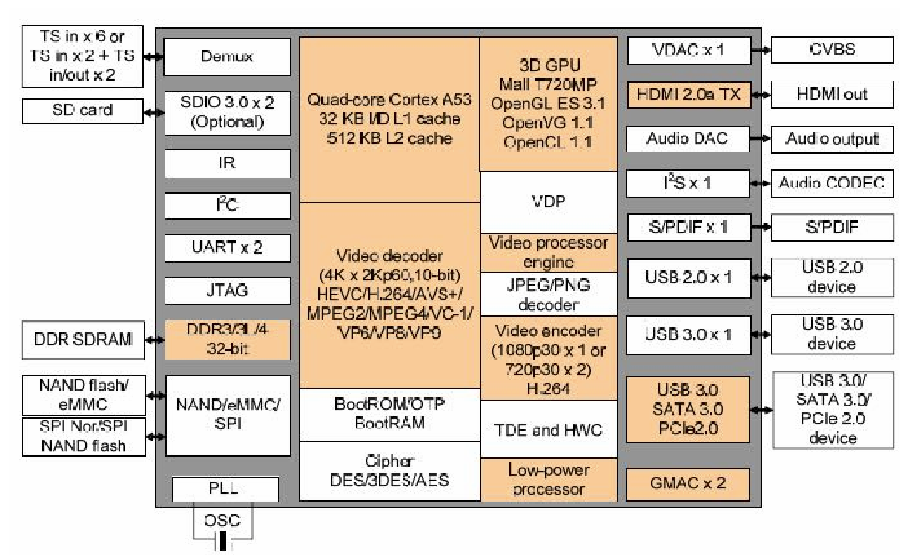

***

## Jumpers Configurations

The 96Boards Poplar board allows system to boot from the SPI flash, NAND flash, fSD, eMMC, or SPI NAND flash. Jumper J21 BOOTSEL0, Jumper J20 BOOTSEL1, and Jumper J19 BOOTSEL2 work together to select the boot mode.

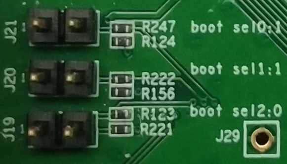

The value of BOOTSEL2, BOOTSEL1, or BOOTSEL0 is as follows:

| BOOTSEL2: BOOTSEL1: BOOTSEL0 | Boot Mode                             |
|:-----------------------------|:--------------------------------------|
| 000                          | boot from the SPI NOR flash           |
| 001                          | boot from the NAND flash              |
| 010                          | boot from the fSD                     |
| 011                          | Boot from the eMMC                    |
| 100                          | Boot from the SPI NAND Flash          |
| other                        | Reserved                              |

The value of jumpers is as follows:

| J Header        | Open/Closed         | Boot Select                     |
|:----------------|:--------------------|:--------------------------------|
| J19             | CLOSED              | BOOTSEL2 will be set 1          |
|                 | OPEN                | BOOTSEL2 will be set 0(Default) |
| J20             | CLOSED              | BOOTSEL1 will be set 0          |
|                 | OPEN                | BOOTSEL1 will be set 1(Default) |
| J21             | CLOSED              | BOOTSEL0 will be set 0          |
|                 | OPEN                | BOOTSEL0 will be set 1(Default) |

## Getting Started

#### Prerequisites

< Add a list of things needed to switch ON the board with the default SW >

Before you power up your 96Boards Poplar board for the first time you will need the following:

-  96Boards Poplar board.
- A 96Boards compliant power supply (sold separately).
- A HDMI or DVI LCD Monitor that supports the specified resolution.
- HDMI-HDMI cable or HDMI-DVI cable to connect the board to the Monitor.
- A computer keyboard with USB interface.
- A computer mouse with USB interface.

#### Known Limitations

< Add a list of HW/SW limitations (e.g. OTG and Type A USB can’t be use simultaneously) >

#### Starting the board for the first time

< Add a list of steps to switch ON the board for the first time including any warnings about jumper positions, connecting cables. A picture/block diagram showing how to connect the board for development is welcome >

To start the board, follow these simple steps:

1. Connect the HDMI cable to the 96Boards Poplar HDMI connector and to the LCD Monitor.
2. Connect the power supply to power connector P301
3. Plug the power supply into the power outlet.

> Note: Once you plug the power supply into a power outlet the board will start the booting  process, and you should see Linux/Android boot up

***

## Component Details

### Processor

Hi3798C V200 is an unltra-HD high performance SoC supporting 4Kp60 fps decoding for the DVB and IPTV STB markets. With an integrated quad-core 64-bit high-performance Cortex A53 processor and embedded NEON, Hi3798C V200 provides powerful CPU processing capabilities that meet differentiated service requirements. It creates the industry's best user experience in stream compatibility, smoothness and picture quality of live video playback, and STB performance. To meet the growing requirements on multimedia playback, video communication, and multi-screen transcoding, Hi3798C V200 supports 4K x 2Kp60@10-bit ultra-HD video decoding in various formats (including H.265/HEVC, H.264/AVC, AVS+, MVC, MPEG2, MPEG4, VC-1, VP6, VP8, and VP9) and high-performance H.264 encoding. It also supports Dolby and DTS audio processing. Hi3798C V200 provides a smooth man-machine interface and rich gaming experience with a high-performance multi-core 2D/3D acceleration engine. The chip also enables flexible connection schemes with multiple Ethernet ports, USB 2.0 ports, USB 3.0 ports, SATA/eSATA ports, PCIe 2.0 ports, and more peripheral interfaces.

### Memory (DRAM)

The 96Boards Poplar board uses a 2GB LPDDR3 DRAM chip as the memory, a single embedded Multi Chip Package (eMCP) dual function LPDDR3/eMMC memory solution.  The LPDDR3 is a 32bit width bus implementation interfacing directly to the Hi3798C V200 build-in LPDDR controller. The maximum DDR clock is 800Mhz.

### Storage

#### eMMC

The 96Boards Poplar board has 8GB eMMC on-board storage.

#### Micro SDHC

The microSDHC socket is on the bottom left corner of the PCB and is routed directly to the Hi3798C V200 SD 3.0 interface, and supports 1-bit and 4-bit modes (3 V and 1.8 V supported for the I/O device). The slot is a push-push type with a dedicated support for card detect signal.

### Networking

#### LAN

The 96Boards Poplar board uses a 10M/100M/1000M RJ45 interface. You can connect the board and the router with the network cable. Then the board can be set the network parameters through Linux/Android OS to connect the Internet.

#### WiFi

The 96Boards Poplar board uses a small size and low power module for IEEE 802.11 ac/b/g/n wireless LAN. It is based on MT7668 USB combo BT/WiFi solution with IEEE 802.11 ac/b/g/n Dual Band. This WiFi has the following features:

- IEEE 802.11 a/b/g/n/ac compliant
- Support 20MHz, 40MHz, 80Mhz bandwidth in 2.4GHz band 5GHz band
- Dual-band 2T2R mode
- USB Interface for WiFi/BT
- Support MU-MIMO RX
- Support STBC, LDPC, TX Beamformer and RX Beamformee
- Greenfield, mixed mode, legacy modes support
- IEEE 802.11 d/e/h/i/j/k/mc/r/v/w support
- Security support for WFA WPA/WPA2 personal, WPS2.0, WAPI
- QoS support of WFA WMM, WMM PS
- Integrated LNA, PA, and T/R switch
- Supports WiFi Direct
- Optional external LNA and PA support.

The WiFi hardware block Diagram is followed:

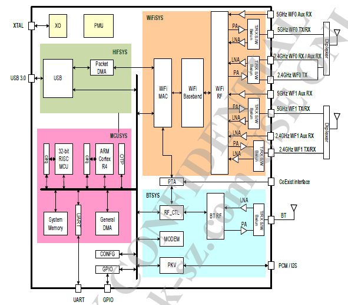

#### Bluetooth

The MT7668 bluetooth has following features:

- _Bluetooth_® wireless technology specification 2.1+EDR
- Bluetooth 4.2 Low Energy (LE)
- Bluetooth 5.0
- ANT/ANT+
- Integrated BALUN and PA
- Scatternet support: Up to 7 piconets simultaneously with background inquiry/page scan
- Up to 7 BT link + 32 BLE link
- Support SCO and eSCO link with re-transmission
- Support wide-band speech and hardware accelerated SBC codec for A2DP streaming
- Packet loss concealment
- Channel quality driven data rate adaptation
- Channel assessment and WB RSSI for AFH

### HDMI

Hi3798C V200 integrates a HDMI 2.0a TX output supporting HDCP 2.2/1.4 and maximum 4K x 2K resolution.

### USB Ports

There are a total of 3 USB ports on the 96Boards Poplar board. One USB 2.0 port and one USB 3.0 port, one microUSB AB 2.0 host/slave port. The USB 2.0 host controller supports the high-speed (480 Mbit/s), full-speed (12 Mbit/s), and low-speed (1.5 Mbit/s) data transfer modes and the USB 2.0, OHCI Rev 1.0a, and EHCI Rev 1.0 protocols. It contains a root hub that is part of the USB system and can be used to extend USB ports.

The USB 2.0 host controller has the following functions:

- Controls and processes data transfer.
- Parses data packets and packages data.
- Encodes and decodes the signals transmitted over the USB port.
- Provides interfaces (such as the interrupt vector interface) for the driver.
- Supports the high-speed (480 Mbit/s) and full-speed (12 Mbit/s) data transfer modes.

It supports the host/device switch interface.

The USB 3.0 host port supports the 5Gbit/s transfer rate defined in the USB 3.0 protocol and 480 Mbit/s, 12 Mbit/s, and 1.5 Mbit/s transfer rates defined in the USB 2.0 protocol. It complies with the XHCI 1.0 protocol, PHY Interface for the PCI Express (PIPE) protocol (for super-speed transfer), and UTMI protocol (for high-speed transfer). It has an integrated root hub for extending the USB port or other hubs.

The USB 3.0 host controller has the following functions:

- Controls and processes data transfer.
- Parses data packets and packages data.
- Encodes and decodes the signals transmitted over the USB port.
- Provides interfaces (such as the interrupt vector interface) for the driver.
- Supports the high-speed (480 Mbit/s) and full-speed (12 Mbit/s) data transfer modes.

### Audio

The 96Boards Poplar board uses HDMI audio as the audio output.

### DC Power

The 96Boards Poplar board specification calls for power to be provided to the board in the  following way:

-  An 12V power from a dedicated DC jack.
-  Powering via USB is forbidden.

An 12V power supply at a minimum of 2A rating can be used to provide sufficient board power for on system requirements as well as external devices. Additional current rating may be required for mezzanine boards or modules. DC Power can also be supplied via the SYS_DCIN pins on the low speed expansion.

### UART

The universal asynchronous receiver transmitter (UART) is an asynchronous serial communication interface. It can communicate with another chip by connecting to the UART interface of this chip.

Hi3798C V200 provides two UART units. UART0 supports the 2-wire mode, and UART2 supports the 4-wire mode.

The UART module has the following features:
- A 16 x 8-bit TX FIFO and a 16 x 12-bit RX FIFO
-  Programmable widths of the data bit and stop bit. The width of the data bit can be set to 5 bits, 6 bits, 7 bits, or 8 bits and that of the stop bit can be set to 1 bit or 2 bits by programming.
- Parity check or no check
- Programmable transfer rate
- RX FIFO interrupts, TX FIFO interrupts, RX timeout interrupts, and error interrupts
- Query of the status of raw and masked interrupts
- UART disable or RX/TX disable by programming to reduce power consumption
- UART clock disable to reduce power consumption

### Keys

The 96Boards Poplar board has six buttons.

#### RECOVERY key S1

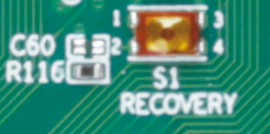

This key can be used to update the board’s software

#### STB_KEY button S2

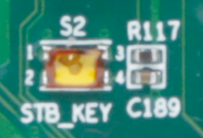

This key can be used to let the board enter standby mode

#### USB_BOOT button S3

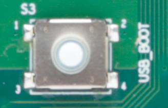

This key can be used to boot from USB flash disk.

#### RST_BIN_N button S4

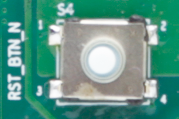

This key can be used to reset.

#### POWER button S6

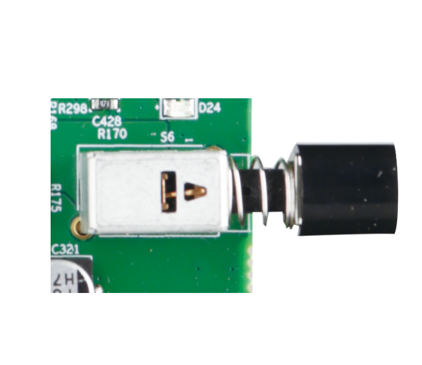

The power button can be used to power up, power down. A press and release will then power off the board.

#### WIFI_WPS button S8

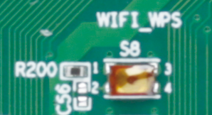

< description >

### LED Indicators

The 96Boards Poplar board specifications calls for six LEDs to be implemented on the board.  The specification defines the LEDs color and mechanical location on the board. There are two status LEDs and four User LEDs on the Poplar board. The user LEDs can be programmed by the SoC directly.

#### Two activity LEDs

-  The WiFi activity LED is a Yellow type surface mount 0603 LED. This LED reflects the status of the Wi-Fi device.
-  The BT activity LED is a Blue Type surface mount 0603 LED. This LED reflects the status of the Bluetooth device.

#### Four User-LED's

-  The four user LEDs are surface mount Green Type 0603 LED.

### GPIO

Hi3798C V200 supports 13 groups of GPIO pins, and each group provides eight programmable input/output pins. Each GPIO pin can be configured as an input or output. These pins are used to generate output signals or capture input signals for specific applications. As an input, each GPIO pin can act as an interrupt source; as an output, each GPIO pin can be separately set to 0 or 1.

The GPIO module has the following features:
-  Each GPIO pin can be set to input or output.
   - When a GPIO pin acts as an input pin, it can be used as the interrupt source. Each GPIO pin supports independent interrupt control.
   - When a GPIO pin acts as an output pin, it can be separately cleared or set to 1.
-  The GPIO interrupts are controlled by seven registers (such as GPIO_IS). These registers are used to specify the interrupt source, polarity, and interrupt edge (falling edge or rising edge). For details about the corresponding interrupt registers of the GPIO.
   -  When multiple interrupts are generated at the same time, these interrupts are combined as one interrupt and then reported.
   - The GPIO_IS, GPIO_IBE, and GPIO_IEV registers determine the features of the interrupt source and interrupt trigger type.
   -  GPIO_RIS and GPIO_MIS are used to read the raw interrupt status and masked interrupt status respectively. GPIO_IE controls the final report status of each interrupt. In addition, GPIO_IC is provided to clear the interrupt status.

***

## Expansion Connectors

### PCIe Expansion Connector

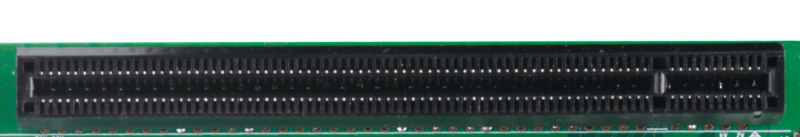

The peripheral component interconnect express (PCIe) module is used for extending the SATA interface, Ethernet port, and Wi-Fi devices.

The PCIe controller has the following features:
-  One PCIe Gen2 X1 controller
-  Compliance with PCIe specifications Rev 1.1/2.0
-  Standard PHY interface for the PIPE interface with 16-bit width and 125 MHz or 250 MHz working clock
-  An X1 link at the rate of 2.5 Gbit/s or 5 Gbit/s
-  Root complex (RC) mode
-  AMBA 3.0 AXI 64-bit data width and 32-bit address width
-  Message signaled interrupts (MSIs) and INTx interrupts
-  Active state power management (ASPM)

### Smart Card expansion connector

The Smart Card module board is optinal supplied.

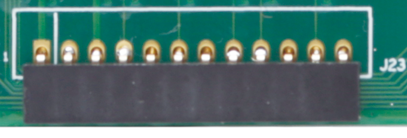

### TS Connector

The tuner module board is optionally supplied.

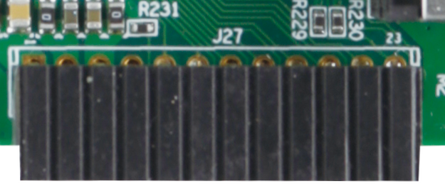

### Low Speed Expansion Connector

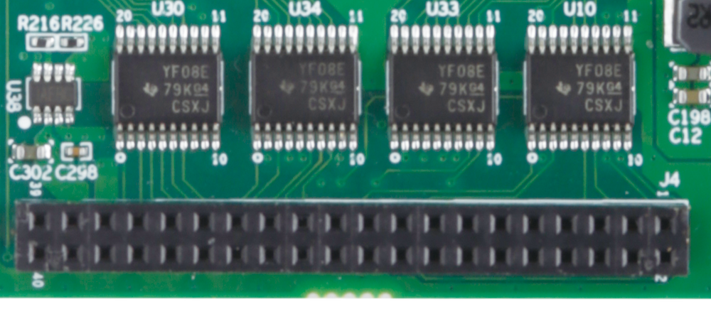

|  Poplar Signals   |  PIN  |  PIN  |  Poplar Signals     |
|:------------------|:------|------:|--------------------:|
| GND               |   1   |   2   | GND                 |
| BT_UART_CTS       |   3   |   4   | PWR_BTN_N           |
| BT_UART_TX        |   5   |   6   | PST_BTN_N           |
| BT_UART_RX        |   7   |   8   | SPI0_SCLK           |
| BT_UART_RTS       |   9   |   10  | SPI0_SDI            |
| NA                |   11  |   12  | SPI0_CSN            |
| NA                |   13  |   14  | SPI0_SDO            |
| I2C0_SCL          |   15  |   16  | PCM_SYNC            |
| I2C0_SDA          |   17  |   18  | PCM_CLK             |
| I2C2_SCL          |   19  |   20  | PCM_OUT             |
| I2C2_SDA          |   21  |   22  | PCM_IN              |
| GPIO5_5           |   23  |   24  | GPIO3_7             |
| GPIO3_4           |   25  |   26  | GPIO4_5             |
| GPIO1_0           |   27  |   28  | GPIO1_5             |
| SF_CLK/GPIO2_3    |   29  |   30  | SF_SDI_IO1/GPIO2_0  |
| SF_CSN/GPIO2_1    |   31  |   32  | SF_WPN_IO2/GPIO1_7  |
| SF_SDO_IO0/GPIO2_4|   33  |   34  | SF_HOLDN_IO3/GPIO2_2|
| 1V8_LSEC          |   35  |   36  | 12V_IN              |
| DEV_5V            |   37  |   38  | 12V_IN              |
| GND               |   39  |   40  | GND                 |

***

## Mechanical Specification

< Add a drawing showing the mechanical layout, dimensions, distance between mounting holes, max. component height >

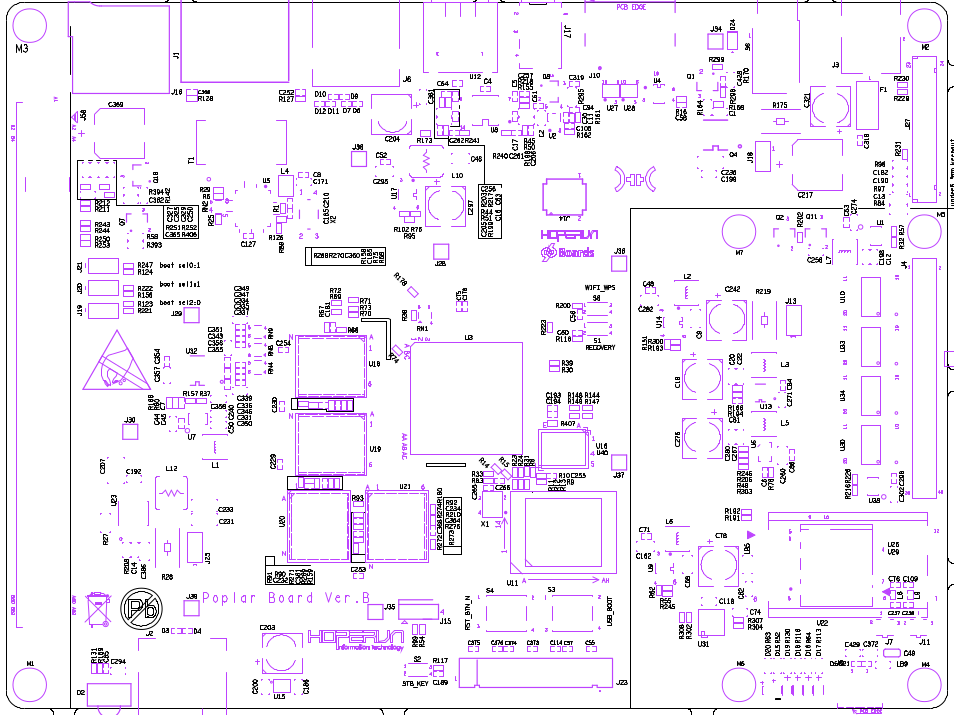
