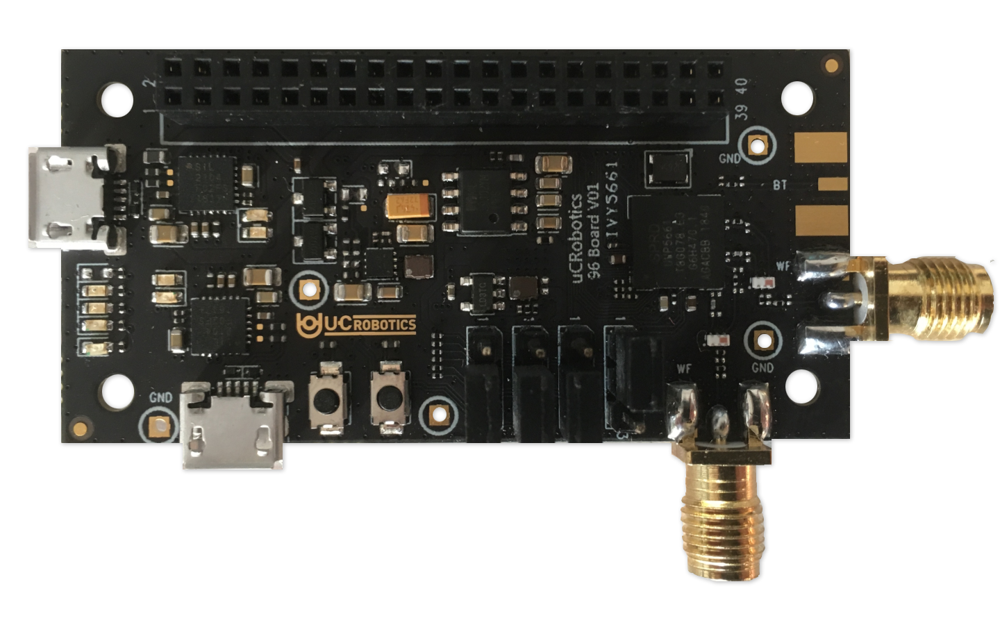

# Getting Started

Learn about your Ivy5661 board as well as how to prepare and set up for basic use

## Setup - What you will need

- **Software**
  - Zephyr
  - Mobile application (optional for extender application)
- **Hardware**
  - USB to Micro-USB cable

***

# Out of the Box

The following subsections should describe how to get started with the Ivy5661 using the release build shipped with the boards. The Ivy5661 board is ready to use “out of the box” with a preinstalled version of the Zephyr RTOS.

## Features

|   Component          |   Description                   |
|:---------------------|:--------------------------------|
| SoC                  | UWP5661 @ 28nm                  |
| CPU                  | Arm Cortex-M4 Dual Core         |
| Clock speed          | 416MHz                          |
| Storage              | 32Mbit                          |
| Wi-Fi                | IEEE802.11ac 2x2                |
| _Bluetooth_® wireless technology            | Bluetooth 5                     |
| USB                  | 2 x Micro USB                   |
| Expansion Interface  | UART, I2C, SPI, I2S, GPIO       |
| LED                  | 4 user LED                      |
| Button               | 2 reset and user button         |
| Power Source         | Micro USB                       |
| OS Support           | Zephyr                          |
| Size                 | 60 x 30mm                       |

For more information, please refer to the [Hardware User Manual](../hardware-docs)

**IMPORTANT NOTES**

Coming soon...

***

## Starting the board for the first time

- Download the [Android Smart Repeater App](https://github.com/unisoc/Android-SmartRepeater/raw/master/SmartRepeater/releaseAPK/SmartRepeater_W18.46.2.apk)
- Install the .apk on your Android Device
   - > Note: You might have to enable "Installtion from Unknown Source". You can read more about that [here](https://developer.android.com/distribute/marketing-tools/alternative-distribution#unknown-sources).
- Plugin the Ivy5661 to a micro-usb cable for power.
  - > Note: Early Adopters might mave to follow the [Downloads](../downloads/) and [Installation](../installation/) instructions to flash the factory firmware.
- The device should show up in the `Android Smart Repeater App`
   - Tap on the device to connect
   - Within the App select WiFi Manager to setup Wifi AP

## What's Next?

If you are already familiar with the Ivy5661 board and would like to change out the stock operating system, please proceed to one of the following pages:
- [Downloads page](../downloads/): This page lists all Linaro and 3rd party operating systems available for the Ivy5661
- [Installation page](../installation/): If you already have the images you need, this page has information on how to install the different operating systems onto your Ivy5661
- [Board Recovery](../installation/)
   - If at any time your board is having unexplainable issues, it is suggested to attempt a board recovery. These instructions will guide you through a succesfull board recovery.
- [Troubleshooting](../support/)
  - From bug reports and current issues, to forum access and other useful resources, we want to help you find answers

Back to the [Ivy5661 documentation home page](../)

***
