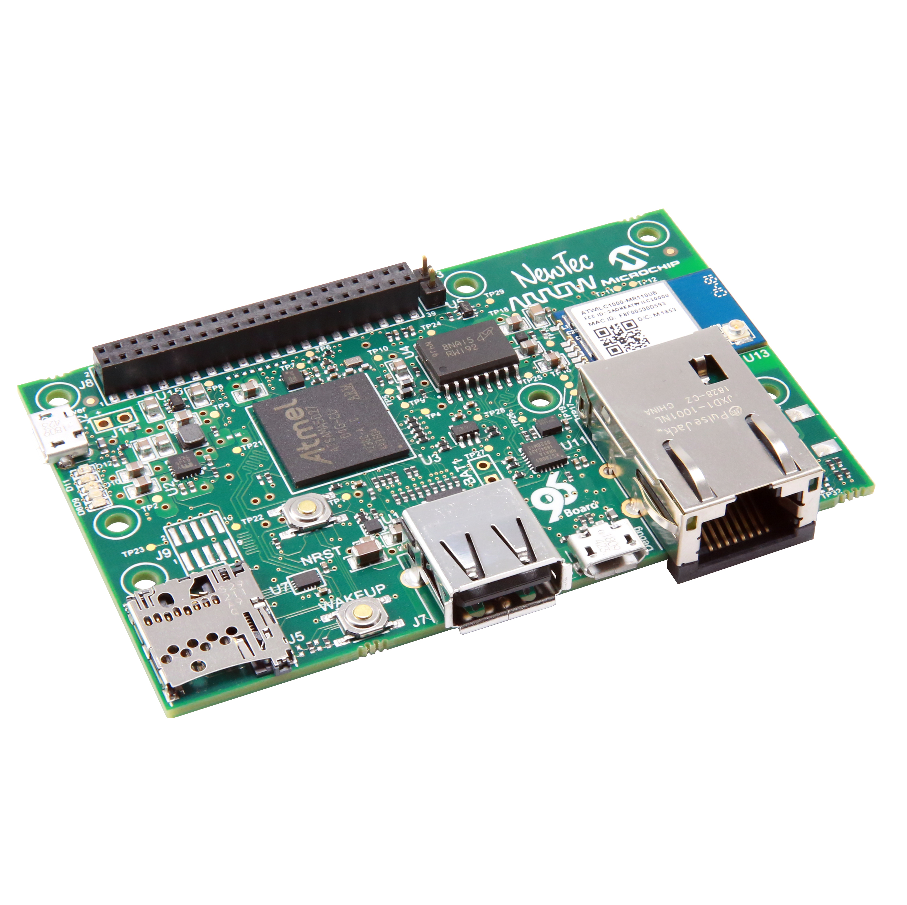
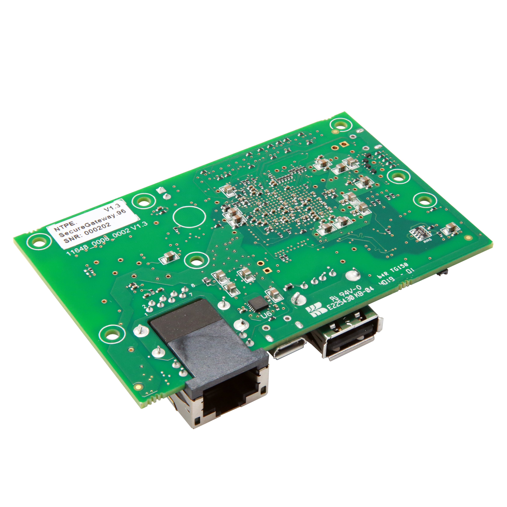

# Getting Started

Learn about your Shield96 board as well as how to prepare and set up for basic use

## Setup - What you will need

**Need**
- Shield96
   - Board based on the ATSAMA5D27 Processor
- Power adapter
   - 96Boards IoT specifications requires a 5v MicroUSB Power adapter with 1000mA capacity.
- MicroSD Card: 8GB
- USB to microUSB cable

**Optional**
- Network:
   - WIFI Antenna (optional)
   - Ethernet cable (optional)

***

# Out of the Box

The following subsections should describe how to get started with the Shield96 using the release build shipped with the boards.

## Features

| Component | Description |
|:---------:|:-----------:|
| Form factor | Conform to 96Boards IoT Edition Extended (1.8V) 40 Pin Low Speed Expansion Connector |
| SoC | ATSAMA5D27, Cortex A5 Core (ARMv7-A Architecture), 500 MHz, 128 Mb RAM integrated (System in Package, Arm TrustZone) |
| WLAN | Microchip ATWILC1000-MR110xB, IEEE 802.11 b/g/n |
| Ethernet | 10BASE-T/100BASE-TX IEEE 802.3 compliant |
| USB | 2.0 OTG USB A Connector |
| Real Time Clock/Calendar | Microchip MCP795W1 Optional Battery-Backed |
| Crypto | CryptoAuthentication Device ATECC608 |
| SD Card | One micro SD Card Slot |
| NOR Flash | Micron MT25QU01GBBB,128 Mb Clock frequency 166MHz (MAX) for all protocols in STR |

***

## Starting the board for the first time

1. [Downloads Page](../downloads/)
2. [Installation page](../installation/)
3. Power ON:
   - Connect Ethernet Cable
   - Insert SD card into SD card slot
   - Connect USB to J2 PC/Power or to J10 Debug
   - Connect to Device over SSH
   > Note: During boot the Device will try to establish a network connection, this may take a bit longer if no Ethernet cable is connected.
4. Connecting To Debug Interface:
   - If you start the Device for the first time it may be useful to see the boot messages or get the device IP address to be able to SSH to the device. You can use the J10 Debug Interface and a serial monitor like putty to connect to the device.
   - Connect USB Cable to J10 Debug
   - Open putty
   - Choose Connection type Serial
   - Set COM Port
   - Set Speed to 115200
   
***

## What's Next?

If you are already familiar with the Shield96 board and would like to change out the stock operating system, please proceed to one of the following pages:

- [Downloads page](../downloads/): This page lists all Linaro and 3rd party operating systems available for Shield96
- [Installation page](../installation/): If you already have the images you need, this page has information on how to install the different operating systems onto your Shield96 board
- [Board Recovery](../installation/)
   - If at any time your board is having unexplainable issues, it is suggested to attempt a board recovery. These instructions will guide you through a succesfull board recovery.
- [Support](../support/)
   - From bug reports and current issues, to forum access and other useful resources, we want to help you find answers

Back to the [Shield96 documentation home page](../)

***   
