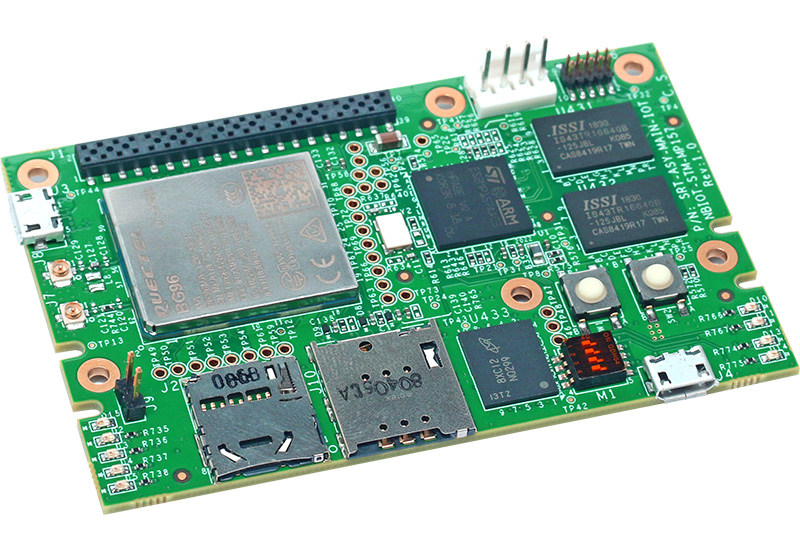
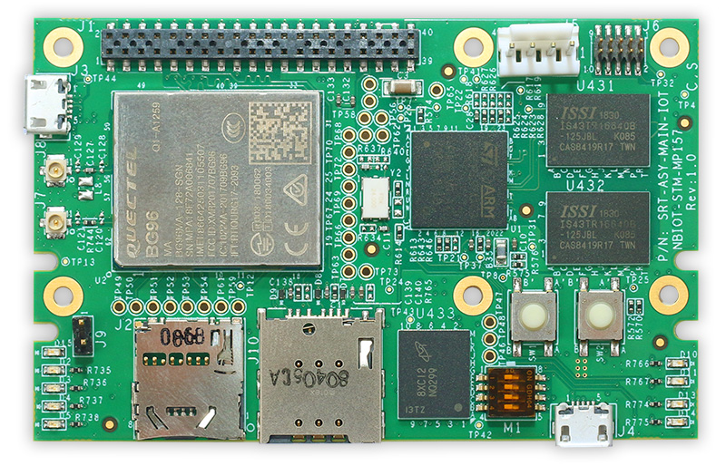
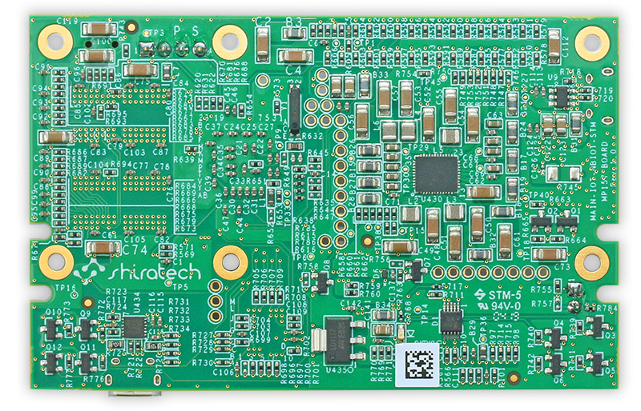

# Getting Started

Learn about your Stinger96 board as well as how to prepare and set up for basic use

## Setup - What you will need

**Need**
- Stinger96
   - Board based on the STM32MP157 Processor
- Power adapter
   - 96Boards IoT specifications requires a 5v MicroUSB Power adapter with 1000mA capacity.
- MicroSD Card: 8GB
- USB to microUSB cable

**Optional**
- Network:
   - LTE Antenna (optional)

***

# Out of the Box

The following subsections should describe how to get started with the Stinger96 using the release build shipped with the boards.

## Features

| Component | Description |
|:---------:|:-----------:|
| Form factor | Conform to 96Boards IoT Edition Extended (1.8V) 40 Pin Low Speed Expansion Connector |
| SoC | ST Microelectronics STM32MP157 32 bit dual-core Arm ® Cortex ® -A7 and 32 bit Cortex®-M4 with FPU/MPU Vivante® - OpenGL® ES 2.0 |
| RAM | DDR3 – 64M x 32bit (2Gbit/256MB) |
| LTE | Quectel BG96 LTE modem |
| USB | 2.0 OTG USB A Connector |
| Storage | SLC NAND FLASH – 1G x 8bit (8Gbit/1GB)   micro SD connector |

***

## Starting the board for the first time

1. [Downloads Page](../downloads/)
2. [Installation page](../installation/)
3. Power ON:
   - Connect Ethernet Cable
   - Insert a clean SD card to your PC, then burn the .img file to the SD card using a suitable tool
(Win32 Disk Imager for example).
   - To boot from SD card, change the boot select to 1 0 1. The boot select pins are ordered as
follows, top to bottom: Boot0, Boot1, Boot2.
   - Insert the SD card containing the image file to the SD card connector.
   - Connect the board to the PC using the micro USB connector. Make sure you connect using
USB1 + Console (the one next to the boot select pins).
4. Connecting To Debug Interface:
   - Your board should now boot from the SD card. Open your device manager. The board should
appear under ‘Ports (COM & LPT)’.
   - Connect to the board through a serial connection using a suitable tool (PuTTY, for example).
Make sure you have picked the correct COM port (the one you see in the device manager), and
that you use the correct baud rate – 115200.
   
***

## What's Next?

If you are already familiar with the Stinger96 board and would like to change out the stock operating system, please proceed to one of the following pages:

- [Downloads page](../downloads/): This page lists all Linaro and 3rd party operating systems available for Stinger96
- [Installation page](../installation/): If you already have the images you need, this page has information on how to install the different operating systems onto your Stinger96 board
- [Board Recovery](../installation/)
   - If at any time your board is having unexplainable issues, it is suggested to attempt a board recovery. These instructions will guide you through a succesfull board recovery.
- [Support](../support/)
   - From bug reports and current issues, to forum access and other useful resources, we want to help you find answers

Back to the [Stinger96 documentation home page](../)

***   
