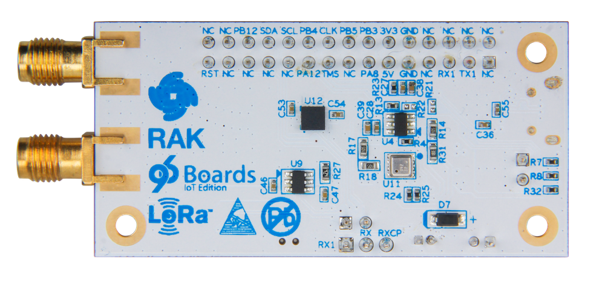

# Getting Started

Learn about your WisTrio board as well as how to prepare and set up for basic use

## Setup - What you will need

**Need**

- [WisTrio](https://www.96boards.org/)
   - Board based on RAK5205
   - LoRaWAN antenna
   - GPS Antenna
   - Micro-USB Cable

***

# Out of the Box

The following subsections describe how to get started with the WisTrio using the release build shipped with your board.




## Features

|   Component          |   Description                                                                                    |
|:---------------------|:-------------------------------------------------------------------------------------------------|
| Processor            | RAK5205                                                                                          |
| Power Consumption    | 16uA(sleep mode), support GPS Power-off mode, MCU & Sensor Support sleep mode                    |
| Interface            | I2C, GPIOs, UART and ADC                                                                         |
| Dimension            | 60 x 30 x 11.45 mm(LxWxH)                                                                        |
| Band                 | support the Global Multiple Bands                                                                |
| Sensors              | LIS3DH & BME680 inside                                                                           |
| Antenna Options      | SMA & iPEX can be switched                                                                       |

***

## Starting the board for the first time

The WisTrio Board comes pre-loaded with firmware. It is useful for testing LoRaWAN, GPS and on-board sensors.

- Connect the GPS and LoRaWan Antennas to the WisTrio Board
  - The Antenna sockets are labeled, make sure not to mismatch the antennas.
- Connect the WisTrio board to a Host PC using the MicroUSB Cable
  - You should see LEDs near the Micro-USB port flash once.
- Access the serial console at 115200 baud
  - Windows users can access using [PuTTY](https://www.putty.org/)
  - Linux users can use tools like ```minicom``` or ```picocom```

**Here is a what you should expect on the serial console (using picocom on linux):**

```
[ric@localhost ~]$ sudo picocom /dev/ttyUSB0 -b 115200
picocom v3.1

port is        : /dev/ttyUSB0
flowcontrol    : none
baudrate is    : 115200
parity is      : none
databits are   : 8
stopbits are   : 1
escape is      : C-a
local echo is  : no
noinit is      : no
noreset is     : no
hangup is      : no
nolock is      : no
send_cmd is    : sz -vv
receive_cmd is : rz -vv -E
imap is        :
omap is        :
emap is        : crcrlf,delbs,
logfile is     : none
initstring     : none
exit_after is  : not set
exit is        : no

Type [C-a] [C-h] to see available commands
Terminal ready

RAK5205 BreakBoard soft version: 1.1.6
LIS3DH init success
Move Detected INT1 src:0x00
ACC X:0mg Y:0mg Z:48mg
BME680 init success
T: 30.22 degC, P: 994.87 hPa, H 50.00 %rH , G: 1457 ohms
latitude: 28.531935, longitude: 77.387657 , altitude: 0 ;
region = EU868
app_interval = 120
gps_stime = 60
msg confirm = 0
power save = 1

Selected LoraWAN 1.0.2 Region: EU868

OTAA:
Dev_EUI: 60 C5 A8 FF FE 00 00 00
AppEui: 00 13 7A 10 00 00 00 00
AppKey: 5A 69 67 42 65 65 41 6C 6C 69 61 6E 63 65 30 39
OTAA Join Start...

```

**If you physically move the WisTrio board you should also see Accelerometer sensor data:**

```
Move Detected INT1 src:0x50
ACC X:-48mg Y:0mg Z:-208mg
Move Detected INT1 src:0x41
ACC X:-160mg Y:-32mg Z:80mg
Move Detected INT1 src:0x42
ACC X:144mg Y:0mg Z:0mg
Move Detected INT1 src:0x42
ACC X:272mg Y:16mg Z:-48mg
Move Detected INT1 src:0x44
ACC X:96mg Y:-144mg Z:0mg
Move Detected INT1 src:0x44
ACC X:64mg Y:-240mg Z:48mg
Move Detected INT1 src:0x44
ACC X:64mg Y:-160mg Z:32mg
Move Detected INT1 src:0x48
ACC X:-32mg Y:272mg Z:-48mg
Move Detected INT1 src:0x48
ACC X:16mg Y:272mg Z:32mg
Move Detected INT1 src:0x48
ACC X:-96mg Y:160mg Z:0mg

```

***

## What's Next?

If you are already familiar with the WisTrio and would like to change out the stock operating system, please proceed to one of the following pages:

- [Downloads page](../downloads/): This page lists all Linaro and 3rd party operating systems available for the WisTrio
- [Installation page](../installation/): If you already have the images you need, this page has information on how to install the different operating systems onto your WisTrio
- [Guides](../guides/)
- [Support](../support/)
   - From bug reports and current issues, to forum access and other useful resources, we want to help you find answers

Back to the [WisTrio documentation home page](../)

***
