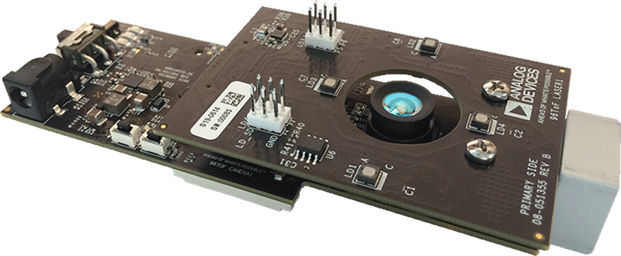

# 3D Imaging Time of Flight Development Platform

- 1) [Introduction](#introduction)
	- 1.1) [About the Analog Devices 3DToF Mezzanine](#11-about-the-analog-devices-3dtof-mezzanine)
	- 1.2) [Features & Specifications](#12-features-and-specifications)
- 2) [Guides](#2-guides)
- 3) [Files](#3-files)

## 1) Introduction
### 1.1) About the Analog Devices 3D Imaging Time of Flight Development Platform

3D Time of Flight (ToF) creates a depth mapping of objects within the field of view and is a key solution used for developing digital vision for many applications. The development platform comes with everything a user needs to start working immediately on 3DToF applications, enabling the development of high value features and functions that create product differentiation.

#### Applications
- **INDUSTRIAL**
 - Automated vehicles
 - Safe zone operation
 - Robotics
- **BUILDING MANAGEMENT**
 - Surveillance applications
 - SLAM
- **AUTOMOTIVE**
 - Gesturing
 - Passenger Monitoring

### 1.2) Features & Specifications

**Features**
- 96Boards mezzanine card
- DragonBoard 410C support
- 6m range, up to 1% accuracy
- Finisar 940 nm wavelength VCSEL, up to 40W output
- VGA resolution up to 30fps
- 90° x 69.2° FOV
- CCD sensor, 640x480
- USB, Ethernet or Wi-Fi to connect to a host computer
- 13.8mm removeable lens
- V4L2 capture driver
- Native/Host SDK
- Support for multiple host OSs: Linux, Windows, MacOS
- OpenCV, python and MATLAB wrapper support
- Evaluation software plus limited demo applications and algorithms included
- Depth mode, IR mode

**Specification**

| Specifications | Typical           |
|:--------------:|:-----------------:|
| DC Input       | 5 VDC             |
| Range          | Up to 6m          |
| FoV            | 90° x 69.2°       |
| VCSEL          | 940nm             |
| Accuracy       | Near: 20cm to 1.2m; < 2.5% accuracy   Mid: 1m to 2.6m; < 2% accuracy   Far: 2.6m to 6m; < 1% accuracy |
| Frame Rate     | Up to 30fps       |
| Resolution     | 640 x 480         |
| Operating Temperature | 0° to 60°C |
| I/O Options for DragonBoard 410c | USB 2.0, Ethernet, Wi-Fi   802.11agn, I²S, HDMI, I²C, MIPICSI, MIPI-DSI, SDIO, USB 2.0,   16 Configurable GPIO   Additional RPI connector on Mezzanine board for connection to other compatible CPU boards |
| Processor | Qualcomm 410E processor |
| EEPROM | 1Mb storage |
| SD/uSD | Removeable uSD card slot |

## 2) [Guides](guides/)

## 3) Files
- [Product Brief](files/3dtof-brief.pdf)

