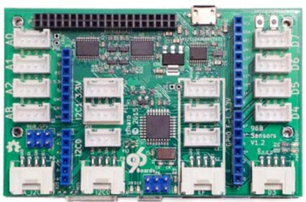
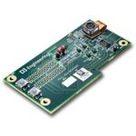

## Mezzanine Guides

Mezzanine Design Guidelines ([View](https://github.com/96boards/documentation/blob/master/mezzanine/files/mezzanine-design-guidelines.pdf) / [Download](https://github.com/96boards/documentation/raw/master/mezzanine/files/mezzanine-design-guidelines.pdf))

## Boards

| 96Boards                                         | About                                                  | Options                                              |
|:------------------------------------------------:|:------------------------------------------------------:|:----------------------------------------------------:|
|   **Secure96 mezzanine board** | The Secure96 board is a 96Boards mezzanine board based around the Infineon SLB9670 | [Documentation](secure96/README.md)  |
|   **STM32 Sensor mezzanine board** | The STM32 Sensor board is a 96Boards mezzanine board based around the STM32F446 MCU  | [Documentation](https://www.96boards.org/product/stm32/)  |
|   **LinkerSprite mezzanine card starter kit** | 96Boards starter kit with Linker mezzanine card and loft modules  | [Documentation](https://www.96boards.org/product/linkspritesensorkit/)  |
|   **96Boards UART Serial Adapter** | USB to UART interface to be used with any 96Boards Consumer or Enterprise Edition board  | [Documentation](https://www.96boards.org/product/uartserial/)  |
|  **Sensors mezzanine** | I/O Expansion board for IoT/Sensor applications, with SoC and Arduino-compatible Grove module interfaces, and Arduino-compatible shield connectors.  | [Documentation](https://www.96boards.org/product/sensors-mezzanine/)  |
|   **Aero Core 2** | The Aero Core 2 for 96Boards provides an ARM Cortex-M4 microcontroller for MAV control and much more...  | [Documentation](https://www.96boards.org/product/aerocore2/)  |
|   **Audio Mezzanine** | Audio Mezzanine Board is a Grove interfaced expansion board intended for 96boards  | [Documentation](audio-mezzanine/)  |
|   **D3 Camera Mezzanine** | D3 Camera Mezzanine Kit connects up to two MIPI CSI-2 cameras. OV5640 Image Sensor Mezzanine Board with Linux OS  | [Documentation](https://www.96boards.org/product/d3camera/)  |
|   **Ethernet Mezzanine** | The PoE + Mezzanine Board is a solution that enables the 96Boards to be powered over Ethernet  | [Documentation](https://www.96boards.org/product/ethernetcard/)  |
|   **MIPI Adapter Mezzanine - AiStarVision** | With this adapter, you can easily integrate image sensors into your camera projects.   | [Documentation](https://www.96boards.org/product/mipiadapter/)  |
|   **NeonKey** | Neonkey is the sensor hub platform for all 96Boards compliant family products  | [Documentation](https://www.96boards.org/product/neonkey/)  |

