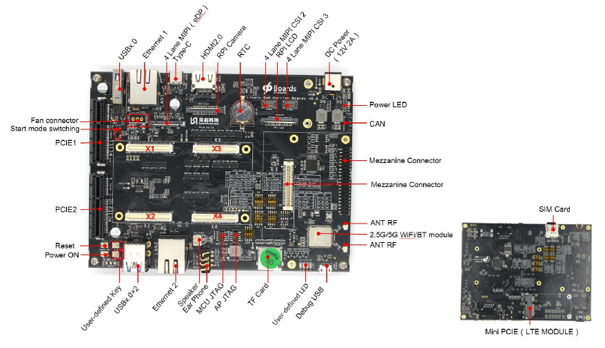

# 96Boards SoM Carrier Board

- 1) [Introduction](#introduction)
	- 1.1) [About the 96Boards SoM Carrier Board](#11-about-the-96boards-som-carrier-board)
	- 1.2) [Features & Specifications](#12-features-and-specifications)
- 2) [Guides](#2-guides)
- 3) [Files](#3-files)

## 1) Introduction
### 1.1) About the 96Boards SoM Carrier Board

The 96Boards Carrier Board is an interface for debugging, testing and prototyping custom carrier board designs. It is built to support the 96Boards Compute SoM Edition Hardware Platform Specification and is itself in compliance with the 96Boards Enterprise Edition Server Hardware Platform Specification.

This carrier board provides many interface as possible to meet the needs of Som board debugging, testing and prototyping. This Carrier Board has been adapted to [TB-96AI](../tb-96ai/) SOM and [TB-96AIoT](../tb-96aiot/) SOM boards out of the box.

### 1.2) Features & Specifications

| Interface | Description |
|:---------:|:-----------:|
| DC Power  | 12v 2A Power supply φ5.5mm DC Connector |
| 4 Lane MIPI CSI2 | Camera interface for MIPI_RX1 on TB-96AI RK3399Pro Som 4 Lane MIPI CSI AXT530124 on Board |
| 4 Lane MIPI CSI3 | Camera interface for MIPI_RX in TB-96AIoT RK1808 Som 4 Lane MIPI CSI AXT530124 on board |
| RPi LCD | Raspberry Pi MIPI LCD Connector for TB-96AI RK3399Pro Som and TB-96AIoT RK1808 Som,1-1734248-5 on board |
| RTC | RTC Battery Holder |
| RPi Camera | Raspberry Pi Camera Connector for MIPI_RX0 in TB-96AI RK3399PRO Som, 1-1734248-5 on board |
| 4 Lane MIPI (eDP) | eDP connector for TB-96AI RK3399Pro Som,MIPI connector for TB-96AIoT RK1808 Som, defined by Rockchip |
| Ethernet 1 | 1000Mbps Ethernet Port for TB-96AI RK3399PRO Som |
| Ethernet 2 | 1000Mbps Ethernet Port for TB-96AIoT RK1808 Som |
| USBx.0 | USB3.0 for TB-96AI RK3399Pro Som 
| USBx.0*2 | USB3.0 for TB-96AI RK3399Pro,USB2.0 for TB-96AIoT RK1808 Som |
| Fan Connector | Fan connector |
| Start mode Switching | Auto Start mode selection |
| PCIE | PCIE x4 interface |
| Reset key | Reset key |
| Power ON Key | Press the sleep or wake up, long press to power down and power on |
| User-Defined Key | The buttons function for User define self |
| Speaker | 8Ω1W Speaker interface |
| Phone | Earphone interface |
| MCU JTAG | MCU JTAG interface |
| AP JTAG | AP JTAG interface |
| TF Card | TF Card interface |
| USER-Defined LED | User-defined leds |
| Debug | Debug usb,USB to UART chip FT232RL on board |
| 2.4G/5G Wifi/BT module | Wifi/BT module AP6356S |
| ANT RF | WIFI/BT Antenna interface |
| Mezzanine Connector | Mezzanine Connector,contains high speed connector and low speed connector |
| CAN | CAN interface |
| System LED | System LED |
| X1、X2、X3、X4 | Som board Connector |

## 2) [Guides](guides/)

## 3) Files

- [HW User Manual](files/96boards-som-carrier-board-hardware-user-manual.pdf)
- [Schematics](files/96boards-som-carrier-board-schematics.pdf)

