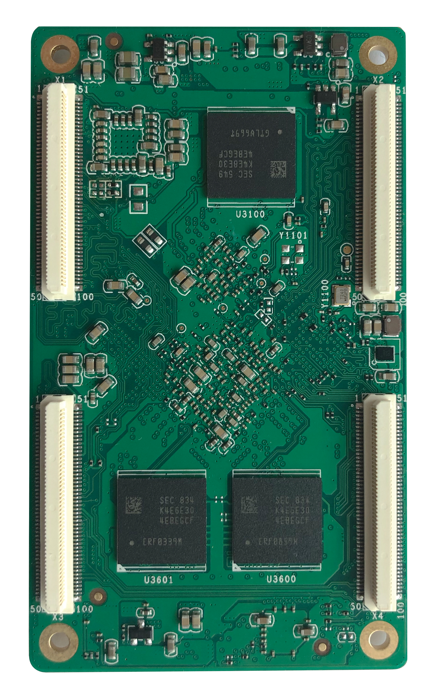
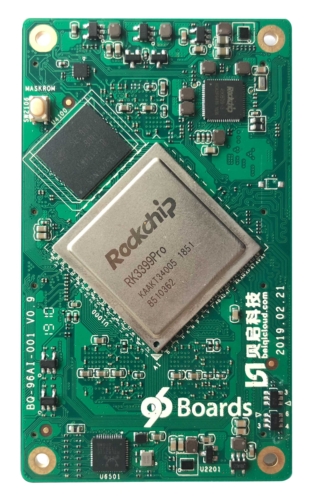

# Getting Started

Learn about your TB-96AI board as well as how to prepare and set up for basic use

## Setup - What you will need

**Need**
- TB-96AI
	- SOM based on the RK3399Pro Application Processor and NPU
- [96Boards SOM Carrier Board](../../96boards-som-carrier-board/)
	- SOM Baseboard
- Power adapter
	- 96Boards specifications requires a 8V-18V with 2000mA Power adapter
- Typc C to Type A Cable
	- To connect Baseboard to PC

***

# Out of the Box

The following subsections should describe how to get started with the TB-96AI SoM.

## Features

|   Component          |   Description                                                                                    |
|:---------------------|:--------------------------------------------------------------------------------------------|
| SoC:                 | Rockchip RK3399Pro with Dedicated NPU |
| CPU:                 | Dual-core Cortex-A72 up to 1.8GHz Quad-core Cortex-A53 up to 1.4GHz |
| GPU:                 | ARM® Mali-T860 MP4 Quad-core GPU Supports OpenGL ES1.1/2.0/3.0/3.1, OpenVG1.1, OpenCL, DX11, Support AFBC (frame buffer compression) |
| NPU:                 |  Support 8bit/16bit computing, AI computing power up to 3.0TOPs Full load computing power, low load operation power consumption is low Compatible with Caffe/Mxnet/TensorFlow model, support multi-class framework, support mainstream layer type, easy to add custom layer Provides easy-to-use development tools, PC-based model conversion, performance estimation, and accuracy verification Provides AI application development interface: support Android NN API Provides RKNN cross-platform API, Linux supported TensorFlow development |
| VPU: |  Support 4K VP9 and 4K 10bits H265/H264 video decoding, up to 60fps 1080P multi-format video decoding (WMV, MPEG-1/2/4, VP8)  1080P video encoding, support H.264, VP8 format Video post processor: de-interlacing, denoising, edge/detail/color optimization |
| RAM:                 | Optional configuration with the following options:  3GB LPDRR3(CPU 2GB + NPU 1GB) 8GB LPDDR3(CPU 4GB + NPU 4GB) |
| Storage:             | Optional configuration with the following options: 16GB eMMC 32GB eMMC 64GB eMMC 128GB eMMC |
| Connectivity:        | Built-in WiFi/BT module, reserved antenna holder, can be directly inserted into the antenna. Built-in Gigabit Ethernet PHY chip, 10/100/1000Mbps adaptive. |
| Camera:              | MIPI-CSI×2,Dual camera interface (built-in dual hardware ISP, up to single 13Mpixel or dual 8Mpixel) |
| Display Interface:   | Embed two VOPs, support dual-screen simultaneous/dual-screen display, and can choose to output from the following display interface. MIPI-DSI×1 eDP×1 DP×1 HDMI × 1 ( Support 480p/480i/576p/576i/720p/1080p/1080i/4k, support RGB format) |
| Audio Interface: | I2S0: -    Support user extended use I2S1: -    Speaker×1 -    Headphone×1 -    MIC×1 I2S2: -    HDMI interface audio output -    DP interface audio output |
| USB: | Type C: USB3.0/DisplayPort 1.2,OTG USB:  USB3.0×1 (according to RK3399Pro design, NPU needs to be mounted on USB3.0, so USB3.0 needs to connect back to NPU, if you need to expand USB3.0 interface, you need external HUB) USB2.0×2, HOST |
| Expansion Interface: | SDMMC(TF Card)×1 SPI×1 UART×3, One of the CPU Debug UARTs, one NPU Debug UART I2C×6 SDIO×1 PCIe×1 PWM×2 GPIO,For detailed GPIO definitions, please refer to the interface definition ADC×3,One for buttons, one for headset microphone detection, and one for user-definable use |
| OS Support:          | Android, Linux |
| Mechanical:          | 85mm×50mm×1.6mm 96Boards SoM standard dimensions specifications. |
| SoM Connectors       | X1 X2 |

***

## Starting the board for the first time

- Insert the TB-96AI SoM in the 96Boards Carrier Board as Shown in the figure above.
- Configure the MUX Switches on the Carrier Board as follows
	- The switches for TB-96AI are configured as follows
	- All switch on S1,S2,S8,S9,S10,S11,S12,S14,S15, configure to disconnect.
	- All switch on S6,S7 config to connect for TF card.
	- Bit1 on S16 config to connect for audio jacket
	- Bit1 & Bit2 on S5 config to connect for debug uart
	- Bit1, Bit2 & Bit3 on S3 config to connect for WIFI and BT
- Connect the TYPEC to PC
- Long press and hold the Maskrom button as shown in the following figure.
- Insert power supply.
- Continue to the [Installation page](../installation/).

***

## What's Next?

If you are already familiar with the TB-96AI board and would like to change out the stock operating system, please proceed to one of the following pages:

- [Downloads page](../downloads/): This page lists all Linaro and 3rd party operating systems available for TB-96AI
- [Installation page](../installation/): If you already have the images you need, this page has information on how to install the different operating systems onto your TB-96AI board
- [Support](../support/)
   - From bug reports and current issues, to forum access and other useful resources, we want to help you find answers

Back to the [TB-96AI documentation home page](../)

***   
