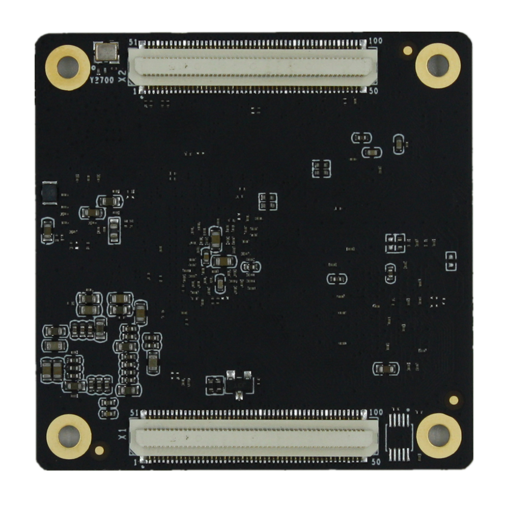
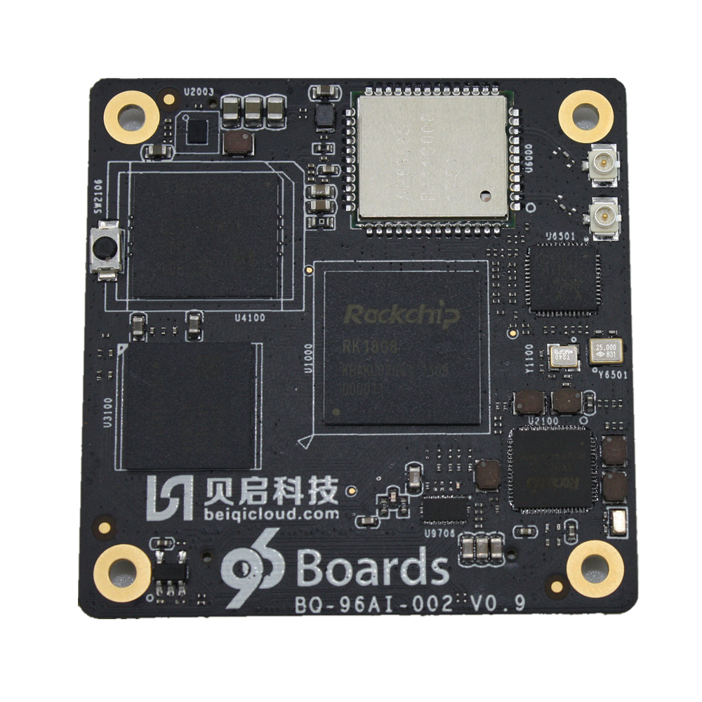
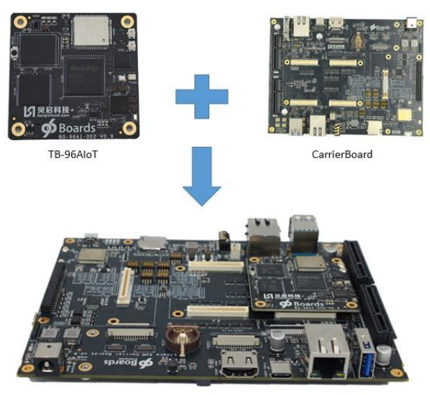

# Getting Started

Learn about your TB-96AI board as well as how to prepare and set up for basic use

## Setup - What you will need

**Need**
- TB-96AIoT
	- SOM based on the RK1808 Application Processor and NPU
- [96Boards SOM Carrier Board](../../96boards-som-carrier-board/)
	- SOM Baseboard
- Power adapter
	- 96Boards specifications requires a 8V-18V with 2000mA Power adapter
- Typc C to Type A Cable
	- To connect Baseboard to PC

***

# Out of the Box

The following subsections should describe how to get started with the TB-96AIoT SoM.

## Features

|   Component          |   Description                                                                                    |
|:---------------------|:--------------------------------------------------------------------------------------------|
| SoC:                 | Rockchip RK1808(22nm FD-SOI) with Dedicated NPU |
| CPU:                 | ARM Dual Cortex-A35@1.6GHz |
| NPU:                 | Support 8bit/16bit operation, computing power up to 3.0TOPS Support TensorFlow, Caffe model |
| VPU: | 1080p@60P H.264 Decoder 1080p@30P H.264 Encoder|
| RAM:                 | Optional configuration with the following options: 1GB LPDDR3 2GB LPDDR3 1GB LPDDR3 |
| Storage:             | Optional configuration with the following options: 16GB eMMC 32GB eMMC 64GB eMMC 128GB eMMC |
| Connectivity:        | Built-in WiFi/BT module, reserved antenna holder, can be directly inserted into the antenna. Built-in Gigabit Ethernet PHY chip, 10/100/1000Mbps adaptive. |
| Camera:              | MIPI-CSI,Maximum support 1920 × 1080 resolution |
| Display Interface:   | One MIPI-DSI interface, up to 1920×1080@60fps display output |
| USB: | Type C: USB3.0 DRM ×1 USB: USB2.0 HOST ×1 |
| Expansion Interface: | PCIE×1 I2C×3 UART Debug×1 SPI×2 SD Card ×1 PWM×1 ADC×2 |
| OS Support:          | Linux |
| Mechanical:          | 150mm×50mm×1.6mm 96Boards SoM standard dimensions specifications. |
| SoM Connectors       | X1 X2 |

***

## Starting the board for the first time

### Step 1

Insert the TB-96AIoT SoM in the 96Boards Carrier Board as Shown in the figure above, making sure that connectors X1 and X2 are bing utilised.

### Step 2

Configure the MUX Switches on the Carrier Board as follows:

**NPU or CPU UART Debug ports selection**: voltage Level shifter enable S3/Bit4 and S5.
For TB-96AIOT RK1808 SOM UART Debug: Bit4 on S3, S5
S3 Bits functions:

- Bit1: Not used
- Bit2: Not used
- Bit3: Not used
- Bit4: UART voltage
- Only one UART debug port, Bit4 on S3 is ON with 3V3, Bit1/Bit2 of S5 are ON and Bit3/Bit4 of S5 are OFF

**TF Card switches:S6/S7/S8/S9**
For TB-96AIOT RK1808 SOM

- S6,S7,S10 are OFF and S8,S9 must be ON for TF Card.

**High speed expansion SDIO  port: S11/S12 switches**

For TB-96AIOT RK1808 SOM

- All Bits of S11 and S12 are ON, and all Bits of S8,S9,S1,S2 are OFF. 
- During this case, the TF Card is forbidden to use.

**JTAG switches: S10**

For TB-96AIOT RK1808 SOM JTAG

- Bit3,Bit4 of S10 are ON. All the switches on S8,S9 must be ON and all the switches of S6,S7,S1,S2,S11,S12 must be OFF.
- JTAG and TF card can not work at the same time.

**96Boards HS Speed ** **USB2.0:  S13**

For TB-96AIOT RK1808 SOM

- The USB2.0 of HS speed USB2.0 and MiniPCIe are muxed.
- The Bit1,Bit2,Bit4 of S13 must be ON. If MiniPCIE LTE Module is used, the Bit3 of S13 must be ON. If USB2.0 on High speed expansion connector is required,Bit3 of S13 must be OFF.

**Display port switches: S14**

For TB-96AIOT RK1808 SOM(only 1 MIPI DSI supported)

- If the MIPI DSI display port on RK LCD connector(J5001) is used, the Bit2 of S14 must be OFF.
- If the MIPI display port on High speed expansion connector is used, the Bit2/Bit3 of S14 must be ON.

Notes: the DSI and eDP display of RK LCD connector(J5001) are the same.

The eDP display can be purchased by: [https://item.taobao.com/item.htm?ft=t&id=596997529966](https://item.taobao.com/item.htm?ft=t&id=596997529966)(eDP display) or contact with [sales@beiqicloud.com](mailto:sales@beiqicloud.com) 

The DSI display can be purchased by:

[https://item.taobao.com/item.htm?ft=t&id=596790859176](https://item.taobao.com/item.htm?ft=t&id=596790859176) Or [https://www.aliexpress.com/item/4000096367335.html](https://www.aliexpress.com/item/4000096367335.html)

**Camera CSI switches: S15**

For TB-96AIOT RK1808 SOM

- The RK1808 only has a MIPI CSI interface.
- If the Bit2 of S15 is OFF, the MIPI CSI will be connected to CAM3 camera connector(CON1702).
- If the Bit2 of S15 is ON and the Bit3 of S15 is OFF.The MIPI CSI will be connected to high speed expansion connector(CON509).

**GPIO switches: S16**

For TB-96AIOT RK1808 SOM

- Bit1:Void
- Bit2:RK1808 earphone plugin check
- Bit3:RK1808 USB port Host Power enable.
- Bit4: Void
- The Bit2,Bit3 must be ON.

### Step 3

Connect the TYPEC to PC

### Step 4

Long press and hold the Maskrom button as shown in the following figure.

### Step 5

Insert power supply.

### Step 6

Continue to the [Installation page](../installation/).

***

## Next steps

If you are already familiar with the TB-96AIoT board and would like to change out the stock operating system, please proceed to one of the following pages:

- [Downloads page](../downloads/): This page lists all Linaro and 3rd party operating systems available for TB-96AIoT
- [Installation page](../installation/): If you already have the images you need, this page has information on how to install the different operating systems onto your TB-96AIoT board
- [Support](../support/)
   - From bug reports and current issues, to forum access and other useful resources, we want to help you find answers

Back to the [TB-96AIoT documentation home page](../)

***
